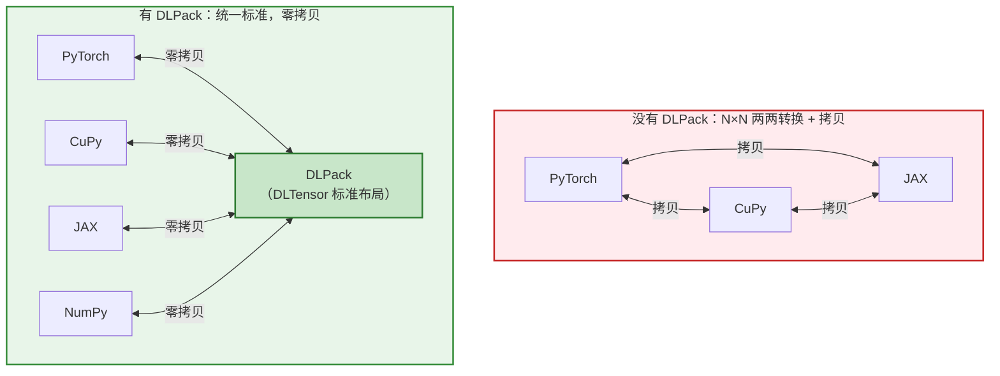
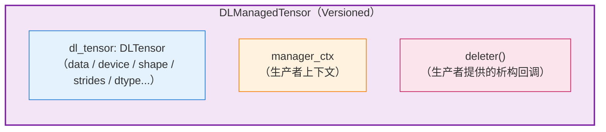
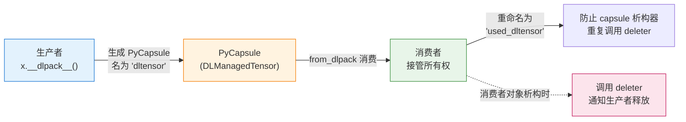

# DLPack 技术文档

## 前置声明

本文基于 **DLPack 官方文档（dmlc.github.io/dlpack）**、**dmlc/dlpack GitHub 仓库源码**及 **Python Array API 标准**核实撰写。DLPack 的 C 结构体、Python 协议（`__dlpack__`）及所有权语义均以官方为准。文中版本相关信息（如 DLPack 1.0）已核实，个别细节请对照官方最新头文件 `include/dlpack/dlpack.h`。

---

## 一、什么是 DLPack

**DLPack 是一个开放的内存张量结构标准，用于在不同深度学习框架/数组库之间"零拷贝"共享张量（Tensor）。** 它由 DMLC（Distributed Machine Learning Community）社区维护。

它要解决的核心痛点是：

> **不同框架（PyTorch、NumPy、CuPy、JAX、TensorFlow、MXNet……）各自用不同的内部结构存储张量。如果没有统一标准，想把 PyTorch 的张量传给 CuPy，就必须经过"拷贝到 CPU → 再拷贝回 GPU"等昂贵操作。**

DLPack 提供了一个**极简的、框架中立的公共 ABI**，让各框架就"稠密、strided、N 维数组在内存中如何布局"达成共识，从而实现**零拷贝（zero-copy）数据交换**。



**它与 TVM 的关系**：正如前文所述，**TVM FFI 的张量互操作完全建立在 DLPack 之上**——`DLTensor` 是 TVM FFI 中 Tensor 的一等布局，使 TVM 能与 PyTorch/JAX/CuPy 零拷贝互通。DLPack 是整个 ML 系统互操作的"最小公约数"之一。

---

## 二、核心设计哲学：极简 + 只描述不管理

DLPack 的设计极其克制，核心原则：

1. **只描述内存布局，不定义操作**：DLPack 不包含任何算子、不规定如何计算，只回答"这块张量数据在内存里长什么样"。
2. **不负责内存分配**：DLPack 结构**不拥有**它所描述的数据，数据的分配与释放由**生产者（producer）**负责。
3. **稠密 + strided 布局**：只支持稠密、可跨步（strided）的 N 维数组，不涉及稀疏、ragged 等复杂结构。
4. **设备无关**：通过 `DLDevice` 抽象支持 CPU、CUDA GPU、ROCm、Metal、TPU 等多种设备。

---

## 三、核心 C 数据结构

DLPack 的核心是几个精简的 C 结构体（源码见 `dlpack.h`）。

### 3.1 `DLTensor`——核心张量描述符

`DLTensor` 是 DLPack 的**灵魂**，它描述一块张量数据的全部布局信息（**不含所有权/析构**）：

```c
typedef struct {
  void* data;              // 指向数据起始的指针
  DLDevice device;         // 设备（类型 + 设备号）
  int32_t ndim;            // 维度数
  DLDataType dtype;        // 数据类型（如 float32）
  int64_t* shape;          // 各维度大小
  int64_t* strides;        // 各维度步长（元素为单位；NULL 表示紧凑连续）
  uint64_t byte_offset;    // data 指针的字节偏移
} DLTensor;
```

字段说明：

| 字段            | 含义                            |
| ------------- | ----------------------------- |
| `data`        | 数据缓冲区首地址（可能在 GPU 显存中）         |
| `device`      | 数据所在设备，见下文 `DLDevice`         |
| `ndim`        | 张量维度数                         |
| `dtype`       | 元素数据类型，见下文 `DLDataType`       |
| `shape`       | 形状数组，长度为 `ndim`               |
| `strides`     | 步长数组（以元素个数计），`NULL` 代表行优先紧凑排列 |
| `byte_offset` | 相对 `data` 的字节偏移（用于表达 view/切片） |

### 3.2 `DLDevice`——设备描述

```c
typedef struct {
  DLDeviceType device_type;   // 设备类型枚举
  int32_t device_id;          // 设备编号（如第几块 GPU）
} DLDevice;
```

`DLDeviceType` 枚举包含（部分）：`kDLCPU`、`kDLCUDA`、`kDLCUDAHost`（pinned 内存）、`kDLROCM`、`kDLMetal`、`kDLVulkan`、`kDLOpenCL`、`kDLTPU`（较新增加的 TPU 支持）等。

### 3.3 `DLDataType`——数据类型描述

```c
typedef struct {
  uint8_t code;     // 类型代码：kDLInt / kDLUInt / kDLFloat / kDLBfloat 等
  uint8_t bits;     // 位宽：8/16/32/64
  uint16_t lanes;   // 向量化 lane 数（标量为 1）
} DLDataType;
```

例如 `float32` = `{code=kDLFloat, bits=32, lanes=1}`。

### 3.4 `DLManagedTensor` / `DLManagedTensorVersioned`——带所有权管理的张量

`DLTensor` 只描述布局，**不含所有权信息**。跨框架传递时需要"谁来释放"的约定，因此包了一层：

```c
typedef struct DLManagedTensor {
  DLTensor dl_tensor;                       // 实际张量
  void* manager_ctx;                        // 生产者的上下文（内部使用）
  void (*deleter)(struct DLManagedTensor*); // 析构回调：由生产者提供
} DLManagedTensor;
```

- **`deleter`** 是关键：**由生产者提供**，消费者用完后调用它来通知生产者释放资源。这实现了"**在一处分配、在另一处安全释放**"的跨框架内存管理。
- **`manager_ctx`**：生产者存放自身管理上下文（如原始对象指针），供 `deleter` 使用。

> **版本演进（已核实）**：**自 DLPack 1.0 起，引入了 `DLManagedTensorVersioned`**（带版本号与 flags 字段，如 `DLPACK_FLAG_BITMASK_IS_COPIED` 标识数据是否为拷贝），**原 `DLManagedTensor` 被视为已弃用（deprecated）**。过渡期内建议两者都支持。



---

## 四、Python 层协议：`__dlpack__` 与 `from_dlpack`

在 Python 侧，DLPack 已被纳入 **Python Array API 标准**，通过两个魔术方法 + 一个消费函数实现交换：

| API                                                       | 角色        | 作用                                                         |
| --------------------------------------------------------- | --------- | ---------------------------------------------------------- |
| `__dlpack__(self, *, stream=None, max_version=None, ...)` | **生产者**实现 | 生成一个封装 `DLManagedTensor` 的 **PyCapsule**                   |
| `__dlpack_device__(self)`                                 | **生产者**实现 | 返回 `(device_type, device_id)`，供消费者查询设备（如多 GPU 时传对的 stream） |
| `from_dlpack(x)`                                          | **消费者**调用 | 接受任意实现了上述方法的对象，构造出自己框架的张量                                  |

### 4.1 使用示例

```python
import torch
import cupy as cp

# PyTorch 张量（在 GPU 上）
x = torch.arange(10, device="cuda")

# 零拷贝转换为 CuPy 数组
y = cp.from_dlpack(x)     # 走 __dlpack__ 协议，无数据拷贝

# 反向也可以
import numpy as np
a = np.arange(10)
b = torch.from_dlpack(a)  # NumPy → PyTorch，CPU 上零拷贝
```

### 4.2 所有权移交语义（核心且易错）

官方规范对**所有权移交**有严格约定，这是保证不发生 double-free / 泄漏的关键：



关键规则（源自官方规范）：

1. **生产者仍拥有 `x` 的内存**；`y` 通常是 `x` 的一个 **view（视图）**（若无法零拷贝才会拷贝，并置位 `IS_COPIED` flag）。
2. **PyCapsule 命名约定**：生产者把 capsule 命名为 `"dltensor"`；消费者接管后**必须重命名为 `"used_dltensor"`**，以确保 capsule 自身的析构器**不会**再去调用 `deleter`（避免重复释放）。
3. **capsule 恰好被消费一次**：它在 `from_dlpack` 内部被立即消费，对普通用户不可见。
4. **`deleter` 由消费者对象的析构负责调用**：消费者创建的、用于持有 `DLManagedTensor` 的对象在销毁时才调用 `deleter`。
5. **视图可变性警告**：由于 `y` 可能是 `x` 的视图，用户应避免原地修改 `y`，以免意外影响 `x`。

### 4.3 Stream 同步（CUDA/ROCm）

对于有 stream 概念的设备（CUDA、ROCm）：**消费者必须把它将要使用的 stream 传给生产者，生产者在必要时对该 stream 做同步/等待**。默认 stream 场景下通常无需同步，从而允许异步执行。

---

## 五、DLPack 的价值与生态地位

| 价值点      | 说明                                                                                      |
| -------- | --------------------------------------------------------------------------------------- |
| **零拷贝**  | 框架间共享同一块（显存）数据，避免昂贵的拷贝与设备往返                                                             |
| **框架中立** | 不偏向任何框架，是社区共同标准（PyTorch、NumPy、CuPy、JAX、TensorFlow、MXNet、PaddlePaddle、Apache Arrow 等均支持） |
| **极简稳定** | 结构小、C ABI 稳定，易于各语言/框架实现与长期维护                                                            |
| **设备广泛** | 覆盖 CPU / CUDA / ROCm / Metal / Vulkan / TPU 等                                           |
| **标准化**  | 已纳入 **Python Array API 标准**，`from_dlpack` 成为通用入口                                        |

在 ML 系统栈中，DLPack 扮演"**张量交换的通用语**"角色：**TVM FFI、CuPy、PyTorch、JAX、Triton 等都借助它实现张量零拷贝互通**，是构建可互操作 ML 系统的关键基础设施。

---

## 六、主流框架 / 库对 DLPack 的支持情况

DLPack 已成为 ML 生态**事实上的张量交换标准**，主流数组库与框架基本都提供了 `from_dlpack`（消费）与 `to_dlpack` / `__dlpack__`（生产）能力。

### 6.1 支持一览表

| 框架 / 库           | 消费 API（导入）                                 | 生产方式（导出）                                         | 支持设备              | 备注                                                      |
| ---------------- | ------------------------------------------ | ------------------------------------------------ | ----------------- | ------------------------------------------------------- |
| **NumPy**        | `numpy.from_dlpack(x)`                     | `__dlpack__` / `__dlpack_device__`               | CPU               | **1.22+** 起支持；已对齐 Array API 标准                          |
| **PyTorch**      | `torch.from_dlpack(x)`                     | `torch.utils.dlpack.to_dlpack(t)` / `__dlpack__` | CPU / CUDA / ROCm | 老接口 `to_dlpack`/`from_dlpack` 长期可用；新接口走 `__dlpack__` 协议 |
| **CuPy**         | `cupy.from_dlpack(x)`                      | `__dlpack__` / `toDlpack()`                      | CUDA / ROCm       | GPU 数组零拷贝互通的典型场景                                        |
| **JAX**          | `jax.numpy.from_dlpack(x)`（或 `jax.dlpack`） | `jax.dlpack.to_dlpack` / `__dlpack__`            | CPU / CUDA / TPU  | 注意 JAX 数组不可变、异步执行，涉及 stream 同步                          |
| **TensorFlow**   | `tf.experimental.dlpack.from_dlpack(x)`    | `tf.experimental.dlpack.to_dlpack(t)`            | CPU / CUDA        | 位于 **`experimental`** 命名空间                              |
| **cuDF（RAPIDS）** | `cudf.from_dlpack(x)`                      | `DataFrame.to_dlpack()`                          | CUDA              | 用于 GPU DataFrame ↔ 张量交换                                 |
| **Apache Arrow** | 支持 DLPack 协议（`__dlpack__`）                 | 支持                                               | CPU（当前主要）         | 列式数据与张量库互通                                              |
| **PaddlePaddle** | `paddle.utils.dlpack.from_dlpack`          | `paddle.utils.dlpack.to_dlpack`                  | CPU / CUDA        | —                                                       |
| **MXNet**        | `mxnet.nd.from_dlpack`                     | `mxnet.nd.to_dlpack_for_read/write`              | CPU / CUDA        | 早期支持 DLPack 的框架之一                                       |
| **TVM FFI**      | 内部以 `DLTensor` 为一等张量布局                     | 同上                                               | 多设备               | 本系列前文重点，零拷贝依托 DLPack                                    |
| **Numba**        | 通过 CUDA Array Interface 桥接                 | 可导出 device array                                 | CUDA              | 常与 DLPack 协同（经 CUDA Array Interface）                    |

> ⚠️ 各框架首次引入 DLPack 的确切版本、以及"老 `to_dlpack` 接口"与"新 `__dlpack__` 协议"的支持程度随版本演进，涉及生产代码时请以你所用版本的官方文档为准。

### 6.2 两种 API 风格

主流框架的 DLPack 接口大致分为两代，目前多数框架**同时保留**：

1. **旧式显式接口**（capsule 风格）：如 `to_dlpack(tensor)` 生成 PyCapsule，再由另一框架的 `from_dlpack(capsule)` 消费。
2. **新式协议接口**（Array API 标准）：对象实现 `__dlpack__()` / `__dlpack_device__()`，消费方统一用 `from_dlpack(obj)` 调用——这是 **Python Array API 标准**推荐的方式，可自动协商版本（`max_version`）与 stream。

```python
import torch, cupy as cp, numpy as np

x = torch.arange(6, device="cuda").reshape(2, 3)

# 新式协议：直接把对象传给消费方的 from_dlpack
y = cp.from_dlpack(x)          # PyTorch(CUDA) → CuPy，零拷贝

a = np.arange(6)
b = torch.from_dlpack(a)       # NumPy(CPU) → PyTorch，零拷贝
```

### 6.3 跨框架互通的注意事项

尽管协议统一，实际跨框架交换时仍需注意几点（源自官方规范与框架文档）：

- **设备不匹配会报错**：若消费方不支持数据所在设备，规范建议抛出 `BufferError`（除非显式请求拷贝）。
- **Stream 同步（CUDA/ROCm）**：消费方需把将使用的 stream 传给生产方，避免异步执行下的读写竞争。
- **视图 vs 拷贝**：零拷贝时 `y` 是 `x` 的视图，**原地修改会互相影响**；Array API v2023 起可通过 `copy` 参数显式要求/禁止拷贝，拷贝时生产方须置位 `DLPACK_FLAG_BITMASK_IS_COPIED`。
- **连续性要求**：部分实现只接受 C-order 连续张量（如遇 *"DLPack tensor is not contiguous"* 报错，需先 `.contiguous()`）。
- **版本与 capsule 命名**：使用 `DLManagedTensorVersioned` 时，capsule 名需带 `_versioned` 后缀；不匹配可能导致消费失败。
- **胶水库兜底**：对于只实现了 **Array Interface / CUDA Array Interface / Buffer 协议**但未原生实现 DLPack 的对象，可借助 **`pydlpack`** 这类库（其 `asdlpack()` 能把 NumPy、Torch、CuPy、Numba、`bytes`/`bytearray` 等包装为 DLPack 对象）统一转换。

---

## 七、核心结论

- **DLPack 是一个开放、极简、框架中立的张量内存布局标准**，核心目标是让不同框架/库之间**零拷贝共享张量**。
- **核心结构是 `DLTensor`**（描述 data/device/shape/strides/dtype 布局），外层包 `DLManagedTensor`（+ `deleter` 实现跨框架所有权移交）；**DLPack 1.0 起推荐使用带版本的 `DLManagedTensorVersioned`**。
- **只描述、不管理、不定义操作**：DLPack 不拥有内存、不做计算，仅提供布局共识与所有权移交约定。
- **Python 侧通过 `__dlpack__` / `__dlpack_device__` / `from_dlpack` 三件套**交换，并有严格的 **PyCapsule 命名（`dltensor`→`used_dltensor`）** 与 **deleter 调用**规则保证内存安全。
- **它已成为 ML 生态事实上的张量交换标准**，主流框架（NumPy / PyTorch / CuPy / JAX / TensorFlow / cuDF / PaddlePaddle / MXNet 等）普遍支持，也是 **TVM FFI 张量零拷贝能力的底层依托**。

---

## 参考来源（已核实）

- **DLPack C API 文档**：`https://dmlc.github.io/dlpack/latest/c_api.html`
- **DLPack Python 规范**（Array API 标准）：`https://dmlc.github.io/dlpack/latest/python_spec.html`
- **源码头文件**：`dmlc/dlpack` → `include/dlpack/dlpack.h`（`https://github.com/dmlc/dlpack`）
- **Python Array API 标准**（`from_dlpack` / `__dlpack__`）：`https://data-apis.org/array-api/latest/`
- **PyTorch `torch.utils.dlpack`**：`https://docs.pytorch.org/docs/stable/dlpack.html`
- **CuPy Interoperability**：`https://docs.cupy.dev/en/stable/user_guide/interoperability.html`
- **TensorFlow `tf.experimental.dlpack`**：`https://www.tensorflow.org/api_docs/python/tf/experimental/dlpack`
- **JAX DLPack**：`https://jax.readthedocs.io/`（`jax.dlpack` / `jax.numpy.from_dlpack`）
- **Apache Arrow DLPack 协议**：`https://arrow.apache.org/docs/python/dlpack.html`
- **pydlpack（跨协议胶水库）**：`https://pypi.org/project/pydlpack/`

> ⚠️ DLPack 结构体字段可能随版本演进（如 TPU 设备类型、versioned 结构、flags 位）微调，涉及底层实现时请以你所用版本的 `dlpack.h` 为准。官方文档配有 `DLPack_diagram.png` 结构关系图，建议对照查看。

---

> 如需进一步展开 **DLPack 1.0 versioned 结构与 flags 的完整细节**、**如何用 C/C++ 手写一个 `__dlpack__` 生产者**、**TVM FFI 内部如何封装 DLTensor 实现零拷贝**，或 **某个框架（如 PyTorch / JAX）DLPack 导入导出的完整实战与坑点**，可以告诉我，我可以继续深入。😊
