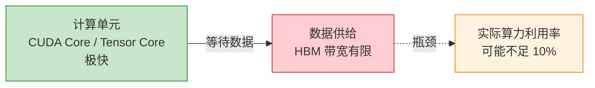
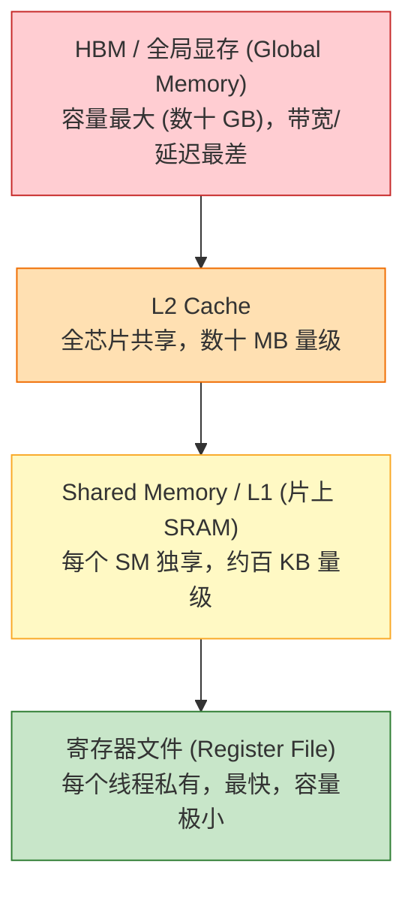
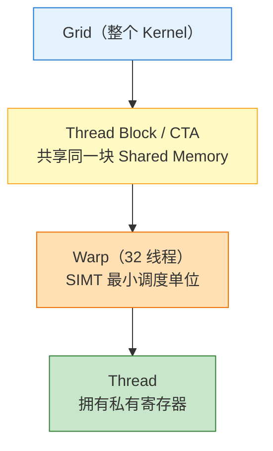
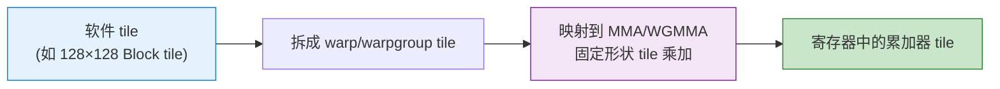
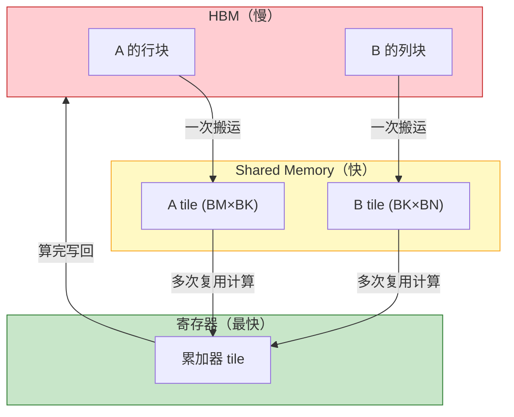
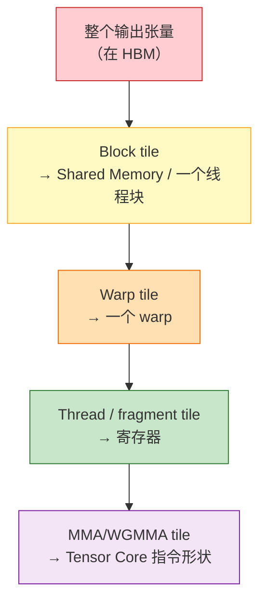
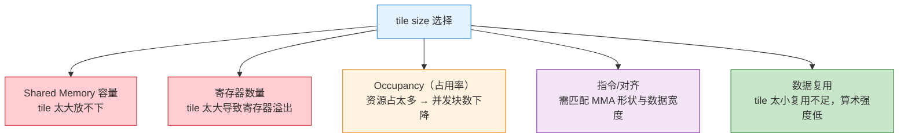
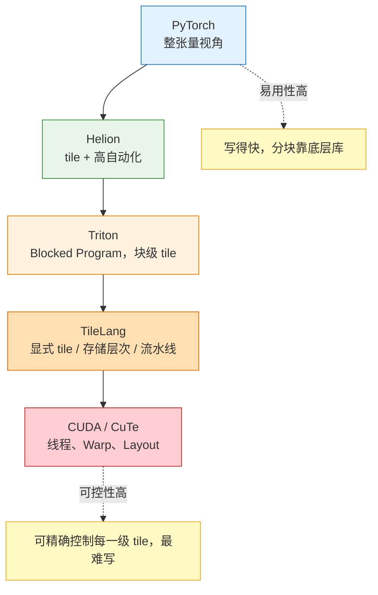

# Tile 深入解析：从 GPU 硬件到 DSL 抽象

> Tile（分块 / 瓦片）是 GPU 高性能计算里最核心的概念之一。很多人只把它理解成“把大矩阵切成小块”，但要真正理解 tile，必须**从硬件出发**：它首先是被 GPU 的存储层次、执行模型和张量指令“逼”出来的物理必然，然后才逐层上升为编译优化手段（tiling），最终成为 Triton、TileLang、Helion 等新一代 DSL 的一等编程抽象。
> 
> 本文自底向上组织：**硬件 → 为什么必须分块 → 多级 tile → tiling 优化 → tile 作为编程单位 → DSL 抽象层次**，帮助读者从深层次理解 tile。

---

## 目录

1. [先看硬件：GPU 为什么“算得快却喂不饱”](#一先看硬件gpu-为什么算得快却喂不饱)
2. [存储层次：tile 的物理起点](#二存储层次tile-的物理起点)
3. [执行模型：Thread、Warp、Block 与 tile 的对应](#三执行模型threadwarpblock-与-tile-的对应)
4. [Tensor Core：硬件本身就是按 tile 计算的](#四tensor-core硬件本身就是按-tile-计算的)
5. [从硬件约束到 tiling 优化：以 GEMM 为例](#五从硬件约束到-tiling-优化以-gemm-为例)
6. [多级 tile：与存储层次一一对应](#六多级-tile与存储层次一一对应)
7. [tile size 不是随便选的：约束与权衡](#七tile-size-不是随便选的约束与权衡)
8. [从 tiling（动作）到 tile（一等公民）](#八从-tiling动作到-tile一等公民)
9. [DSL 抽象层次：tile 在语言里的不同暴露方式](#九dsl-抽象层次tile-在语言里的不同暴露方式)
10. [总结](#十总结)

---

## 一、先看硬件：GPU 为什么“算得快却喂不饱”

要理解 tile，先要理解一个根本矛盾：**现代 GPU 的算力增长远快于访存带宽增长**。

以数据中心 GPU 为例，其张量算力已经达到每秒数百 TFLOPS 到 PFLOPS 量级，而 HBM（High Bandwidth Memory，高带宽显存）带宽虽然也在提升，但相对算力的比例却在持续下降。这带来一个可以量化的概念——**算术强度（Arithmetic Intensity）**：

$$
\text{算术强度} = \frac{\text{计算量（FLOPs）}}{\text{访存量（Bytes）}}
$$

Roofline 模型指出：只有当算术强度足够高时，程序才可能达到峰值算力，否则就被内存带宽卡住。



如果对一个大张量“整体地、直接地”做计算，同一份数据会被反复从 HBM 搬进搬出，计算单元大部分时间在**等待数据**，这就是所谓的“**访存墙（Memory Wall）**”。

> tile 的存在，本质就是为了**提高算术强度**：把数据留在离计算单元更近的地方反复使用，把慢速访存换成快速访存。

---

## 二、存储层次：tile 的物理起点

GPU 的存储不是均质的，而是一个金字塔：**容量越大，速度越慢；速度越快，容量越小**。这正是 tile 必须存在的物理原因。



| 存储层级               | 大致容量          | 相对速度 | 作用范围          | 与 tile 的关系                |
| ------------------ | ------------- | ---- | ------------- | ------------------------- |
| 寄存器 File           | 每线程极小         | 最快   | 单线程私有         | 承载最内层、最小的 tile / fragment |
| Shared Memory / L1 | 每 SM 约百 KB 量级 | 很快   | 线程块（Block）内共享 | 承载 Block 级 tile，供块内线程复用   |
| L2 Cache           | 数十 MB 量级      | 中等   | 全芯片共享         | 影响 tile 的复用与调度顺序（swizzle） |
| HBM 全局显存           | 数十 GB         | 最慢   | 全局            | 存放完整大张量，是被“切 tile”的对象     |

关键点在于：**寄存器和 Shared Memory 的容量非常有限**，根本装不下一个完整的大张量。因此必须把大张量切成刚好能装进这些快速存储的小块——这个小块就是 tile。

> 换句话说：**tile 的尺寸，本质上是被快速存储的容量“定义”出来的。** 你不是随意切块，而是切成“恰好能放进 Shared Memory / 寄存器”的大小。

### 2.1 用真实数据感受“容量”约束

上面的“数量级”描述比较抽象。下面用 NVIDIA 近几代数据中心 GPU 的公开参数，让读者对每一级存储的真实容量有直观感受。

**片上存储：每个 SM 的寄存器与 Shared Memory**

这一层最能解释“为什么必须切 tile”——它的容量以 **KB** 计，而不是 GB。

| 架构 / GPU      | 计算能力 | 寄存器文件 / SM              | L1+Shared 合并容量 / SM | 可配置 Shared Memory 上限 / SM |
| ------------- | ---- | ----------------------- | ------------------- | ------------------------- |
| Volta / V100  | 7.0  | 65536 × 32-bit ≈ 256 KB | 128 KB              | 96 KB                     |
| Ampere / A100 | 8.0  | 65536 × 32-bit ≈ 256 KB | 192 KB              | 164 KB                    |
| Hopper / H100 | 9.0  | 65536 × 32-bit ≈ 256 KB | 256 KB              | 228 KB                    |

几个关键事实：

- **寄存器文件三代都是每 SM 256 KB**（65536 个 32-bit 寄存器），且被该 SM 上所有并发线程**瓜分**。一个线程用寄存器越多，能同时驻留的线程（Occupancy）就越少——这直接约束了最内层 thread/fragment tile 能开多大。
- **Shared Memory 是可配置的，且有上限**（如 H100 每 SM 最高 228 KB）。一个 Thread Block 能用的 Shared Memory 不超过这个上限，这就把 Block 级 tile 的大小“钉死”在一个具体范围内。
- 为兼容旧架构，**静态** Shared Memory 分配上限为 48 KB；要用到 A100/H100 的百 KB 级容量，必须使用**动态** Shared Memory。

**片外存储：L2 Cache 与 HBM 全局显存**

这一层容量大得多，但带宽/延迟也差得多，正是被“切 tile”以减少访问的对象。

| 架构 / GPU            | L2 Cache（全 GPU 共享） | 全局显存类型与容量             | 显存带宽（约）           |
| ------------------- | ------------------ | --------------------- | ----------------- |
| Volta / V100        | 6 MB               | HBM2，16 / 32 GB       | ~0.9 TB/s         |
| Ampere / A100       | 40 MB              | HBM2e，40 / 80 GB      | ~2.0 TB/s（80GB 版） |
| Hopper / H100 (SXM) | 50 MB              | HBM3，80 / 96 GB       | ~3.35 TB/s        |
| Hopper / H200       | 50 MB              | HBM3e，141 GB          | ~4.8 TB/s         |
| Blackwell / B200    | —                  | HBM3e，约 192 GB（单 GPU） | ~8 TB/s           |

> 数据来源：NVIDIA 各代架构白皮书与官方产品页（H200/B200 部分为公开规格，可能随版本调整）。B200 的片上 L2/Shared Memory 细节这里不逐项列出，以官方 Blackwell 白皮书为准。

**从这组数字能读出什么**

把两级容量放在一起，量级差异一目了然：

```text
HBM 全局显存 :  数十 ~ 上百 GB       ← 完整大张量放这里（慢）
      ↑ 差约 5~6 个数量级
Shared Memory:  每 SM 约 100~228 KB   ← Block tile 放这里（快）
寄存器文件   :  每 SM 256 KB（被众多线程瓜分） ← thread/fragment tile（最快）
```

这解释了三件事：

1. **为什么一定要切 tile**：一个 $4096\times4096$ 的 FP16 矩阵就有 32 MB，远超任何 SM 的百 KB 级片上存储，只能分块加载。
2. **为什么 tile size 有明确上限**：Block tile 受 Shared Memory 上限约束，thread tile 受寄存器数量约束，超了就放不下或发生寄存器溢出（spill）。
3. **为什么新架构能用更大的 tile / 更激进的流水线**：从 V100 到 H100，Shared Memory 上限从 96 KB 提升到 228 KB，配合更大的 L2 和更高的 HBM 带宽，使得更大的 Block tile 和多级预取流水线成为可能——这也是新硬件上 Kernel 常需重新调优 tile size 的原因。

#### 用 NAVIDA GPU类比来描述tile

tile 的本质，就是每次只从“中央大仓库（HBM）”搬一小批物料到“生产线料架（Shared Memory）”上反复加工，而这个料架的大小，就是**单个 SM** 的片上存储容量。

---

## 三、执行模型：Thread、Warp、Block 与 tile 的对应

GPU 采用 **SIMT（Single Instruction, Multiple Threads）** 执行模型，其组织层次和存储层次是对应的：



这套并行层次天然要求“分块划分工作”：

- 一个 **Grid** 对应整个输出张量；
- 一个 **Block** 负责输出的一个较大 tile，并把它加载到 Shared Memory；
- 一个 **Warp** 负责这个 Block tile 内更小的一块；
- 一个 **Thread** 用寄存器承载最内层的微 tile。

因此 tile 不只是“内存里的一块数据”，它同时是**并行任务的划分单位**：一个 tile 恰好对应一组协同工作的线程。这就是 tile 的第二重物理含义——**匹配并行硬件的粒度**。

> 存储层次决定了 tile 要多大，执行层次决定了 tile 由谁来算。二者共同把“分块”变成硬件层面的必然选择。

---

## 四、Tensor Core：硬件本身就是按 tile 计算的

现代 GPU 用于矩阵乘的核心单元是 **Tensor Core**，而它的指令**天生就是 tile 粒度**的，不接受“逐元素”的输入。

- 早期 WMMA（Warp Matrix Multiply-Accumulate）以 warp 为单位，执行如 $16\times16\times16$ 这类固定形状的矩阵块乘加；
- 新一代架构上的 `mma` / `wgmma`（warpgroup-level MMA）等指令，则以更大的、由 warp group 协作的 tile 形状执行矩阵乘累加。

也就是说：

```text
Tensor Core 指令  =  对一个固定形状 tile 做 D = A × B + C
        ↓
软件层面的 tile，最终必须匹配硬件指令要求的 tile 形状
        ↓
tile size 常常要对齐到硬件矩阵指令的形状与数据类型宽度
```



这解释了一个常被忽略的事实：**tile 不是纯软件概念，它一路贯穿到硬件指令**。把循环“张量化（tensorize）”到 Tensor Core，本质就是把软件 tile 对齐并映射到硬件 tile。若 tile 形状不匹配指令要求，就无法用上 Tensor Core，性能会大幅下降。

此外，为了让计算单元不空等数据，现代 GPU 还提供**异步数据搬运**（如 `cp.async`、TMA 等）与**多级软件流水线**：一边计算当前 tile，一边预取下一个 tile。这也是 tile 编程中“流水线（pipeline）”原语的硬件根源。

---

## 五、从硬件约束到 tiling 优化：以 GEMM 为例

把上面的硬件约束落到最经典的算子——矩阵乘（GEMM）$C = A \times B$ 上，就自然推导出了 **tiling（分块优化）**。

**朴素实现**（不分块）：

```text
for i in 0..M:
  for j in 0..N:
    for k in 0..K:
      C[i][j] += A[i][k] * B[k][j]
```

问题：计算 `C[i][j]` 时要遍历 `A` 的一行和 `B` 的一列，这些数据被反复从 HBM 读取，几乎没有复用，算术强度极低。

**分块实现**（tiling）：

```text
for 每个 C 的 tile (BM × BN):        # Block 级：结果 tile 放寄存器/共享内存
  初始化累加器 tile = 0
  for k_tile in 0..K step BK:         # 沿 K 维分块
    把 A 的 (BM × BK) tile 载入 Shared Memory
    把 B 的 (BK × BN) tile 载入 Shared Memory
    在 Shared Memory 内做 tile 乘加，结果累加到累加器 tile
  把累加器 tile 写回 C
```

分块之后，加载进 Shared Memory 的一个 tile 会被块内众多线程**反复复用**，从而把大量 HBM 访问替换成快速的片上访问，算术强度显著提高。



> 这就是 tiling 的根本机制：**用一次慢速搬运换来多次快速复用**。tile 是这个机制的“载体”，tiling 是这个机制的“动作”。

---

## 六、多级 tile：与存储层次一一对应

真实的高性能 Kernel 从来不是“切一层”，而是**沿存储/执行层次逐级分块**，形成嵌套的多级 tile。每一级 tile 对应一级存储、一级并行单位：



| tile 级别                | 对应存储          | 对应执行单位       | 决定什么                    |
| ---------------------- | ------------- | ------------ | ----------------------- |
| Block tile             | Shared Memory | Thread Block | 块内复用程度、Shared Memory 占用 |
| Warp tile              | 寄存器 / Shared  | Warp         | warp 间的工作划分             |
| Thread / fragment tile | 寄存器           | Thread       | 每线程的计算量与寄存器压力           |
| 指令 tile                | 硬件寄存器         | Tensor Core  | 是否命中 MMA/WGMMA、精度与对齐    |

理解“多级 tile”是理解现代 Kernel 的关键：一个 GEMM Kernel 的性能，取决于这几级 tile 的尺寸如何**协同匹配**存储容量、并行度和指令形状。这也是为什么 DSL 里会同时出现 Block、Warp、fragment、pipeline 等概念——它们都是多级 tile 的直接映射。

---

## 七、tile size 不是随便选的：约束与权衡

“切多大”是 tiling 里最关键、也最难的问题。tile size 受到多重硬件约束的夹击：



核心权衡在于：

- **tile 越大** → 数据复用越充分、算术强度越高，但占用的 Shared Memory 和寄存器越多，可能降低 Occupancy，甚至导致寄存器溢出（spill）。
- **tile 越小** → 资源占用少、并发块多，但复用不足，重新回到访存瓶颈。

因此存在一个**与具体硬件、算子形状强相关的最优 tile size**，而且它是一个**非凸、离散**的搜索问题。这正是自动调优（Auto-Tuning）与代价模型要解决的核心问题之一：在巨大的 tile size 组合空间里，快速找到接近最优的配置。

> 关于 tile size 搜索、Auto-Scheduling 与 Auto-Tensorize 的系统方法，可参见 [Polyhedral Model 之后：Auto-Tiling 与 Auto-Tensorize 的技术演进](../../Optimization/Polyhedral-Model之后-Auto-Tiling-与-Auto-Tensorize的技术演进/index.md)。

---

## 八、从 tiling（动作）到 tile（一等公民）

前面几节都在讲硬件与优化。现在往上抽象一层，看 tile 在**编程范式**中的演进。这里有一个关键的词性变化：

```text
tiling（动名词）= “分块”这个优化【动作】
    在传统编译器里：tiling 是编译器在幕后自动做的一个 pass
    程序员通常看不见、也难以直接控制

tile（名词）= “块”这个【一等编程对象】
    在 Triton / TileLang / Helion 里：
    tile 被提升为语言中显式、可操作的实体
        ↓
    程序员直接说：给我一个 tile、在 tile 上做运算、tile 之间如何配合
```

这个演进的动机，恰恰来自前面讲的硬件事实：**tile 是性能的关键，但它又与硬件强绑定**。

- 如果完全交给编译器自动 tiling（如传统多面体编译器），程序员失去了对性能关键点的控制，且编译器的代价模型未必准确；
- 如果完全手写 CUDA，程序员又要陷入线程级细节的泥潭。

于是新一代 DSL 选择把 tile **显式暴露到语言层面**：让程序员以 tile 为单位表达算法和数据流动，而把“tile 内如何映射到线程、如何合并访存、如何同步”交给编译器。这既保留了对分块策略的控制，又免去了最繁琐的线程管理。

> 这就是为什么会出现 **TileLang** 这样直接以 tile 命名的语言——它把 tile 从“编译器内部的优化步骤”提升为“语言的核心抽象单位”。

---

## 九、DSL 抽象层次：tile 在语言里的不同暴露方式

理解了 tile 的硬件本质，就能看清各类 DSL 的差异——它们的本质区别，是**把多级 tile 中的哪几级暴露给程序员，又把哪几级交给编译器**。



| 层次          | 编程单位            | 程序员控制的 tile 级别                        | 交给编译器的部分           | 特点                |
| ----------- | --------------- | ------------------------------------- | ------------------ | ----------------- |
| PyTorch     | 整个张量            | 基本不涉及（黑盒库内部分块）                        | 全部分块与映射            | 最易用、最不可控          |
| Helion      | tile（高层）        | 声明 tile 迭代空间                          | 大部分索引、映射与调优        | 易用 + 一定控制，自动生成/调优 |
| Triton      | Blocked Program | Block 级 tile、块内算法                     | 线程映射、访存合并、部分指令选择   | 效率与性能的平衡点         |
| TileLang    | tile / Buffer   | Block / Warp / fragment tile、存储层次、流水线 | 具体 CodeGen 与部分硬件路径 | 更接近硬件、可控性更高       |
| CUDA / CuTe | 线程 / Layout     | 全部各级 tile 与线程映射                       | 极少                 | 最可控、最难写           |

可以看到一条清晰的谱系：**越往上，越多级 tile 被编译器接管，开发越简单；越往下，越多级 tile 由程序员显式掌控，性能上限越高、也越难写。**

- **Triton** 把“Block 级 tile”暴露给你，把“tile 内线程细节”藏起来；
- **TileLang** 进一步把 Warp/fragment tile、存储层次搬运、软件流水线也暴露出来，让你更贴近硬件多级 tile；
- **Helion** 则反方向再抬高一层：你只声明 tile 迭代空间，连 tile size 都可以交给自动调优搜索，最终生成 Triton Kernel。

> 各 DSL 的详细定位与选型，见 [GPU Kernel DSL 总览](../index.md)。

---

## 十、总结

```text
Tile 要从三层理解，且必须【自底向上】：

【硬件层】tile 是被 GPU 逼出来的物理必然
    • 存储层次有限（寄存器/Shared Memory 装不下大张量）
    • SIMT 执行需要按块划分并行工作
    • Tensor Core 指令本身就按固定 tile 形状计算
        ↓
    tile 尺寸 ≈ 快速存储容量 + 并行粒度 + 指令形状 共同决定

【优化层】tiling 是“用一次慢搬运换多次快复用”的动作
    • 提高算术强度，突破访存墙
    • 多级 tile 与存储/执行/指令层次一一对应
    • tile size 是受多重硬件约束的非凸搜索问题

【范式层】tile 从编译器幕后的 tiling 动作
          提升为语言表面的一等编程单位
        ↓
    程序员以“整块 tile”为单位思考，而非“单个元素/线程”
        ↓
    各 DSL 的区别 = 暴露哪几级 tile、隐藏哪几级
        PyTorch(整张量) > Helion(高层 tile)
        > Triton(Block tile) > TileLang(多级 tile) > CUDA/CuTe(线程/Layout)
```

**核心洞察**：tile 之所以成为当代 AI 编译栈的公共粒度，是因为它同时站在两个世界的交界处——向下，它精确对应 GPU 的存储层次、并行结构和张量指令，是“让计算适配硬件”的物理单位；向上，它是一个人类可以直接书写和推理的编程对象，让开发者摆脱线程级细节，用“一整块”的方式表达算法。真正理解 tile，不是记住“把矩阵切成小块”，而是理解**它为什么必须存在（硬件约束）、它如何提升性能（算术强度与多级复用）、以及它如何被抬升为语言抽象（tiling → tile）**。从 CUDA 到 Triton、TileLang，再到 Helion，整个演进都在回答同一个问题：**tile 这个既贴硬件又可编程的粒度，应该由谁、在哪一层、以什么方式来掌控。**

---

### 延伸阅读

- [GPU Kernel DSL 总览](../index.md)
- [GPU 计算基础（存储层次、SIMT、Tensor Core）](../../../Hardware/GPU-computation/index.md)
- [算子级优化](../../Optimization/Operator-Level-Optimization/index.md)
- [指令级优化（mma / wgmma / cp.async / TMA）](../../Optimization/Instruction-Optimization/index.md)
- [Polyhedral Model 之后：Auto-Tiling 与 Auto-Tensorize 的技术演进](../../Optimization/Polyhedral-Model之后-Auto-Tiling-与-Auto-Tensorize的技术演进/index.md)
