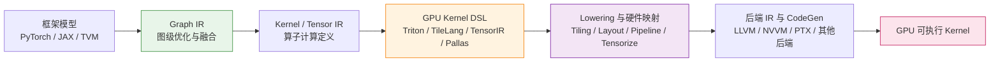
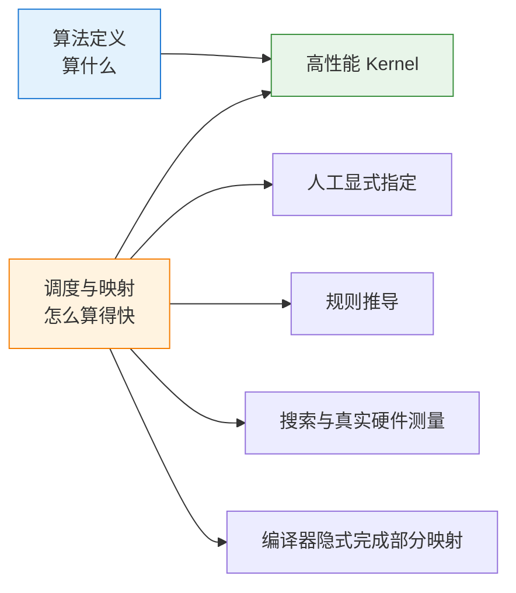
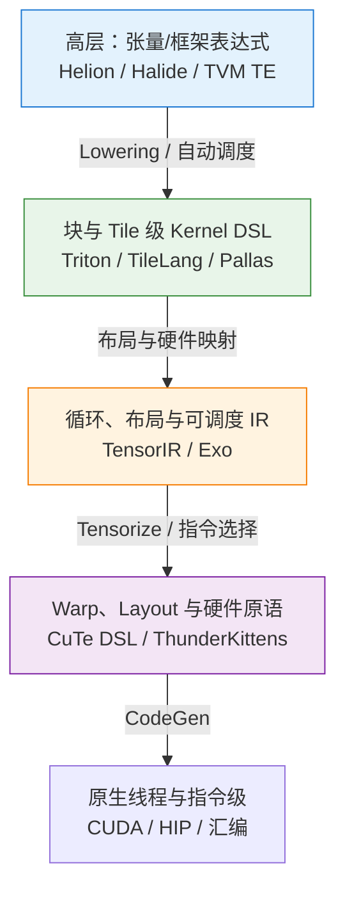
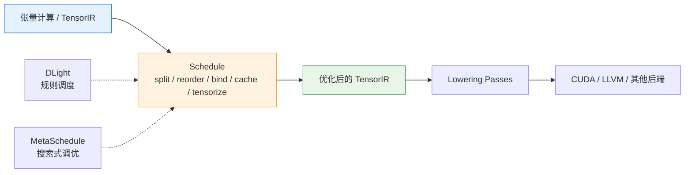
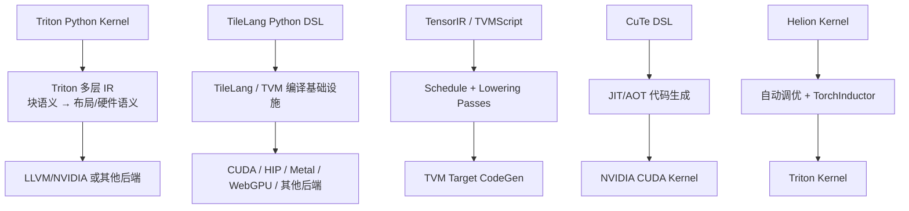
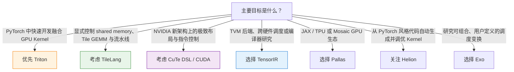

# GPU Kernel DSL：从 CUDA、Triton 到 TileLang 与 TensorIR

> GPU Kernel DSL（领域特定语言）试图在**开发效率、性能上限、硬件可移植性**之间取得平衡。本文从抽象层次、调度控制、编译链路和自动调优四个维度，梳理 Triton、TileLang、TVM TensorIR、Halide、Exo、CuTe DSL、Pallas 与 Helion 等技术，并说明它们各自适合解决什么问题。

---

## 目录

1. [GPU Kernel DSL 在 AI 编译器中的位置](#一gpu-kernel-dsl-在-ai-编译器中的位置)
2. [为什么需要 GPU Kernel DSL](#二为什么需要-gpu-kernel-dsl)
3. [理解 DSL 的三个关键维度](#三理解-dsl-的三个关键维度)
4. [技术版图与抽象层次](#四技术版图与抽象层次)
5. [Triton：以 Blocked Program 代替逐线程编程](#五triton以-blocked-program-代替逐线程编程)
6. [TileLang：显式表达 Tile、存储层次与流水线](#六tilelang显式表达-tile存储层次与流水线)
7. [TVM TensorIR：可调度的循环级张量 IR](#七tvm-tensorir可调度的循环级张量-ir)
8. [Halide 与 Exo：调度语言的两种代表](#八halide-与-exo调度语言的两种代表)
9. [更低层与更高层的 DSL](#九更低层与更高层的-dsl)
10. [编译链路对比](#十编译链路对比)
11. [Auto-Tuning、Auto-Scheduling 与 Auto-Tensorize](#十一auto-tuningauto-scheduling-与-auto-tensorize)
12. [横向对比与选择建议](#十二横向对比与选择建议)
13. [总结与延伸阅读](#十三总结与延伸阅读)

---

## 一、GPU Kernel DSL 在 AI 编译器中的位置

AI 编译器通常先在 Graph IR 上完成算子融合、常量折叠和数据布局传播，再把算子或融合子图降低为面向硬件的 Kernel。GPU Kernel DSL 主要位于**算子级后端优化与代码生成之间**：



需要注意：**DSL、IR、编译器和自动调度器不是同一个概念**。

- **DSL**：供开发者表达 Kernel 的语言或嵌入式接口，例如 Triton、TileLang。
- **IR**：编译器内部的程序表示，例如 Triton IR、TVM TensorIR、MLIR Dialect。
- **编译器**：负责解析、优化、Lowering 和代码生成的完整系统。
- **自动调度器**：在候选调度空间中搜索高性能实现，例如 TVM MetaSchedule。

同一个系统可能同时扮演多种角色。例如 Triton 既是一门 Python 嵌入式 DSL，也包含自己的编译器和多层 IR；TensorIR 首先是一种 IR，但也通过 TVMScript 提供可编程接口。

关于 AI 编译器完整流水线，可先阅读 [AI 编译器总览](../index.md)。

---

## 二、为什么需要 GPU Kernel DSL

开发高性能 GPU Kernel，传统上存在两个极端：

| 路线                     | 优点            | 局限                          |
| ---------------------- | ------------- | --------------------------- |
| 手写 CUDA / HIP / 汇编     | 控制最细、性能上限高    | 开发困难，需手工管理线程、同步、布局、流水线和硬件指令 |
| 调用 cuBLAS / cuDNN 等算子库 | 接口稳定，标准算子性能优秀 | 难以覆盖新算子、融合算子、稀疏模式和快速变化的模型结构 |

GPU Kernel DSL 位于二者之间：开发者保留对分块、布局和算法结构的控制，同时把部分线程映射、访存合并、指令选择与代码生成交给编译器。

```text
高开发效率
    ↑
    │  图编译器 / 高层 Kernel 生成器
    │  Helion 等高层 DSL
    │  Triton / TileLang / Pallas
    │  TensorIR / Exo
    │  CuTe DSL / ThunderKittens
    │  CUDA / HIP / 汇编
    └────────────────────────→ 更细的硬件控制与更高的理论性能上限
```

这里不存在“抽象越高越好”或“越接近硬件越好”。正确选择取决于：

- 算子是否规则；
- 是否需要跨硬件运行；
- 是否追求极致性能；
- 团队能否承担低层 Kernel 的开发和维护成本；
- 是否允许离线搜索与性能测量。

---

## 三、理解 DSL 的三个关键维度

### 3.1 程序员以什么粒度描述计算

以矩阵乘法 $C_{ij}=\sum_k A_{ik}B_{kj}$ 为例，不同语言暴露的抽象粒度并不相同：

- **标量 / 线程级**：指定每个线程处理哪些元素，例如 CUDA。
- **Warp / Tile 级**：显式组织数据块、共享内存和矩阵乘原语，例如 CuTe DSL、TileLang。
- **Blocked Program 级**：每个程序实例处理一个张量块，由编译器映射到底层线程，例如 Triton。
- **循环 / Buffer 级**：显式表示循环、Buffer 和计算块，再通过调度变换优化，例如 TensorIR、Exo。
- **张量表达式级**：主要描述“算什么”，由调度器决定“怎么算”，例如 Halide 的算法定义、TVM TE。

### 3.2 谁决定调度

调度（Schedule）包括：

- tile size；
- 循环顺序；
- 并行粒度；
- 数据放在 global/shared/register 的哪一级；
- 线程、Warp、Block 的映射；
- 软件流水线与预取；
- 是否映射到 Tensor Core 指令。



Halide 将“算法”和“调度”写成两个独立部分；TensorIR 和 Exo 允许用调度原语变换程序；Triton 则要求开发者给出 block-level 算法，把更细粒度的线程映射交给编译器。它们不是同一种设计，只是都在重新划分“人和编译器各负责什么”。

### 3.3 暴露多少硬件细节

高性能不仅由计算公式决定，还取决于硬件映射：

- HBM 访问是否合并；
- shared memory 是否发生 bank conflict；
- 寄存器是否溢出；
- tile 是否匹配 MMA/WGMMA 等矩阵指令；
- 数据搬运能否与计算重叠；
- Occupancy 与单个程序实例的资源使用是否平衡。

DSL 的核心取舍是：**暴露更多细节可以提高性能可控性，但也会降低可移植性并增加开发成本。**

---

## 四、技术版图与抽象层次

下图按主要编程抽象分类。它不是严格的性能排名；同一系统也可能跨越多个层级。



| 类别                      | 代表系统                    | 主要控制方式                 | 典型用途                  |
| ----------------------- | ----------------------- | ---------------------- | --------------------- |
| 原生 GPU 语言               | CUDA、HIP                | 显式线程、同步、内存与指令          | 基础库、极致性能 Kernel       |
| 低层布局 / Tile DSL         | CuTe DSL、ThunderKittens | 显式布局、Warp/Tile 与硬件原语   | GEMM、Attention、架构专用优化 |
| Block / Tile Kernel DSL | Triton、TileLang、Pallas  | 以数据块描述 Kernel，部分隐藏线程细节 | 自定义融合算子、大模型 Kernel    |
| 可调度循环 IR / DSL          | TensorIR、Exo            | 循环和 Buffer + 调度变换      | 编译器后端、多硬件适配、研究        |
| 高层 Kernel 生成            | Helion、部分图编译器           | 张量代码 + 自动构造和搜索调度       | 快速生成融合 Kernel、性能可移植性  |

---

## 五、Triton：以 Blocked Program 代替逐线程编程

### 5.1 编程模型

Triton 官方将其模型概括为 **Blocked Program, Scalar Threads**：开发者描述一个程序实例如何处理一块数据，而不是像 CUDA 那样从单个线程处理的标量出发组织计算。

以向量加法为例：

```python
import triton
import triton.language as tl


@triton.jit
def add_kernel(x_ptr, y_ptr, output_ptr, n_elements, BLOCK_SIZE: tl.constexpr):
    program_id = tl.program_id(axis=0)
    offsets = program_id * BLOCK_SIZE + tl.arange(0, BLOCK_SIZE)
    mask = offsets < n_elements

    x = tl.load(x_ptr + offsets, mask=mask)
    y = tl.load(y_ptr + offsets, mask=mask)
    tl.store(output_ptr + offsets, x + y, mask=mask)
```

开发者仍然需要决定：

- 每个 program 处理什么数据块；
- tile size 和网格划分；
- 数据加载、计算、归约和写回的块级算法；
- `num_warps`、`num_stages` 等配置或搜索空间。

编译器则利用块级数据流分析处理更多底层问题，例如访存合并、线程重排、向量化、共享内存分配、同步、预取和部分硬件指令选择。

因此，**Triton 并不是“无需理解 GPU 的自动优化器”**。高性能 Triton Kernel 仍要求开发者理解数据局部性、分块、归约、布局和资源约束，只是不必逐线程编程。

### 5.2 自动调优

`triton.autotune` 可以针对一组候选配置进行真实运行测量，常见搜索参数包括：

- `BLOCK_M`、`BLOCK_N`、`BLOCK_K`；
- `num_warps`；
- `num_stages`；
- 针对不同 shape 的配置选择键。

它主要解决的是**给定 Kernel 结构后的参数选择**。Kernel 的总体算法结构、融合边界和候选配置仍通常由开发者提供，因此不能把 Triton Autotune 等同于完整的 Auto-Scheduling。

### 5.3 适用场景与边界

适合：

- PyTorch 生态中的自定义融合算子；
- Softmax、Normalization、GEMM Epilogue、Attention 等规则或半规则计算；
- 希望在开发效率和性能控制之间取得平衡的团队。

需要谨慎：

- 极度依赖特定新架构指令的 Kernel，低层 DSL 或 CUDA 可能更容易达到性能上限；
- 不规则控制流和复杂跨 Block 协作并不会因为使用 Triton 自动消失；
- 后端能力和最佳编程方式随 Triton 版本与目标硬件持续演进。

---

## 六、TileLang：显式表达 Tile、存储层次与流水线

TileLang 是建立在 Apache TVM 编译基础设施之上的 Python 嵌入式 DSL，目标是在简洁语法中保留对底层优化的控制。它显式提供适合现代神经网络 Kernel 的 tile 级原语。

### 6.1 核心原语

| 原语                 | 作用                          |
| ------------------ | --------------------------- |
| `T.Kernel`         | 定义 Kernel 网格、线程数量和 Block 索引 |
| `T.alloc_shared`   | 分配 shared memory Buffer     |
| `T.alloc_fragment` | 分配寄存器 / fragment 级 Buffer   |
| `T.copy`           | 表达不同存储层次之间的数据搬运             |
| `T.gemm`           | 表达 tile 级矩阵乘                |
| `T.Parallel`       | 表达并行循环                      |
| `T.Pipelined`      | 表达多阶段软件流水线                  |
| `T.use_swizzle`    | 调整 Block 访问顺序以改善缓存局部性       |

其典型 GEMM 结构可以抽象为：

```text
global memory A/B
        │ T.copy
        ▼
shared memory tile
        │ T.Pipelined + T.gemm
        ▼
register / fragment accumulator
        │ epilogue + T.copy
        ▼
global memory C
```

与 Triton 相比，TileLang 通常更直接地暴露 shared memory、fragment、流水线与 tile GEMM；与 CUDA 相比，它又避免了大量逐线程索引和底层模板代码。

### 6.2 编译与硬件支持

TileLang 使用 TVM 作为主要编译基础设施，官方项目提供 CUDA、HIP、WebGPU、Metal，以及独立的 Ascend 相关后端。不同后端的功能成熟度并不完全一致，因此“存在后端”不等于“所有 Kernel 都可无修改获得同等性能”。

TileLang 同时提供参数化编译、Profiler 和自动调优示例，可用于搜索 tile size、线程数和流水线 stage 等配置。需要区分：

- 自动选择或生成 TMA/WGMMA 等硬件路径；
- 对候选参数进行 Benchmark 搜索；
- 自动改变整个 Kernel 结构。

这三者的自动化层次不同，不能统称为“全自动优化”。

### 6.3 适用场景

- 需要明确控制 shared memory 和软件流水线；
- GEMM、量化 GEMM、FlashAttention、线性注意力等 tile-centric Kernel；
- 希望在 NVIDIA 之外探索 AMD、Metal、Ascend 等后端；
- 研究新的 Kernel 调度或硬件映射方法。

TileLang 仍处于快速演进期，实际使用时应以目标版本的官方文档、后端支持矩阵和 Benchmark 为准。

---

## 七、TVM TensorIR：可调度的循环级张量 IR

### 7.1 TensorIR 的定位

TensorIR 用于表示和优化 primitive tensor function。它显式描述：

- 循环与迭代变量；
- `Buffer` 与数据访问；
- 计算块及其读写区域；
- 线程绑定、存储作用域和张量内建指令。

TensorIR 的优势不是语法比 Triton 更短，而是它提供了一个适合**程序分析、合法变换、自动调度和多后端代码生成**的中间层。



### 7.2 TIR 与 TIRx 的命名

历史资料通常使用 **TIR（Tensor IR）**。当前 TVM 文档把原 `tir` 模块进一步拆分为：

- `tirx`：核心 IR 定义与 Lowering；
- `s_tir`（Schedulable TIR）：调度原语、DLight、MetaSchedule 和 tensor intrinsics。

在 TVMScript 中可通过下面的方式访问：

```python
from tvm.script import tirx as T
```

因此，**TIRx 不应再简单视为 TIR 的拼写错误**；在阅读旧论文和不同 TVM 版本源码时，要结合版本语境区分旧称 TIR 与新的模块拆分。

### 7.3 MetaSchedule 与 Tensorize

MetaSchedule 会探索循环分块、向量化、线程绑定等候选 TIR 调度，使用代价模型筛选候选，再由 Builder 编译、Runner 在真实硬件上测量，并把结果反馈给搜索过程。

`tensorize` 则把一段满足模式的循环计算替换为目标硬件的张量内建指令。其难点不只是模式匹配，还包括：

1. 循环结构与指令 tile 对齐；
2. 输入、输出和累加器布局匹配；
3. 数据类型与精度语义一致；
4. 数据搬运、同步和流水线与计算指令协同。

TensorIR 更适合编译器开发、多后端适配和自动调度研究；如果目标只是快速编写一个 PyTorch GPU Kernel，Triton 往往更直接。

---

## 八、Halide 与 Exo：调度语言的两种代表

### 8.1 Halide：算法与调度分离

Halide 最初面向图像处理，它的重要影响在于明确分离：

```text
Algorithm：定义算什么
Schedule ：定义在哪里算、按什么顺序算、如何分块和并行
```

同一个算法可以对应 CPU 多线程、SIMD 或 GPU 等不同调度，而不必修改数学定义。这一思想深刻影响了 TVM TE、自动调度和现代张量编译器。

但算法/调度分离并不意味着调度会自动产生。调度可以由专家编写，也可以由 Auto-Scheduler 搜索；二者是不同问题。

### 8.2 Exo：用户可扩展的调度语言

Exo 是低层、用户可调度的语言，强调由性能工程师控制外编译（Exocompilation）过程。Exo 2 允许用户通过组合受信任的细粒度原语，在编译器外定义新的调度操作。

它适合：

- 针对专用硬件或指令集开发高性能子程序；
- 需要精确、可审查地控制每一步程序变换；
- 研究调度原语的组合和可扩展性。

它与全自动调度器的目标不同：Exo 更强调**让专家拥有安全、可组合的控制能力**，而不是隐藏调度过程。

---

## 九、更低层与更高层的 DSL

### 9.1 CuTe DSL：接近硬件的布局与 Tile 控制

CuTe DSL 是 NVIDIA CUTLASS 生态中的 Python DSL，提供动态 Python API、JIT/AOT 编译和交互式调试，同时保留对布局、tile 和硬件行为的细粒度控制。

需要区分三个概念：

- **CUTLASS**：NVIDIA 的高性能 CUDA 模板、组件与 Kernel 生态；
- **CuTe**：用于表达 Tensor 布局与层次化分解的核心抽象；
- **CuTe DSL**：CUTLASS 提供的 Python DSL 路线。

CuTe DSL 更适合追求 NVIDIA GPU 极致性能、并愿意显式处理布局和架构特性的开发者。它不是 Triton 的简单“高级替代品”，而是更靠近硬件控制的一条路线。

### 9.2 Pallas：JAX 生态的自定义 Kernel 语言

Pallas 是 JAX 的扩展，用于为 GPU 和 TPU 编写自定义 Kernel，并提供对生成代码的细粒度控制。其 GPU 路线包括 Mosaic GPU 后端，TPU 则有相应的 Mosaic TPU 路线。

适合已经使用 JAX、又需要超出普通 XLA 图优化能力的自定义 Kernel。它的价值不仅是语法，还在于与 JAX 的 tracing、数组语义和编译流程集成。

### 9.3 Helion：在 PyTorch 与 Triton 之间再提高一层

Helion 使用“PyTorch with Tiles”的编程模型：开发者写接近 PyTorch 的张量代码并标出 tile 迭代空间，系统自动处理大量索引、参数传递和调优问题，最终生成经过调优的 Triton Kernel。

它代表了一种新趋势：

```text
PyTorch 风格算法
      ↓
隐式构造较大的调度搜索空间
      ↓
离线 Auto-Tuning
      ↓
生成并固化 Triton Kernel 配置
```

这种方法提高了开发效率和性能可移植性，但把成本转移到了首次离线调优，并且最佳配置通常仍与硬件和输入 shape 相关。

### 9.4 其他值得关注的系统

| 系统                    | 核心特点                                           |
| --------------------- | ---------------------------------------------- |
| ThunderKittens        | CUDA 嵌入式 tile 原语，强调面向现代 NVIDIA GPU 的高性能 Kernel |
| Hidet                 | 以 task mapping 将调度过程嵌入张量程序，同时也是更完整的深度学习编译系统    |
| Tiramisu              | 多层 IR 与显式调度，使用多面体方法分析和变换循环                     |
| Tensor Comprehensions | 爱因斯坦求和式 + 多面体映射与自动调优，具有重要历史意义                  |

这些项目的成熟度、生态和目标差异很大，不能只按“代码行数”或单个 Benchmark 判断优劣。

---

## 十、编译链路对比

不同 DSL 最终都要把高层块操作降低成目标硬件可以执行的指令，但中间表示和优化责任不同：



这里故意没有把编译链路写死到某个具体 IR 名称或单一后端版本。现代 DSL 的后端正在快速演进，例如 Triton 除传统 LLVM/NVIDIA 路径外也在发展新的 Tile IR 路线。学习时应区分：

1. **稳定的编程模型**：开发者如何表达 Kernel；
2. **版本相关的 IR Pipeline**：当前版本经过哪些 Dialect/Pass；
3. **目标后端**：最终生成 PTX、二进制或其他设备代码的方式。

---

## 十一、Auto-Tuning、Auto-Scheduling 与 Auto-Tensorize

这三个概念经常被混用，但自动化程度不同。

### 11.1 Auto-Tuning：在既定结构中选参数

给定一个 Kernel 模板，搜索：

- tile size；
- Warp 数量；
- pipeline stage；
- unroll factor；
- swizzle 等参数。

Triton Autotune 和许多 DSL 的参数 Benchmark 属于这一类。搜索空间主要由人定义。

### 11.2 Auto-Scheduling：搜索程序变换和调度结构

搜索的不只是数字，还包括：

- 如何切分、重排与融合循环；
- 缓存块放在哪级存储；
- 如何绑定线程；
- 是否向量化或并行化；
- 不同调度原语的组合顺序。

TVM MetaSchedule 属于这一类。它需要搜索空间、代价模型、候选生成、编译和硬件测量共同工作。

### 11.3 Auto-Tensorize：映射到硬件张量指令

目标是自动识别计算模式并映射到 MMA、WGMMA 或其他矩阵指令，需要同时解决计算模式、循环形状、数据布局和内存层次匹配。

### 11.4 端到端 Kernel Generation

更高层的方法尝试从张量表达式或框架代码直接生成完整 Kernel，同时决定融合、分块、布局、流水线和指令映射。它比参数 Auto-Tuning 更困难，因为搜索对象从有限参数扩展成了程序结构。

```text
自动化程度逐步提高：

固定 Kernel
  → 参数 Auto-Tuning
  → 调度结构 Auto-Scheduling
  → 指令映射 Auto-Tensorize
  → 融合与程序结构的端到端 Kernel Generation
```

更高的自动化并不免费：它通常需要更大的搜索空间、更准确的代价模型、更多编译与测量时间，并可能降低性能结果的可解释性和稳定性。

关于这一方向的历史与最新技术，可继续阅读 [Polyhedral Model 之后：Auto-Tiling 与 Auto-Tensorize 的技术演进](../Optimization/Polyhedral-Model之后-Auto-Tiling-与-Auto-Tensorize的技术演进/index.md)。

---

## 十二、横向对比与选择建议

### 12.1 核心对比

| 系统         | 主要抽象                 | 调度责任                            | 硬件范围                                  | 优势                            | 主要代价             |
| ---------- | -------------------- | ------------------------------- | ------------------------------------- | ----------------------------- | ---------------- |
| CUDA / HIP | 线程、Block、显式内存        | 人工                              | 对应厂商 GPU                              | 控制最细、生态成熟                     | 开发和维护成本最高        |
| Triton     | Blocked Program      | 人工设计块算法，编译器完成部分细粒度映射，可参数调优      | 多 GPU 后端，能力随版本演进                      | Python 友好，开发效率与性能平衡好          | 仍需掌握 GPU 分块与资源模型 |
| TileLang   | Tile、Buffer、流水线      | 显式 tile/storage/pipeline + 参数调优 | CUDA、HIP、Metal、WebGPU、Ascend 等不同成熟度后端 | 适合表达 GEMM/Attention 的存储层次与流水线 | 项目和接口演进较快        |
| TensorIR   | 循环、Buffer、Block      | 手工、规则或 MetaSchedule 搜索          | TVM 多后端                               | 可分析、可变换，适合自动调度与编译器研究          | 学习曲线陡，直接开发效率较低   |
| CuTe DSL   | Layout、Tile、硬件原语     | 专家显式控制                          | NVIDIA GPU                            | 接近硬件，适合追求极致性能                 | 架构知识要求高、可移植性较弱   |
| Pallas     | JAX 数组与 Block Kernel | 用户定义 Kernel，编译器映射               | GPU、TPU                               | 与 JAX 集成自然                    | 主要面向 JAX 生态      |
| Exo        | 低层程序 + 可扩展调度         | 专家显式、可组合调度                      | 面向特定后端与指令                             | 调度过程精确、可扩展                    | 自动化程度较低          |
| Helion     | PyTorch 张量操作 + Tile  | 隐式搜索和离线调优                       | 取决于 PyTorch/Triton 后端                 | 高层、代码短、便于性能移植                 | 首次调优成本较高，生态较新    |

### 12.2 选择决策



实践中也常组合使用多种层级：

- 图编译器完成融合，再生成 Triton Kernel；
- TileLang 使用 TVM 基础设施完成 Lowering；
- Helion 生成 Triton；
- 高层系统在常见算子上调用库，对长尾融合算子使用 DSL；
- 性能关键路径用 CuTe DSL/CUDA，其余 Kernel 使用更高层 DSL。

---

## 十三、总结与延伸阅读

### 13.1 核心结论

1. **GPU Kernel DSL 的本质不是语法糖，而是重新划分人和编译器对调度、布局及硬件映射的责任。**
2. **Triton** 以 Blocked Program 降低逐线程编程负担，是 PyTorch 自定义 GPU Kernel 的常用平衡点。
3. **TileLang** 更显式地表达 tile、存储层次和软件流水线，适合现代 GEMM 与 Attention 类 Kernel。
4. **TensorIR** 是可分析、可调度的循环级张量 IR，更适合多后端编译、Auto-Scheduling 与编译器研究。
5. **CuTe DSL** 更接近 NVIDIA GPU 的布局和硬件原语，性能可控性高，但对架构知识要求也更高。
6. **Pallas 与 Helion** 代表与 JAX、PyTorch 深度集成以及继续提高抽象层次的路线。
7. 不应把 **Auto-Tuning、Auto-Scheduling、Auto-Tensorize 和端到端 Kernel Generation** 混为一谈。
8. DSL 不会消除 GPU 性能工程；它只是让开发者在更合适的抽象层处理分块、数据复用、并行性与硬件映射。

### 13.2 仓库内延伸阅读

- [AI 编译器完整 Pipeline](../index.md)
- [算子级优化](../Optimization/Operator-Level-Optimization/index.md)
- [指令级优化](../Optimization/Instruction-Optimization/index.md)
- [Polyhedral Model 之后：Auto-Tiling 与 Auto-Tensorize 的技术演进](../Optimization/Polyhedral-Model之后-Auto-Tiling-与-Auto-Tensorize的技术演进/index.md)
- [GPU 计算基础](../../Hardware/GPU-computation/index.md)

### 13.3 官方资料

- [Triton Documentation](https://triton-lang.org/main/index.html)
- [TileLang Documentation](https://tile-ai.github.io/tilelang/)
- [Apache TVM TensorIR](https://tvm.apache.org/docs/deep_dive/tensor_ir/index.html)
- [TVM MetaSchedule](https://tvm.apache.org/docs/deep_dive/tensor_ir/tutorials/meta_schedule.html)
- [NVIDIA CUTLASS / CuTe DSL](https://docs.nvidia.com/cutlass/latest/)
- [Halide](https://halide-lang.org/)
- [Exo](https://exo-lang.dev/)
- [JAX Pallas](https://docs.jax.dev/en/latest/pallas/index.html)
- [Helion](https://pytorch.org/blog/helion/)
