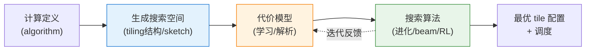
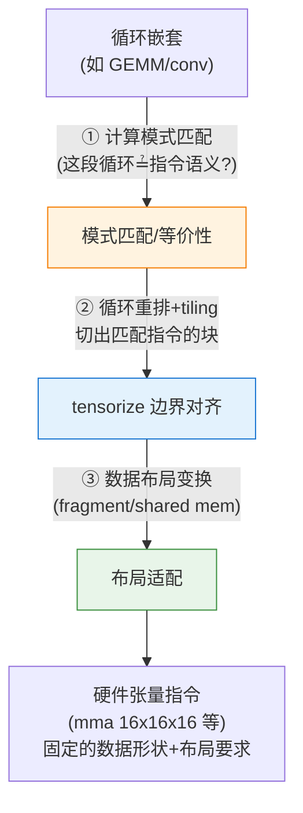

# Polyhedral Model 之后：Auto-Tiling 与 Auto-Tensorize 的技术演进

这是个很好的问题。多面体模型（polyhedral model，如 Pluto、PPCG、isl）奠定了循环变换的理论基础，但它在**tile size 选择**和**映射到硬件张量指令**上都有局限。近十年（尤其是 ML 编译器兴起后）涌现了多条新技术路线。我按 auto-tiling 和 auto-tensorize 两条线分别梳理。

---

## 一、背景：多面体模型的局限

```
多面体模型(Pluto 算法等)擅长：
    ✅ 循环变换合法性判定(依赖分析)
    ✅ 自动发现 tiling / fusion / skewing 的【结构】

但存在痛点：
    ❌ tile size 具体取值 → Pluto 只给出"可 tile"，不给最优尺寸
    ❌ 硬件张量指令映射(Tensor Core 等) → 模型本身不涉及
    ❌ 搜索空间爆炸 + 解析代价模型不准
    ❌ 对非仿射(non-affine)、动态 shape 支持弱
```

---

## 二、Auto-Tiling 的主要技术路线

### 路线 A：搜索式自动调度（ML 编译器主流）

这是近年最主流的方向——**把 tiling/调度当作搜索问题**，用代价模型 + 搜索算法自动探索。

| 系统                        | 核心思想                                         | 关键特征                   |
| ------------------------- | -------------------------------------------- | ---------------------- |
| **Halide auto-scheduler** | 分离 algorithm 与 schedule，beam search + 学习代价模型 | 开创"计算与调度分离"            |
| **AutoTVM**               | 模板（template）+ 参数搜索                           | 需人工写 schedule template |
| **Ansor (TVM)**           | **无模板**，分层生成 sketch + 随机注入 tiling，进化搜索       | 自动生成搜索空间               |
| **Meta-Schedule (TVM)**   | 统一的可编程搜索抽象，替代前两者                             | TVM 现代方案               |



**Ansor 的关键突破**：不需要人写模板，而是自动把程序分解为多个子图，为每个子图生成分层的 tiling 结构（sketch），再随机填充具体 tile size，用进化搜索 + 学习代价模型剪枝。

### 路线 B：多面体 + 自动调优结合

| 系统                                   | 特点                          |
| ------------------------------------ | --------------------------- |
| **Tensor Comprehensions** (Facebook) | 多面体 IR + 遗传算法调 tile size    |
| **Tiramisu**                         | 多层 IR，多面体调度 + 显式调度命令        |
| **AKG** (华为，Ascend)                  | 多面体自动 tiling + 针对 NPU 的存储层次 |
| **Polly / MLIR affine**              | LLVM/MLIR 内的多面体基础设施         |

这条线试图**保留多面体的合法性保证**，同时用搜索弥补 tile size 决策。

### 路线 C：解析式/学习式代价模型

tiling 的核心难点是**代价预测**。近年趋势：

```
纯解析模型(roofline, cache model) → 不够准
        ↓
学习式代价模型(XGBoost / GNN / Transformer)
    • TVM 的代价模型
    • TenSet(大规模数据集)
    • TLP、TiRex 等基于 learned model 的预测器
        ↓
减少真实硬件测量次数，加速搜索
```

---

## 三、Auto-Tensorize 的主要技术路线

Auto-tensorize 的核心挑战：**自动识别一段循环嵌套能否映射到硬件张量指令**（如 NVIDIA Tensor Core 的 `wmma/mma`、TPU 的 MXU、各种 dot-product 指令），并生成正确的数据布局与调用。

### 核心难点



### 代表性技术

| 系统 / 论文                 | 方法                                          | 贡献                     |
| ----------------------- | ------------------------------------------- | ---------------------- |
| **TVM tensorize 原语**    | 手工声明 tensor intrinsic，编译器做匹配替换              | 最早的实用机制，但需人工描述指令       |
| **UNIT** (CGO 2021)     | 统一张量化指令抽象，自动检测可张量化循环                        | 自动化 intrinsic 匹配       |
| **AMOS** (ISCA 2022)    | **软硬件映射抽象**，自动探索计算到 spatial 硬件的映射           | 无需手写 intrinsic，自动映射+调优 |
| **Hidet** (ASPLOS 2023) | task-mapping 编程范式，细粒度控制 tensor 程序           | 更强的调度表达力               |
| **Graphene**            | 张量核映射的层次化 IR 抽象                             | 表达复杂张量指令映射             |
| **Mosaic / Triton**     | block-level 编程，程序员写 block，编译器负责 tensor core | 折中：牺牲部分自动化换性能可控        |

### AMOS 的思路（较有代表性）

```
传统 tensorize：人工描述硬件指令的 compute intrinsic + 手工匹配
        ↓
AMOS：定义"软件-硬件映射"抽象
    • 描述硬件指令的计算语义与访存能力
    • 自动探索：循环如何切分、映射到指令
    • 结合搜索找最优映射
        ↓
显著降低支持新硬件/新算子的人工成本
```

---

## 四、新兴趋势与方向

### 1. MLIR 生态：多层 IR + 渐进式 lowering

```
Linalg dialect (结构化算子)
    ↓ tiling/fusion pass
Affine / SCF dialect
    ↓ vectorize / tensorize
硬件相关 dialect (GPU/NVVM/...)
```

MLIR 的 **linalg** 提供了结构化的算子表示，tiling 和 tensorize 作为 pass 逐层下降，成为许多新编译器（IREE、Triton 后端等）的基础设施。

### 2. Equality Saturation / 重写驱动

- **egg / egglog**：用 e-graph 做等价重写，探索 tiling/tensorize 变换空间而不会过早提交（避免 phase-ordering 问题）
- 在张量图层已有 **TASO / PET** 用类似思路做子图替换

### 3. 学习驱动的端到端

- 用 RL / 强化学习探索调度（如早期的 device placement、AutoPhase）
- 大规模 learned cost model（TenSet 数据集）

### 4. 面向动态 shape

传统多面体假设静态仿射边界，近年针对 LLM 等**动态 shape** 场景：

- TVM Unity / Relax
- 符号化 shape 的 tiling 与 tensorize

---

## 五、总结对比

| 维度            | 多面体模型      | 搜索式(Ansor等)        | Auto-tensorize(AMOS等) |
| ------------- | ---------- | ------------------ | --------------------- |
| **tiling 结构** | 解析推导（合法性强） | 自动生成 sketch        | 由指令映射决定               |
| **tile size** | 不擅长        | 搜索 + 代价模型          | 搜索                    |
| **张量指令映射**    | 不涉及        | 有限（需 tensorize 原语） | **核心目标**              |
| **合法性保证**     | ✅ 强        | 依赖框架               | 依赖映射抽象                |
| **动态 shape**  | 弱          | 逐步支持               | 逐步支持                  |

```
一句话概括近年演进：

多面体模型解决了"如何合法变换循环"，
但把"选多大的 tile"和"怎么用上张量硬件"留给了后人。
        ↓
Auto-tiling：主要靠【搜索 + 学习代价模型】(Ansor/Meta-Schedule)
             + 多面体做合法性骨架(AKG/Tiramisu)
        ↓
Auto-tensorize：从【手工 intrinsic 匹配】(TVM tensorize)
                走向【自动软硬件映射抽象】(UNIT/AMOS/Hidet)
        ↓
基础设施层：MLIR(linalg→affine→硬件) 成为共同底座
研究前沿：equality saturation、learned model、动态 shape
```

---

> ⚠️ **一点说明**：这是一个**快速演进**的领域，我对上述主流系统（Halide、TVM/Ansor、AMOS、MLIR linalg 等）的核心思想较有把握，但个别论文的**具体发表年份/会议**可能有出入，建议以原论文为准。如果你有更具体的关注点（比如**只关心 GPU Tensor Core 映射**，或**动态 shape 下的 tiling**，或**MLIR 生态的具体 pass**），我可以就某一条线展开更深入的技术细节。

你目前更关注**auto-tiling 的搜索/代价模型**，还是**auto-tensorize 的硬件指令映射**这一侧？

这是一个非常好的问题。polyhedral model 在循环变换方面奠定了理论基础，但在 auto-tiling 和 auto-tensorize 的实际应用上，近十年来确实涌现了大量新工作。让我搜索一下最新的进展。

## Polyhedral Model 之后的 Auto-Tiling 与 Auto-Tensorize 技术全景

这是一个研究热点非常活跃的领域。polyhedral model 在理论上非常优美（精确建模迭代空间的依赖关系、自动推导合法变换），但在实践中存在三个根本局限：

1. **只适用于静态控制流**的完美循环嵌套（SCoPs），难以处理动态 shape、稀疏计算、不规则访存
2. **Tile size 选择是非凸优化问题**——polyhedral 能告诉你"可以如何 tiling"，但不能告诉你"最优 tile size 是多少"
3. **Tensorize 需要硬件感知**——将循环映射到张量指令（如 MMA、tensor core）需要对硬件 ISA 和内存层级的精确建模

因此近十年涌现了大量新方法，大致可以分为以下几条主线：

---

### 一、搜索驱动方法（Search-based）——"搜出来"的 tile size 和 schedule

这是目前**工业界最主流**的方向，核心思想是把 auto-tiling/auto-tensorize 转化为搜索问题。

**1. TVM 生态（三代演进）**

| 系统                  | 年份    | 核心思想                                  | 对 tiling 的处理                                     |
| ------------------- | ----- | ------------------------------------- | ------------------------------------------------ |
| **AutoTVM**         | 2018  | 手写模板 + ML-based cost model + 模拟退火搜索   | 模板中预定义 tiling 参数，搜索最优 tile size                  |
| **Ansor** (OSDI'20) | 2020  | 分层搜索空间 + 进化搜索，无需手写模板                  | 自动生成"草图"（sketch），包含多种 tiling 结构，再搜索参数            |
| **MetaSchedule**    | 2022+ | 统一 AutoTVM 和 Ansor，更灵活的调度原语 + 随机/进化搜索 | 用 `tile`、`split`、`reorder` 等调度原语描述 tiling，自动搜索组合 |

Ansor 是分水岭——它不依赖手写模板，而是通过递归分解计算图来**自动生成包含各种 tiling 结构的搜索空间**，然后用进化算法搜索最优配置。这是从"polyhedral 理论推导"到"数据驱动搜索"的重要转向。

**2. ROLLER（OSDI 2022, Microsoft）——构造式 + 硬件对齐**

ROLLER 走了一条不同的路：**不搜索，而是构造**。核心创新是 `rTile` 抽象——一种与底层加速器硬件特性（内存带宽、SM 数量、tensor core 规格）对齐的 tile 表示。它将算子计算建模为**基于 tile 的流水线**，通过递归构造算法生成 `rProgram`，**编译时间只需数秒**，而不是 TVM 的小时级。这对 auto-tiling 的核心贡献是：通过与硬件 spec 对齐来**大幅缩小 tile size 的有效搜索空间**，甚至完全避免搜索。

**3. LOOPer（2024）——深度学习驱动的 polyhedral 自动调度器**

这是 polyhedral 方向上最新的重要工作。LOOPer 是**第一个使用深度学习 cost model 的 polyhedral 自动调度器**，它用 GNN（图神经网络）来预测不同 tile size 和循环变换组合的性能，从而解决传统 polyhedral 编译器（如 Pluto）中 cost model 不准的问题。它将 polyhedral 的优雅理论与 ML 的数据驱动能力结合了起来。

**4. Pearl（2025）——深度强化学习自动代码优化**

Pearl 使用深度强化学习来自动选择代码优化序列，包括 tiling、loop unrolling、vectorization 等。与搜索方法不同，RL agent 学习的是"在不同代码上下文中应该应用什么优化"的策略，而非针对每个 kernel 从头搜索。

**5. AutoTriton（2025）——强化学习自动生成 Triton 程序**

这是针对 Triton 语言的自动编程工具，使用强化学习自动生成 Triton kernel，包括自动决定 tiling 结构和参数。它的意义在于：将"人写 Triton kernel"这个过程自动化了。

---

### 二、编译器 IR 层面的结构性方法——用 IR 设计"消化" tiling 和 tensorize

**1. MLIR Linalg Dialect**

MLIR 的 `linalg` dialect 提供了一种**结构化操作**（structured ops）的表示，如 `linalg.matmul`、`linalg.conv_2d`，这些操作自带迭代空间语义。在此基础上：

- `linalg.tile` pass 可以对操作进行分块
- `linalg.vectorize` 可以将分块后的操作映射到向量/SIMD 指令
- 结合 `transform` dialect，可以用脚本控制 tiling 层次和 tile size

核心思路是：**不是编译器自动决定 tile size，而是提供一个灵活的框架让人或上层工具来指定**。IREE、Torch-MLIR 等编译器都基于此构建。

**2025 年的进展**：LLVM Dev Meeting 上专门有 tutorial 讨论如何用 MLIR 的 linalg dialect 构建"tiling tower"（多层分块），以及 MLIR 新增的 `Tiling-Aware Vectorization Framework`（2026），在 tile 之后自动进行向量化。

**2. Triton（OpenAI, 2019+）——block-level 编程模型**

Triton 走了另一条路：**不是全自动 tiling，而是将 tiling 的责任部分转移给程序员**。程序员以 "block" 为粒度编写 kernel（每个 block 对应一个 GPU program），编译器再自动处理：

- Block 内的 memory coalescing
- Shared memory 分配与管理
- 自动向量化/Tensorize 到 MMA 指令

Triton 的核心贡献是通过 **block-level data-flow analysis** 做自动调度——它分析 block 内的数据流，自动决定 prefetch、pipeline 等优化。这比 polyhedral 更"务实"：不追求全自动，而是在人可以理解的一层提供自动化。

**3. Welder（OSDI 2023）——tile-graph 抽象**

Welder 引入 `tile-graph` 作为核心抽象，将算子的内存访问建模为 tile 之间的数据流图，然后**从整体内存访问优化的角度**来决定 tiling 和 fusion 策略。这比 polyhedral 更直接地考虑了内存层级的影响。

**4. TileFlow（MICRO 2023）——融合数据流的系统化建模**

TileFlow 将算子融合的 tiling 设计空间刻画为一个 3D 空间：compute ordering、resource binding、loop tiling，并引入了 **tile-centric notation** 来表达各种融合数据流。这为 auto-tiling 中的 fusion+tiling 联合优化提供了形式化基础。

---

### 三、端到端全自动方法——"数学公式直接到高效 kernel"

**Nautilus（2026 年 4 月，UIUC）**

这是**最新、最激进**的工作——宣称实现从"类数学公式的代数描述"到"高效分块 GPU kernel"的全自动编译。具体来说：

- 输入：类似数学公式的 attention 定义
- 中间：多层 successive lowering（高层表达式重写 → tile optimizer）
- 输出：自动发现 **FlashAttention-3 级别**的融合 kernel

Nautilus 的 auto-scheduler 在搜索优化序列时，同时保证两点：

1. 保持程序结构足够规整，让 tile optimizer 能正常施展
2. 捕捉全局变换（如 reduction fusion）对性能的影响

在 GH200 上比 SOTA 编译器吞吐量提升最高 23%，RTX 5090 上提升 42%。这标志着 auto-tiling 正从"半自动"走向"真·全自动"。

---

### 四、工业实践

| 项目                              | 机构           | 方法                                                          |
| ------------------------------- | ------------ | ----------------------------------------------------------- |
| **AKG** (Auto Kernel Generator) | 华为/MindSpore | 基于 polyhedral 做 auto-tiling、auto-vectorization，结合 Halide-IR |
| **XLA**                         | Google       | 预定义 tiling pattern + HLO fusion，偏保守的自动优化                    |
| **TensorRT**                    | NVIDIA       | 手写 kernel 模板 + 有限的自动 kernel 选择                              |
| **IREE**                        | Google/社区    | 基于 MLIR linalg，transform dialect 驱动的 tiling pipeline        |

---

### 五、总结：技术演进脉络

```
Polyhedral Model (1990s-2010s)
    │  理论优美，但 tile size 选择和 tensorize 映射是弱项
    │
    ├── 搜索驱动 ─────────────────────────────────────────────
    │   AutoTVM (2018) → Ansor (2020) → MetaSchedule (2022)
    │   Roller (2022) —— 硬件对齐构造，秒级编译
    │   Pearl (2025) / LOOPer (2024) —— ML/RL 驱动的搜索
    │   AutoTriton (2025) —— RL 自动生成 Triton kernel
    │
    ├── IR 结构驱动 ─────────────────────────────────────────
    │   MLIR Linalg (2020+) —— 结构化操作 + transform dialect
    │   Triton (2019+) —— block-level 编程 + 编译器自动处理
    │   Welder (2023) —— tile-graph 全内存视角优化
    │   TileFlow (2023) —— tiling+fusion 联合设计空间建模
    │
    └── 端到端全自动 ────────────────────────────────────────
        Nautilus (2026) —— 数学公式 → FlashAttention-3 级别 kernel
```

**关键趋势**：

- 从"纯编译器推导"到"**搜索 + 学习**"的混合范式
- 从"通用循环优化"到"**硬件感知**的专用优化（tile size 必须与 tensor core、shared memory 规格对齐）
- 从"全自动"到"**可分层的自动化**"（Triton 让人管 block-level，编译器管 block 内；MLIR 让人/工具管 transform pipeline）
- 最新的趋势是 **"数学公式直接到高效 kernel"**（Nautilus），用 successive lowering + auto-scheduler 统一处理 tiling、fusion、tensorize

如果你感兴趣，我建议重点阅读 **Ansor (OSDI'20)**、**ROLLER (OSDI'22)**、**Welder (OSDI'23)** 和 **Nautilus (2026)** 这四篇——它们代表了 auto-tiling/auto-tensorize 从搜索、构造、图优化到端到端全自动的完整演进谱系。需要我帮你整理其中某篇的详细技术要点吗？
