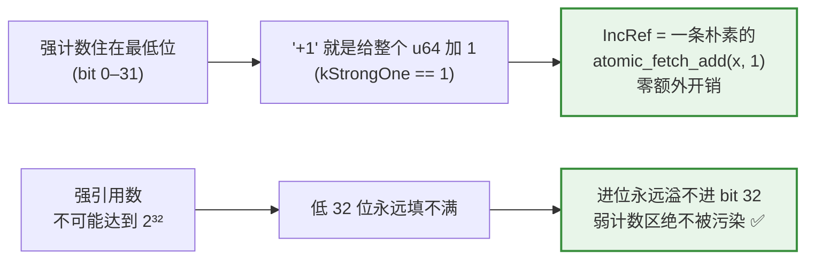
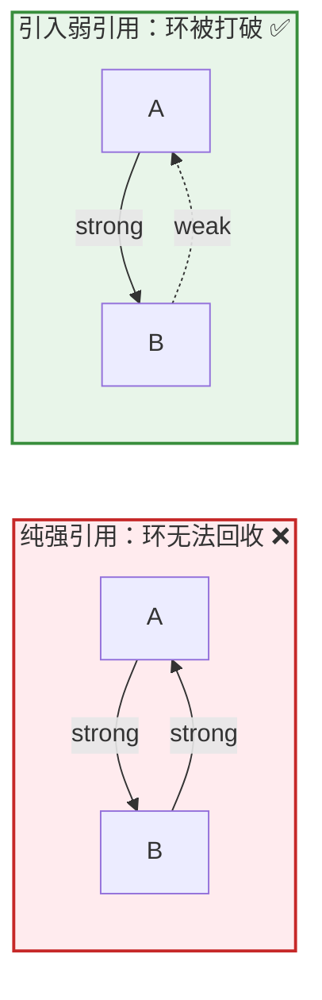
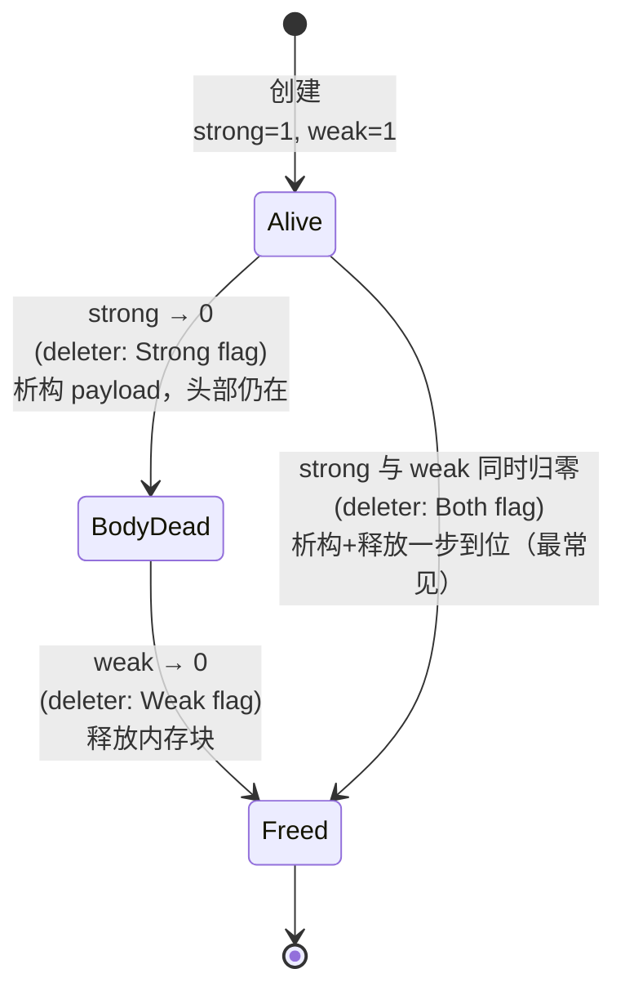

# [struct TVMFFIObject](https://github.com/apache/tvm-ffi/blob/main/include/tvm/ffi/c_api.h)

TVMFFIObject：24 字节对象头如何支撑跨语言的引用计数与动态类型系统

## 1. 引言

如果说 `TVMFFIAny` 是 TVM FFI 中"值的通用货币"，那么 `TVMFFIObject` 就是**所有堆上对象的共同祖先**。String、Bytes、Error、Function、Shape、Tensor、Array、Map、Module，乃至用户通过反射系统注册的自定义类型——它们的内存布局都以同一个 24 字节的头部开头：

> 所有 TVM-FFI 对象共享这些特征：堆分配、引用计数、**布局稳定的 24 字节头部**（含引用计数、类型索引与 deleter 回调）、`type_index >= kTVMFFIStaticObjectBegin`。

这个头部是整个 ABI 中"稳定而又可扩展"（stable yet extensible）矛盾的解决者：布局固定不变以保证二进制兼容，类型系统却能无限扩展。本文逐字段拆解它的设计。

## 2. 内存布局：24 字节，四段

`TVMFFIObject` 的完整定义：

```c
typedef struct {
  /*!
   * \brief Combined strong and weak reference counter of the object.
   *
   * Strong ref counter is packed into the lower 32 bits.
   * Weak ref counter is packed into the upper 32 bits.
   *
   * It is equivalent to { uint32_t strong_ref_count, uint32_t weak_ref_count }
   * in little-endian structure:
   *
   * - strong_ref_count: `combined_ref_count & 0xFFFFFFFF`
   * - weak_ref_count: `(combined_ref_count >> 32) & 0xFFFFFFFF`
   *
   * Rationale: atomic ops on strong ref counter remains the same as +1/-1,
   * this combined ref counter allows us to use u64 atomic once
   * instead of a separate atomic read of weak counter during deletion.
   *
   * The ref counter goes first to align ABI with most intrusive ptr designs.
   * It is also likely more efficient as rc operations can be quite common.
   */
  uint64_t combined_ref_count;
  /*!
   * \brief type index of the object.
   * \note The type index of Object and Any are shared in FFI.
   */
  int32_t type_index;
  /*! \brief Extra padding to ensure 8 bytes alignment. */
  uint32_t __padding;
  union {
    /*!
     * \brief Deleter to be invoked when strong reference counter goes to zero.
     * \param self The self object handle.
     * \param flags The flags to indicate deletion behavior.
     * \sa TVMFFIObjectDeleterFlagBitMask
     */
    void (*deleter)(void* self, int flags);
    /*!
     * \brief auxilary field to TVMFFIObject is always 8 bytes aligned.
     * \note This helps us to ensure cross platform compatibility.
     */
    int64_t __ensure_align;
  };
} TVMFFIObject;
```

布局图：

```text
offset 0  ┌──────────────────────────────────┐
          │ uint64_t combined_ref_count      │  8 字节：强/弱引用计数打包
          │  ├─ 低 32 位：strong_ref_count   │
          │  └─ 高 32 位：weak_ref_count     │
offset 8  ├──────────────────────────────────┤
          │ int32_t type_index               │  4 字节：类型标签
offset 12 ├──────────────────────────────────┤
          │ uint32_t __padding               │  4 字节：显式对齐填充
offset 16 ├──────────────────────────────────┤
          │ union {                          │  8 字节：
          │   void (*deleter)(void*, int)    │   ├─ 析构回调
          │   int64_t __ensure_align         │   └─ 对齐锚点
          │ }                                │
          └──────────────────────────────────┘
sizeof(TVMFFIObject) = 24，alignof = 8
```

$$
\text{sizeof}(\texttt{TVMFFIObject}) = \underbrace{8}_{\text{ref count}} + \underbrace{4}_{\text{type\_index}} + \underbrace{4}_{\text{padding}} + \underbrace{8}_{\text{deleter}} = 24 \text{ bytes}
$$

对象的具体数据（如 `StringObj` 的 `TVMFFIByteArray`、`FunctionObj` 的 `TVMFFIFunctionCell`）紧跟在这 24 字节之后。这正是为什么文档中的示例可以用 `reinterpret_cast<char*>(v_obj) + sizeof(TVMFFIObject)` 做指针算术直接取到 payload。

## 3. combined_ref_count：一次原子操作管两个计数器

### 3.1 位级布局

这是最精妙的一个字段。强引用与弱引用两个 32 位计数器被打包进单个 `uint64_t`：

```c
/*! \brief One counter for weak reference. */
constexpr uint64_t kCombinedRefCountWeakOne = static_cast<uint64_t>(1) << 32;
/*! \brief One counter for strong reference. */
constexpr uint64_t kCombinedRefCountStrongOne = 1;
/*! \brief Both reference counts. */
constexpr uint64_t kCombinedRefCountBothOne = kCombinedRefCountWeakOne | kCombinedRefCountStrongOne;
/*! \brief Mask to get the lower 32 bits of the combined reference count. */
constexpr uint64_t kCombinedRefCountMaskUInt32 = (static_cast<uint64_t>(1) << 32) - 1;
```

即：

$$
\texttt{combined\_ref\_count} = (\texttt{weak} \ll 32)\;|\;\texttt{strong}
$$

$$
\texttt{strong} = \texttt{combined\_ref\_count}\;\&\;\texttt{0xFFFFFFFF}, \qquad \texttt{weak} = \texttt{combined\_ref\_count} \gg 32
$$

### 3.2 为什么要打包

对比 `std::shared_ptr` 的经典实现（控制块中两个独立的原子计数器），打包设计带来两个关键收益，源码注释说得很直白：

**（a）强引用计数的原子操作退化为普通的 +1/-1。** 由于强计数器占据低 32 位，给它加一就是对整个 u64 加一（`kCombinedRefCountStrongOne == 1`）——低 32 位的进位永远不会"溢入"弱计数区（强引用数不会超过 $2^{32}$）。因此 `IncRef()` 只是一条 `__atomic_fetch_add(..., 1, __ATOMIC_RELAXED)`，与操作独立计数器完全等价、零额外成本：

```c
  void IncRef() {
#ifdef _MSC_VER
    _InterlockedIncrement64(
        reinterpret_cast<volatile __int64*>(&header_.combined_ref_count));  // NOLINT(*)
#else
    __atomic_fetch_add(&(header_.combined_ref_count), 1, __ATOMIC_RELAXED);
#endif
  }
```

**（b）销毁路径只需读一次原子变量。** `shared_ptr` 释放时通常要分别检查"强计数是否归零"和"弱计数是否归零"；而这里一次 `fetch_sub` 的返回值就能同时回答两个问题。看 `DecRef()` 的快路径：

```c
    uint64_t count_before_sub = __atomic_fetch_sub(&(header_.combined_ref_count),
                                                   kCombinedRefCountStrongOne, __ATOMIC_RELEASE);
    if (count_before_sub == kCombinedRefCountBothOne) {
      // common case, we need to delete both the object and the memory block
      // only acquire when we need to call deleter
      __atomic_thread_fence(__ATOMIC_ACQUIRE);
      if (header_.deleter != nullptr) {
```

若减法前的值恰好是 `kCombinedRefCountBothOne`（强 1、弱 1，即对象只有一个强引用、没有额外弱引用——这是无弱指针场景下的常态），一次比较就走完快路径：析构 + 释放内存一步到位。只有当值不匹配时（还有其他强引用，或存在弱引用），才进入慢路径分别处理。弱指针提升（`TryPromoteWeakPtr`）则用 CAS 循环防止"提升与销毁"的竞态。

**（c）引用计数放第一个字段。** 注释给出了两条理由：与主流 intrusive pointer 设计的 ABI 惯例对齐（"The ref counter goes first to align ABI with most intrusive ptr designs"）；引用计数操作极其频繁，放偏移 0 处在多数指令集上有最短的寻址形式。

## 4. deleter：ABI 级的"虚析构函数"

C++ 对象跨动态库边界析构是 ABI 的经典陷阱（两侧可能用不同的 allocator、不同的 CRT）。`TVMFFIObject` 的解法是把析构逻辑做成**对象自带的数据**——一个函数指针：

$$
\texttt{deleter} : (\texttt{void* self},\ \texttt{int flags}) \to \texttt{void}
$$

`flags` 取自 `TVMFFIObjectDeleterFlagBitMask`，精确区分三种销毁时机（`c_api.h:215-230`）：

| flag                                          | 触发时机   | 语义                               |
| --------------------------------------------- | ------ | -------------------------------- |
| `kTVMFFIObjectDeleterFlagBitMaskStrong` ($1$) | 强计数归零  | 调用析构函数，但**不释放内存块**（可能还有弱引用要读头信息） |
| `kTVMFFIObjectDeleterFlagBitMaskWeak` ($2$)   | 弱计数也归零 | **释放内存块**                        |
| `kTVMFFIObjectDeleterFlagBitMaskBoth` ($3$)   | 两者同时归零 | 最常见情形：析构 + 释放一次完成                |

这套"析构与释放分离"的两阶段协议，正是弱引用能够安全存在的基础：强计数归零后对象本体已死，但头部（引用计数、deleter）必须存活到最后一个弱引用离开。

由于 deleter 是创建对象时由**创建方一侧**填入的（C++ 侧 `make_object` 自动完成），释放方无需知道对象的任何类型信息，只需回调这个函数指针——内存由分配它的那一边回收，跨库边界彻底安全。

## 5. type_index：与 Any 共享的运行时类型系统

头部的 `type_index` 与 `TVMFFIAny` 的 `type_index` **使用同一套编号**（"The type index of Object and Any are shared in FFI"），这让"Any 中指针指向的对象类型"与"Any 标签声称的类型"可以互相校验。其取值区间：

- 堆对象的 $\texttt{type\_index} \geq \texttt{kTVMFFIStaticObjectBegin} = 64$；
- $[64, 128)$：框架内置的静态类型（`kTVMFFIStr = 65$、`kTVMFFIFunction = 68$、`kTVMFFITensor = 70$……）；
- $[128, +\infty)$：运行时通过 `TVMFFITypeGetOrAllocIndex` 动态分配的用户类型，支持**单继承**——每个类型记录父类型链，继承检查退化为沿祖先链的整数比较，完全不依赖 C++ RTTI。

这是"extensible"一词的落点：ABI 头部永远不变，但类型空间从 128 起向后无限开放。

## 6. 跨平台兼容性：每一字节都是显式约定

与 `TVMFFIAny` 一脉相承，这个头部把"编译器可以自由发挥"的地方全部钉死：

**（1）`__padding`：显式填充。** `type_index`（4 字节）之后若依赖隐式对齐，填充行为就交由编译器决定；显式声明 `uint32_t __padding` 后，offset 16 在任何平台上都是确定的。C++ 侧构造函数也将其显式清零（`object.h:136`）。

**（2）`__ensure_align`：union 里的对齐锚点。** deleter 是函数指针，32 位平台上只有 4 字节。union 中放入 `int64_t __ensure_align`，强制该 union 的大小为 8、对齐为 8——头部在所有平台上都是 24 字节，且**紧跟其后的 payload 永远 8 字节对齐**。源码注释直接点题：

```c
    /*!
     * \brief auxilary field to TVMFFIObject is always 8 bytes aligned.
     * \note This helps us to ensure cross platform compatibility.
     */
    int64_t __ensure_align;
```

**（3）位布局写入 ABI 文档。** `combined_ref_count` 的注释明确规定了小端下等价于 `{ uint32_t strong, uint32_t weak }` 的结构——位级布局成为契约的一部分，而非实现细节。这正是"稳定 ABI"与"碰巧能跑"的分水岭。

**（4）原子操作的双实现。** GCC/Clang 走 `__atomic_*` 内建，MSVC 走 `_Interlocked*` 系列，保证同一位布局在两个工具链下有等价的原子语义（`object.h` 中 `#ifdef _MSC_VER` 分支随处可见）。

## 7. 与 Any 的协作及 C API 面

`TVMFFIAny` 通过 `v_obj` 指针持有对象时，`type_index >= 64` 即表明"这是一个需要引用计数管理的堆对象"。C API 只暴露两个操作：

```c
int TVMFFIObjectDecRef(TVMFFIObjectHandle handle) {
  TVM_FFI_SAFE_CALL_BEGIN();
  tvm::ffi::details::ObjectUnsafe::DecRefObjectHandle(handle);
  TVM_FFI_SAFE_CALL_END();
}

int TVMFFIObjectIncRef(TVMFFIObjectHandle handle) {
  TVM_FFI_SAFE_CALL_BEGIN();
  tvm::ffi::details::ObjectUnsafe::IncRefObjectHandle(handle);
  TVM_FFI_SAFE_CALL_END();
}
```

注意 C 侧的对象一律以 `typedef void* TVMFFIObjectHandle` 不透明句柄出现——宿主语言（Python、Rust、其他编译器生成的代码）只能增/减引用计数、回调 deleter，而无法也不需知晓对象的真实类型。拥有语义的 `Any` 析构时对 `v_obj` 调 `DecRef`，借用语义的 `AnyView` 则不动计数，所有权规则与头部协议严丝合缝。

## 8. 结语

`TVMFFIObject` 的 24 字节回答了一个难题：**如何在不暴露任何 C++ 实现的前提下，让任意语言安全地共享堆对象？**

- `combined_ref_count` 用一次 u64 原子操作同时承载强/弱两个计数器，把 `shared_ptr` 级别的语义压缩到 intrusive pointer 的成本；
- `deleter` 函数指针是 ABI 级的虚析构，配上三态 flags，把"析构"与"释放"解耦，让跨库内存回收和弱引用都安全可行；
- `type_index` 与 Any 共享编号、静态/动态分区，在不依赖 RTTI 的前提下支撑可扩展的单继承类型体系；
- `__padding` 与 `__ensure_align` 则把布局的每一字节都变成显式契约，兑现 "ensure cross platform compatibility"。

与 16 字节的 `TVMFFIAny` 合在一起，两者构成了 TVM FFI 稳定 ABI 的最小内核：**Any 负责"值怎么传"，Object 负责"对象怎么活"**。

# 解释：强计数 +1 为什么等价于对整个 u64 +1

## 先回顾布局

`combined_ref_count` 是一个 64 位整数，两个 32 位计数器**并排塞在里面**：

$$
\texttt{combined\_ref\_count} = \underbrace{(\texttt{weak} \ll 32)}_{\text{高 32 位}}\;|\;\underbrace{\texttt{strong}}_{\text{低 32 位}}
$$

画成二进制（64 个 bit）：

```text
 bit 63 ......................... bit 32 │ bit 31 ......................... bit 0
┌────────────────────────────────────────┬────────────────────────────────────────┐
│          weak_ref_count (32 位)         │         strong_ref_count (32 位)        │
└────────────────────────────────────────┴────────────────────────────────────────┘
        高 32 位 = 弱计数                          低 32 位 = 强计数
```

- **强计数**住在 **低 32 位**（bit 0–31）
- **弱计数**住在 **高 32 位**（bit 32–63）

---

## 第一句：为什么"给强计数加一 = 对整个 u64 加一"

因为 **`kCombinedRefCountStrongOne == 1`**。

强计数在最低位，所以"给强计数加 1"这个语义，对应的数值就是给整个 64 位数加上 $1 \times 2^0 = 1$：

$$
\texttt{kCombinedRefCountStrongOne} = 1 = \underbrace{0\ldots0}_{32\text{ 位 weak}}\underbrace{0\ldots0001}_{32\text{ 位 strong}}
$$

对比一下弱计数的"加一"——弱计数在 bit 32，所以它的"1"要左移 32 位：

$$
\texttt{kCombinedRefCountWeakOne} = 1 \ll 32 = \underbrace{0\ldots0001}_{32\text{ 位 weak}}\underbrace{0\ldots0000}_{32\text{ 位 strong}}
$$

**关键结论**：由于强计数恰好落在最低位，它的"+1"就是普通整数的"+1"。于是 `IncRef()` 不需要任何位运算、掩码、移位——**一条最朴素的 `atomic_fetch_add(&x, 1)` 就完成了**，和操作一个独立的 32 位计数器**成本完全相同、零额外开销**。

```c
// IncRef 本质上就是：combined_ref_count += 1
__atomic_fetch_add(&(header_.combined_ref_count), 1, __ATOMIC_RELAXED);
```

---

## 第二句：为什么进位"永远不会溢入弱计数区"

这是这个技巧能成立的**安全性保证**。

### 担心的是什么？

既然强、弱共用一个 64 位数，一个自然的担忧是：**给低 32 位（强计数）不断加一，会不会加着加着"满了"，进位跑到第 33 位，把高 32 位（弱计数）也 +1，从而污染弱计数？**

低 32 位能表示的最大值是：

$$
2^{32} - 1 = \texttt{0xFFFFFFFF} = 4{,}294{,}967{,}295
$$

**只有当强计数达到 $2^{32}-1$ 后再 +1**，才会发生"低 32 位归零、进位溢入 bit 32"的情况：

```text
   低32位 = 0xFFFFFFFF，再 +1
   ┌──────────┬──────────┐
   │ weak = W │0xFFFFFFFF│   +1
   └──────────┴──────────┘
              ↓ 进位溢入！
   ┌──────────┬──────────┐
   │ weak=W+1 │0x00000000│   ← 弱计数被意外 +1，强计数归零 💥
   └──────────┴──────────┘
```

### 为什么现实中不会发生？

因为 **`strong` 表示"同时有多少个强引用（`ObjectRef`）指向这个对象"**。要触发溢出，就得**同时存在超过 42 亿（$2^{32}$）个活跃的强引用指向同一个对象**。

这在物理上不可能：

- 每个强引用（`ObjectRef`）本身至少要占几个字节的存储；
- 42 亿个引用光是存放这些指针本身就需要**几十 GB 内存**；
- 任何真实程序都不可能对单个对象持有如此多的引用。

所以注释里说 **"强引用数不会超过 $2^{32}$"**——这是一个在实践中**绝对安全的假设**。既然强计数永远达不到 $2^{32}$，低 32 位就永远不会满、永远不会向 bit 32 进位，**弱计数区因此永远不会被强计数的加减操作污染**。

---

## 一句话总结



- **前半句**讲**效率**：强计数在最低位，故"+1"退化为对整个 u64 的普通原子 +1，和独立计数器一样便宜。
- **后半句**讲**安全**：强引用数实际上不可能达到 $2^{32}$，所以低 32 位永远不会溢出进位到高位，两个计数器虽然共用一个整数，却**互不干扰**。

这正是"把两个计数器打包进一个 u64"能够既**高效**又**正确**的根本原因。

下面先直接回答这个问题，然后把它**整理成一节可直接插入原文档的内容**（建议作为新的 **3.2 节**插入，原「3.2 为什么要打包」顺延为 **3.3**）——因为逻辑上应当先讲清"**为什么存在两个计数器**"，再讲"**为什么把它们打包进一个 u64**"。

---

## 3.2 为什么需要强引用计数和弱引用计数？

在拆解"打包技巧"之前，必须先回答一个更根本的问题：**为什么一个计数器不够，非要强、弱两个？** 答案是——**它们回答的是两个不同的问题**：

$$
\underbrace{\texttt{strong\_ref\_count}}_{\text{"还有人\textbf{拥有}我吗？"}} \quad\text{vs.}\quad \underbrace{\texttt{weak\_ref\_count}}_{\text{"还有人\textbf{观察}我吗？"}}
$$

|                | 强引用（strong）       | 弱引用（weak）        |
| -------------- | ----------------- | ---------------- |
| **语义**         | 所有权（ownership）    | 观察权（observation） |
| **是否延长对象生命周期** | ✅ 是               | ❌ 否              |
| **归零时触发**      | 析构对象本体（payload）   | 释放内存块（含 24 字节头部） |
| **典型持有者**      | `ObjectRef`（拥有语义） | 弱指针 / 缓存 / 反向引用  |

### 3.2.1 只有强引用计数，会遇到三个致命问题

纯强引用计数（如仅有 `strong` 的 intrusive pointer）虽然简单，却无法解决以下场景——**这正是弱引用存在的理由**：

**① 打破循环引用，避免内存泄漏（最根本的原因）**

引用计数的经典缺陷：**它无法回收环形引用**。若对象 A 强引用 B、B 又强引用 A，则两者的强计数**永远不会归零**，即便外部已无人使用，它们也永远无法被释放——内存泄漏。

TVM 本质是一个**编译器 / IR 系统**，其数据结构（AST、图节点、作用域）中"子节点持有对父节点的反向引用"极为常见，天然容易成环。**把反向引用改用弱引用，即可打破环**：



**② 支持"引用但不拥有"的观察场景**

缓存（cache）、观察者（observer）、父子反向指针等场景，都需要"**引用一个对象，但不希望因此延长它的生命周期**"。若用强引用，缓存就会把本该释放的对象一直"钉"在内存里；用弱引用则能做到——**对象该死就死，弱引用只是旁观**。

**③ 安全地访问"可能已销毁"的对象**

弱引用可通过原子操作 `TryPromoteWeakPtr`**尝试提升为强引用**：

- 若对象仍存活（`strong > 0`）→ 提升成功，安全拿到一个强引用；
- 若对象已被析构（`strong == 0`）→ 提升失败，返回空。

这就从根本上杜绝了**悬垂指针（dangling pointer）**的未定义行为——你永远不会访问到一个已经死掉的对象本体。

### 3.2.2 关键推论：为什么头部必须"比对象本体活得更久"

上面三点引出了本设计**最核心的机制**，也正是第 4 节 deleter 三态 flags 存在的根源：

> **强计数归零 ≠ 立即释放内存。** 对象本体（payload）可以死，但 24 字节头部（引用计数 + deleter）必须存活到**最后一个弱引用离开**。

原因很直接：弱引用要判断"对象是否还活着"，就必须去读头部里的强计数；如果强计数归零时连头部一起释放了，弱引用就会读到一块已被回收的内存——功亏一篑。因此销毁被拆成**两个阶段**，需要**两个计数器分别把关**：

$$
\texttt{strong} \to 0 \;\Rightarrow\; \text{析构对象本体（但保留头部）} \qquad \texttt{weak} \to 0 \;\Rightarrow\; \text{释放整块内存（含头部）}
$$



> 💡 **这解释了初始状态为何是 `strong=1, weak=1`（即 `kCombinedRefCountBothOne`）**：那 1 个弱引用是"**所有强引用共同持有的一份弱引用**"——只要还有强引用存在，头部就一定存活。当强计数归零、且无其他弱引用时，两个计数同时归零，走 `Both` 快路径一步完成析构与释放。

### 3.2.3 小结

- **强计数管"对象本体何时析构"，弱计数管"内存块何时释放"**——这是两个不同的时刻，必须用两个计数器分别把关。
- **弱引用的三大价值**：打破循环引用（防泄漏）、支持"观察而不拥有"、安全提升访问（防悬垂）。
- 正因需要"**头部比本体活得更久**"，才有了后文 deleter 的**析构 / 释放两阶段协议**与三态 flags。

**这也顺势引出了下一个工程问题**：既然要维护两个 32 位计数器，如何让最频繁的引用计数操作依然廉价？——见 3.3。

---

## 3.3 为什么要打包（原 3.2）

> *（原文「3.2 为什么要打包」的全部内容移到此处，编号顺延为 3.3。其余各节序号不变。）*

对比 `std::shared_ptr` 的经典实现（控制块中两个独立的原子计数器），打包设计带来两个关键收益……（下略，保持原文不变）

---

## 整合说明

- **插入位置**：新增的 **3.2**"为什么需要强引用计数和弱引用计数？"插在原「3.1 位级布局」与「3.2 为什么要打包」之间。
- **编号调整**：原 **3.2 为什么要打包** → 顺延为 **3.3**；第 4 节及之后不变。
- **逻辑衔接**：这样安排后，第 3 节形成一条完整的递进链——**3.1 布局是什么 → 3.2 为什么要两个计数器 → 3.3 为什么把它们打包成一个 u64**，并与第 4 节 deleter 三态 flags 前后呼应（3.2.2 的两阶段销毁正是 flags 的设计动机）。

> 如果你希望，我可以把这一节**与原文完全合并、输出一份编号已全部调整好的完整 `TVMFFIObject` 文档**，或进一步补充 **`TryPromoteWeakPtr` 的 CAS 循环源码逐行解析**（弱引用提升如何用 compare-and-swap 防止"提升与销毁"竞态）。😊
