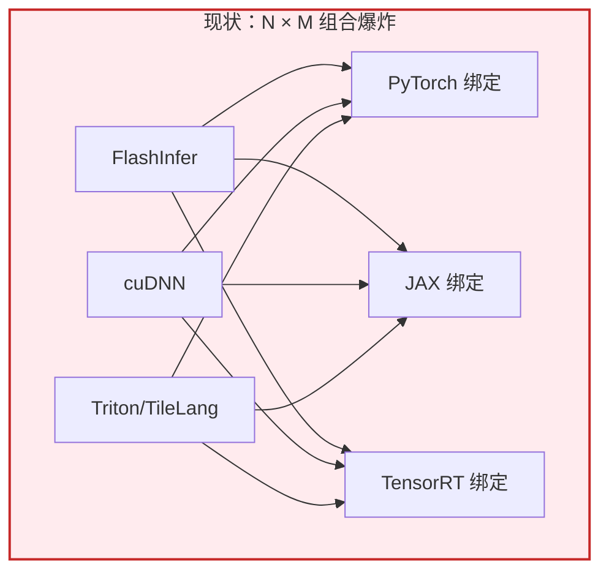
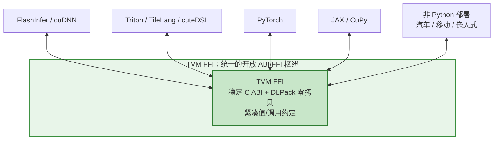
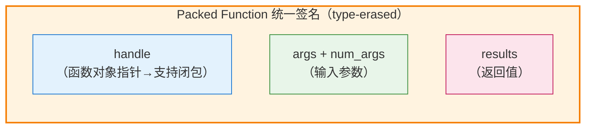
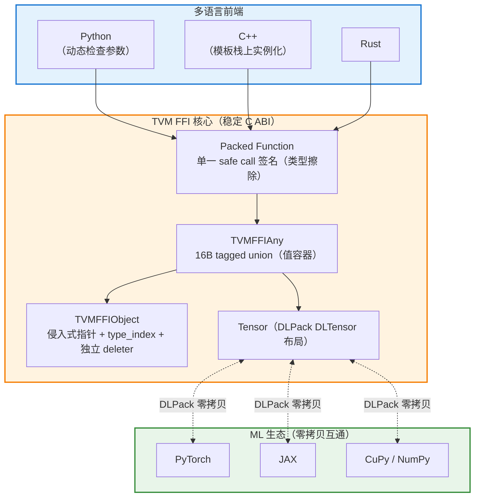

# [tvm-ffi](https://github.com/apache/tvm-ffi)

**Apache TVM FFI** is an open ABI and FFI for machine learning systems. It is a minimal, framework-agnostic(框架无关), yet flexible open convention with the following systems in mind:

- **Kernel libraries** - ship one wheel to support multiple frameworks, Python versions, and different languages. [[FlashInfer](https://docs.flashinfer.ai/)]
- **Kernel DSLs** - reusable open ABI for JIT and AOT kernel exposure frameworks and runtimes. [[TileLang](https://tilelang.com/)][[cuteDSL](https://docs.nvidia.com/cutlass/latest/media/docs/pythonDSL/cute_dsl_general/compile_with_tvm_ffi.html)]
- **Frameworks and runtimes** - a uniform extension point for ABI-compliant libraries and DSLs. [[PyTorch](https://tvm.apache.org/ffi/get_started/quickstart.html#ship-to-pytorch)][[JAX](https://tvm.apache.org/ffi/get_started/quickstart.html#ship-to-jax)][[PaddlePaddle](https://tvm.apache.org/ffi/get_started/quickstart.html#ship-to-paddle)][[NumPy/CuPy](https://tvm.apache.org/ffi/get_started/quickstart.html#ship-to-numpy)]
- **ML infrastructure** - out-of-box bindings and interop across languages. [[Python](https://tvm.apache.org/ffi/get_started/quickstart.html#ship-to-python)][[C++](https://tvm.apache.org/ffi/get_started/quickstart.html#ship-to-cpp)][[Rust](https://tvm.apache.org/ffi/get_started/quickstart.html#ship-to-rust)][[XGrammar](https://github.com/mlc-ai/xgrammar)]
- **Coding agents** - a unified mechanism for shipping generated code in production.

## 要解决的核心问题：ML 系统的互操作性

我们正处在 AI 系统百花齐放的时代，生态中充斥着大量需要**相互集成**的组件：

- **ML 框架 / 数组库**：JAX、PyTorch、CuPy、NumPy……
- **专用高性能库**：FlashAttention、FlashInfer、cuDNN……
- **ML 编译器与 DSL**（图级与 kernel 级）：Torch Inductor、OpenAI Triton、TileLang、Mojo、cuteDSL、Hidet……
- **新兴的代码生成 Agent**：能自动生成 kernel 并集成进 ML 系统。

生态繁荣带来了创新，但也带来了严峻挑战——**互操作性（Interoperability）**：

> 例如 FlashInfer、cuDNN 需要集成进 PyTorch、JAX、TensorRT 的运行时，而每个运行时的接口要求都不同；ML 编译器/DSL 既要暴露 Python JIT 绑定，又要支持面向汽车、移动等非 Python 环境的 AOT 部署。

现状是：生态为**每一对「DSL/库 ↔ 部署环境」都单独编写专用绑定**（Python / Torch / JAX / TensorRT……），组合爆炸，重复劳动严重。

## 问题的根源：ABI 与 FFI

官方指出，这些互操作挑战的核心是 **ABI** 与 **FFI**：

| 概念                                            | 定义                                                                                                                 |
| --------------------------------------------- | ------------------------------------------------------------------------------------------------------------------ |
| **ABI（Application Binary Interface，应用二进制接口）** | 定义数据结构在内存中如何存储、以及函数调用时确切发生什么。例如 PyTorch 存 Tensor 的方式与 CuPy/NumPy 不同，所以不能直接把 `torch.Tensor` 指针当作 `cupy.NDArray` 传递。 |
| **FFI（Foreign Function Interface，外部函数接口）**    | 定义如何跨语言调用函数。每个 ML 编译器 DSL 都可视为「一门自己的语言」，都需要绑定到 Python 及其他部署环境。                                                     |

**已有的起点**：C ABI——几乎每种语言都能对接，且长期稳定。但 C 只关注 `int`、`float`、裸指针等**低级类型**，不足以直接表达 ML 场景。

**关键洞察**：与其做通用大而全的方案，不如**聚焦机器学习这一专门领域**——因为 ML 中传递的核心数据结构主要是**位于 GPU 上的 Tensor**。于是可以用**极简主义**方式，专注于「可移植地交换 GPU Tensor + 操作它们的函数」。

---

## TVM FFI 的四大核心要素

官方明确列出 TVM FFI 包含以下关键要素：

1. **稳定、最小的 C ABI**：为 kernel、DSL 和运行时扩展而设计。
2. **零拷贝互操作（Zero-copy interop）**：基于 **DLPack 协议**，在 PyTorch、JAX、CuPy 之间零拷贝传递张量。
3. **紧凑的值与调用约定（Compact value and call convention）**：覆盖常见数据类型，实现超低开销的 ML 应用。
4. **多语言开箱即用**：Python、C++、Rust（并规划支持更多语言）。

> **重要定位**：项目的目标**不是再造一个框架或语言**，而是让各 ML 系统组件各展所长，并能**更自然地相互增强**。

---

## 技术设计

### 4.1 统一值容器：`TVMFFIAny`（16 字节 tagged union）

跨框架传递的值，统一存储在核心数据结构 **`TVMFFIAny`** 中：

- 它是一个 **16 字节的 C 结构体**；
- 遵循 **tagged union（带标签联合体）** 的设计原则——用一个标签标识当前存的是什么类型，再存对应的值/指针。

这种紧凑设计使得跨语言传值**无需序列化**，开销极低。

### 4.2 对象管理：`TVMFFIObject` + 侵入式指针

对于堆上的复杂对象，用 **`TVMFFIObject`** 管理：

- 采用**侵入式指针（intrusive pointer）**：`TVMFFIObject` 自身包含指针头，用于管理**类型信息**与**析构（deletion）**；
- 使用 **`type_index` 机制**识别对象类型，且**支持未来扩展**——可在运行时基于字符串 type key 注册**动态类型**，从而引入更多对象类型；
- **独立 deleter（standalone deleter）**：确保对象可以在一种语言/来源分配，而在**另一处安全释放**——这是跨语言内存管理安全的关键。

### 4.3 张量：一等公民，基于 DLPack

TVM FFI 为 **owned（拥有所有权）** 和 **unowned（不拥有）** 的 Tensor 提供一等支持，采用 **DLPack 的 `DLTensor` 布局**：

- 得益于 ML 生态的共同努力，可通过 DLPack **直接引入 PyTorch、NumPy、JAX 的张量/数组**，实现**零拷贝**；
- 同时支持 string、array、map 等常见数据类型。

> 这些值类型已覆盖绝大多数 ML 系统的使用场景。

### 4.4 调用约定：单一标准 C 函数签名（Packed Function）

外部函数调用被视为一等公民。TVM FFI 采用**单一标准的 C 函数**（官方称 **"safe call"**）：

- **`handle`**：指向函数对象本身的指针 → 从而支持**闭包（closure）**；
- **`args` + `num_args`**：描述输入参数；
- **`results`**：存储返回值；
- 当 `args`/`results` 含堆管理对象时，调用方拥有它们的所有权。

这种方式被称为 **packed function**：**用单一签名以「类型擦除（type-erased）」的方式表示所有函数**。它省去了为每个 FFI 调用声明和 JIT 生成 shim 的需要，同时保持合理的效率。

### 4.5 单一签名支撑的三大场景

统一的 packed function 签名，优雅地覆盖了三类调用场景：

| 场景                    | 机制                                                                     |
| --------------------- | ---------------------------------------------------------------------- |
| **从动态语言调用（如 Python）** | 提供 `tvm_ffi` 绑定，**动态检查** Python 传入参数并打包为 args                          |
| **从静态语言调用（如 C++）**    | 利用 **C++ 模板**直接在栈上实例化参数，**省去动态检查**                                     |
| **动态语言回调**            | 该签名让 Python 回调可轻松包装为 `ffi::Function`，逐个转换参数——这是"Python 写逻辑、被编译代码调用"的基础 |

---

## 五、整体架构一览

---

## 与传统 TVM PackedFunc 的关系

TVM FFI **不是全新发明**，而是 TVM 内部 **PackedFunc / FFI 机制多年迭代的产物被"标准化、独立化"**：

| 维度       | 传统 TVM 内置 FFI      | 独立的 apache/tvm-ffi                        |
| -------- | ------------------ | ----------------------------------------- |
| **形态**   | TVM 主仓内部模块         | **独立开源库**，可被主仓以 `3rdparty` 引用，也可被其他项目单独使用 |
| **定位**   | 服务 TVM 自身编译/部署     | 面向**整个 ML 系统社区**的通用 ABI/FFI 标准            |
| **核心抽象** | PackedFunc（类型擦除函数） | 同源，正式化为 **safe call / packed function**   |
| **值容器**  | `TVMValue` 等       | **`TVMFFIAny`**（16B tagged union）         |
| **张量互通** | DLPack             | DLPack（一等支持，零拷贝）                          |
| **目标语言** | 主要 Python / C++    | Python / C++ / Rust（并规划更多）                |

> 简言之：**核心思想一脉相承（用统一的类型擦除 packed function + C ABI 打通多语言），但 tvm-ffi 把它提炼为一个中立、通用、可被 PyTorch/JAX/Triton 等广泛复用的开放标准。**

---

## 核心结论

- **TVM FFI 是面向 ML 系统的开放 ABI + FFI**，2025 年从 Apache TVM 中抽离为独立项目 `apache/tvm-ffi`，志在解决 ML 生态「N×M 绑定组合爆炸」的互操作难题。
- **设计哲学是极简主义 + 领域聚焦**：不造新框架/语言，只专注 ML 最核心的需求——**可移植地交换 GPU Tensor 及操作它们的函数**。
- **四大要素**：① 稳定最小 C ABI；② 基于 DLPack 的零拷贝张量互通；③ 紧凑的值/调用约定（`TVMFFIAny` 16B tagged union）；④ 多语言（Python/C++/Rust）。
- **技术核心**：`TVMFFIAny`（值容器）+ `TVMFFIObject`（侵入式指针对象管理，支持跨语言安全释放）+ **单一 packed function 签名**（类型擦除，覆盖 Python 动态调用、C++ 静态调用、动态语言回调三大场景）。
- **它是 TVM 多年 PackedFunc 经验的标准化沉淀**，也吸收了 NumPy、PyTorch、JAX、MXNet、XGBoost、CuPy 等社区的集体智慧。

---

## 参考来源（已核实）

- **官方公告**：《Building an Open ABI and FFI for ML Systems》，2025-10-21，`https://tvm.apache.org/2025/10/21/tvm-ffi`
- **GitHub 仓库**：`apache/tvm-ffi`（Open ABI and FFI for Machine Learning Systems），`https://github.com/apache/tvm-ffi`
- **官方文档**：`https://tvm.apache.org/ffi/`
- **PyPI 包**：`apache-tvm-ffi`（v0.1.0 已发布），`https://pypi.org/project/apache-tvm-ffi/`
- **社区公告**：Announcing apache-tvm-ffi v0.1.0，`https://discuss.tvm.apache.org/t/announcing-apache-tvm-ffi-v0-1-0/18696`

> ⚠️ 本文的架构图为便于理解而绘制，官方原文配有 `tvmffiany.png`、`tvmffiobject.png`、`safecall.png` 等示意图，建议对照原文查看确切结构布局。

## see also

[构建机器学习系统的开放ABI和FFI标准](https://zhuanlan.zhihu.com/p/81570886474?share_code=hwgF567Z5YkU&utm_psn=1965081659973011118)

[Building an Open ABI and FFI for ML Systems](https://tvm.apache.org/2025/10/21/tvm-ffi)

已核实官方信息（2025-10-21 官方公告 + GitHub 仓库）。下面基于这些一手资料，生成一份关于 **TVM FFI** 的技术文档。
