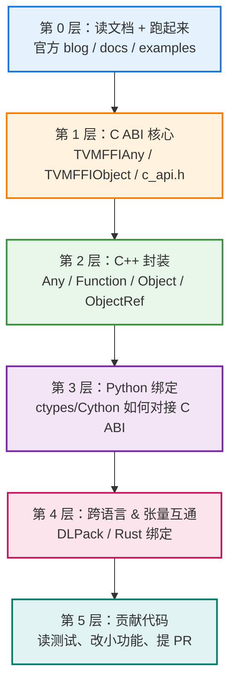
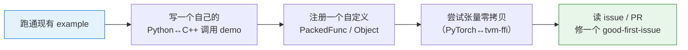

# 如何掌握 apache/tvm-ffi 源代码——学习路线指南

## 前置声明

本文给出一份**系统化的源码学习方法论**。⚠️ 需特别说明：`apache/tvm-ffi` 是 **2025 年新独立**的项目，仍在快速演进，**具体目录结构、文件名、类名会随版本变化**。下文标注的路径（如 `include/tvm/ffi/`）是基于 tvm-ffi 架构的合理推断，**请务必以你 clone 到本地的实际仓库为准**。方法论本身通用可靠。

---

## 一、总体策略：由外到内、由 ABI 到封装

tvm-ffi 是一个**分层清晰**的项目，最佳学习顺序应遵循它的抽象层次——**从最底层稳定的 C ABI 往上，逐层理解封装**。



**核心原则**：这是一个 FFI 库，它的价值在于**"跨越语言边界"**。所以学习时始终抓住一条主线——**一个函数调用/一个张量，是如何从 Python 一路穿过 C ABI 到达 C++ 的**。抓住这条"数据流主线"，源码就不会散。

---

## 二、第 0 层：先读文档、先跑起来（1～2 天）

**不要一上来就读源码。** 先建立全局认知和可运行的环境。

### 2.1 必读材料（按顺序）

1. **官方 blog**：《Building an Open ABI and FFI for ML Systems》（2025-10-21）——理解**设计动机**（为什么要做、解决什么问题）。
2. **官方文档站** `tvm.apache.org/ffi/`——理解 **Stable C ABI、值约定、调用约定**。
3. **仓库 README + `docs/`**——理解项目定位与快速上手。

### 2.2 先把它跑起来

```bash
git clone https://github.com/apache/tvm-ffi.git
cd tvm-ffi
# 阅读 README 的构建说明，通常是 pip 安装或 cmake 构建
pip install apache-tvm-ffi   # 或从源码构建
```

- 跑通仓库里的 **`examples/`** 和 **`tests/`**——**能跑起来的例子是最好的入口**。
- 用调试器/打印，观察一个最简单的 "Python 调用 C++ 函数" 例子的完整流程。

> 💡 **关键心法**：先"用"再"读"。你会调用 API 之后，再去读它背后的实现，理解效率会翻倍。

---

## 三、第 1 层：吃透 C ABI 核心（重中之重）

这是 **整个项目的地基**，也是最该花时间的地方。tvm-ffi 的一切都建立在这套 C ABI 上。

### 3.1 重点文件（推测路径，以实际为准）

| 文件（推测）                    | 内容             | 学习重点                           |
| ------------------------- | -------------- | ------------------------------ |
| `include/tvm/ffi/c_api.h` | 最小 C ABI 定义    | 所有跨语言边界的函数签名                   |
| （`any.h` 相关）              | `TVMFFIAny` 结构 | **16 字节 tagged union** 如何存所有类型 |
| （object 相关）               | `TVMFFIObject` | 侵入式指针、`type_index`、deleter     |

### 3.2 三个必须搞懂的核心问题

结合前文我们已梳理的 tvm-ffi 设计，读这一层时要能回答：

1. **`TVMFFIAny` 是怎么用 16 字节表示 int/float/指针/对象的？**
   
   - 找到这个 struct 定义，看它的 tag 字段和 union/payload 字段。
   - 理解 tagged union：**一个标签 + 一块共用内存**。

2. **一次 "safe call" 的 C 函数签名长什么样？**
   
   - 找到那个统一的函数签名（`handle` + `args` + `num_args` + `results`）。
   - 理解为什么这一个签名能表示**所有函数**（类型擦除 / packed function）。

3. **对象的生命周期怎么跨语言管理？**
   
   - 找到 `TVMFFIObject` 的引用计数、`type_index`、独立 deleter。
   - 理解"**在一种语言分配、在另一处安全释放**"是如何实现的。

> 🎯 **建议动作**：把 `c_api.h` 里的每个导出函数（通常以 `TVMFFI` 开头）列一张清单，标注它的作用。这张清单就是你理解整个库的"地图"。

---

## 四、第 2 层：C++ 封装层

C ABI 很底层、难直接用，所以 tvm-ffi 在其上提供了**符合人体工程学的 C++ 封装**。

### 4.1 重点类（对应前文提到的新版 API）

| C++ 抽象                                 | 作用                                          |
| -------------------------------------- | ------------------------------------------- |
| `ffi::Any`                             | 对 `TVMFFIAny` 的 C++ 封装，安全存取任意值              |
| `ffi::Function`                        | packed function 的 C++ 封装（对应旧版 `PackedFunc`） |
| `PackedArgs`                           | 参数列表封装                                      |
| `Object` / `ObjectRef`                 | 侵入式引用计数对象体系                                 |
| `reflection::GlobalDef().def_packed()` | 全局函数注册                                      |

### 4.2 学习方法：追踪一个 round-trip

选一个测试用例，**用 IDE 的"跳转到定义"功能追踪调用链**：

```cpp
// 从一个注册开始追
refl::GlobalDef().def_packed("myadd", MyAdd);
// 追问：def_packed 做了什么？它把 MyAdd 包装成了什么？最终存到哪张表里？

// 再追一次调用
int r = some_func(1, 2).cast<int>();
// 追问：1、2 怎么变成 PackedArgs？cast<int> 怎么从 Any 里取出 int？
```

> 💡 重点关注 **C++ 模板如何在编译期把强类型参数打包成类型擦除的 args**——这是 C++ 静态调用"零动态检查开销"的关键。

---

## 五、第 3 层：Python 绑定层

理解 Python 是如何"隔着 C ABI"操作 C++ 对象的。

### 5.1 重点目录（推测）

- `python/tvm_ffi/`（或类似）——Python 侧包。
- 关注 **ctypes 或 Cython** 的实现：Python 如何加载动态库、如何调用 `c_api.h` 里的函数。

### 5.2 要搞懂的核心问题

1. Python 对象（`int`、`str`、`numpy/torch` 张量）**如何被转换成 `TVMFFIAny` 打包**？
2. Python 如何**接收 C++ 返回的对象**并包装成 Python 对象？
3. **Python 函数如何被包装成 `ffi::Function` 回调给 C++**？（对应前文的"动态语言回调"场景）

> 🎯 **建议动作**：在 Python 侧调用的入口函数里打断点/加 print，单步跟踪一次 `myadd(1, 2)`，观察参数打包 → 跨边界 → 解包返回值的完整路径。这是把"Python 层"和"C ABI 层"两块知识**串起来**的最有效方法。

---

## 六、第 4 层：张量互通与多语言

- **DLPack 集成**：找到 tvm-ffi 中封装 `DLTensor` 的代码，对照前文 DLPack 文档，理解**零拷贝张量交换**如何落地（如何从 PyTorch/JAX 张量拿到 `DLManagedTensor`）。
- **Rust 绑定**：如果关注多语言，可看 Rust 绑定如何对接同一套 C ABI——**这会加深你对"C ABI 作为最小公约数"的理解**。

---

## 七、第 5 层：从读者变成贡献者

真正掌握一个项目，最好的方式是**动手改它**。

### 7.1 善用测试

- `tests/` 是**最好的可执行文档**：每个测试都演示了一个 API 的正确用法和边界。
- **读测试 → 改测试 → 加测试**，是低风险的深入方式。

### 7.2 循序渐进的实践



### 7.3 参与社区

- **GitHub Issues / Discussions**：看别人问什么、维护者怎么答，能快速了解设计取舍与常见坑。
- **Pull Requests**：读最近合并的 PR，了解代码演进方向和 review 标准。
- **TVM 社区论坛** `discuss.tvm.apache.org`：搜 tvm-ffi 相关讨论。

---

## 八、高效读源码的通用工具与技巧

| 技巧                          | 说明                                                |
| --------------------------- | ------------------------------------------------- |
| **好的 IDE / LSP**            | 用 CLion / VS Code + clangd，"跳转定义""查找引用"是读 C++ 的命脉 |
| **调试器单步**                   | GDB/LLDB 跟 C++，pdb 跟 Python，混合调试跨边界流程             |
| **`git log` / `git blame`** | 看某段代码"为什么这么写"，追溯设计意图                              |
| **画图**                      | 边读边画数据流图/类关系图（如本文的 Mermaid），逼自己理清结构               |
| **对照 commit 历史**            | 项目新，从早期 commit 读起，能看到"最小可用内核"如何逐步长大               |
| **抓主线，忽略枝节**                | 第一遍只追"一次调用的完整路径"，宏定义、边界处理、平台适配先跳过                 |

---

## 九、推荐学习路线总结（时间参考）

| 阶段            | 内容                                             | 目标                      |
| ------------- | ---------------------------------------------- | ----------------------- |
| **Day 1–2**   | 读 blog/docs，clone 跑通 example                   | 建立全局认知，环境可用             |
| **Day 3–6**   | 死磕 C ABI（`c_api.h`、`TVMFFIAny`、`TVMFFIObject`） | 吃透地基，画出"C API 地图"       |
| **Day 7–10**  | C++ 封装层，追踪一次 round-trip 调用                     | 理解类型擦除与模板打包             |
| **Day 11–14** | Python 绑定，单步跟踪跨边界调用                            | 打通 Python↔C ABI↔C++ 全链路 |
| **Week 3+**   | DLPack 张量互通、Rust 绑定、读测试                        | 理解跨框架零拷贝与多语言            |
| **持续**        | 改测试、写 demo、修 issue、提 PR                        | 从读者变贡献者                 |

---

## 十、核心心法

1. **抓一条主线**：始终追问"一个调用/一个张量如何跨越语言边界"，不要迷失在细节里。
2. **由底向上**：C ABI 是地基，务必先吃透，上层封装都是它的"人体工程学包装"。
3. **先用后读**：能跑起来的 example 和 test 是最好的入口。
4. **动手验证**：单步调试跨边界流程，比读一百遍代码都有效。
5. **善用前置知识**：你已经理解了 **PackedFunc、TVMFFIAny、DLPack** 的设计思想（见前文文档），读源码时就是"拿着答案找实现"，事半功倍。

---

## 参考入口（已核实）

- **GitHub 仓库**：`https://github.com/apache/tvm-ffi`
- **官方文档**：`https://tvm.apache.org/ffi/`
- **设计公告**：《Building an Open ABI and FFI for ML Systems》`https://tvm.apache.org/2025/10/21/tvm-ffi`
- **社区论坛**：`https://discuss.tvm.apache.org/`
- **PyPI**：`apache-tvm-ffi`

> ⚠️ 项目处于早期快速迭代阶段，**目录结构与 API 会变化**。本文所有推测路径（`include/tvm/ffi/`、`python/tvm_ffi/` 等）请以实际仓库为准，建议 clone 后用 `tree` 或 IDE 先浏览真实结构再对照本文。

---
