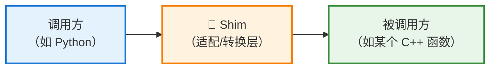
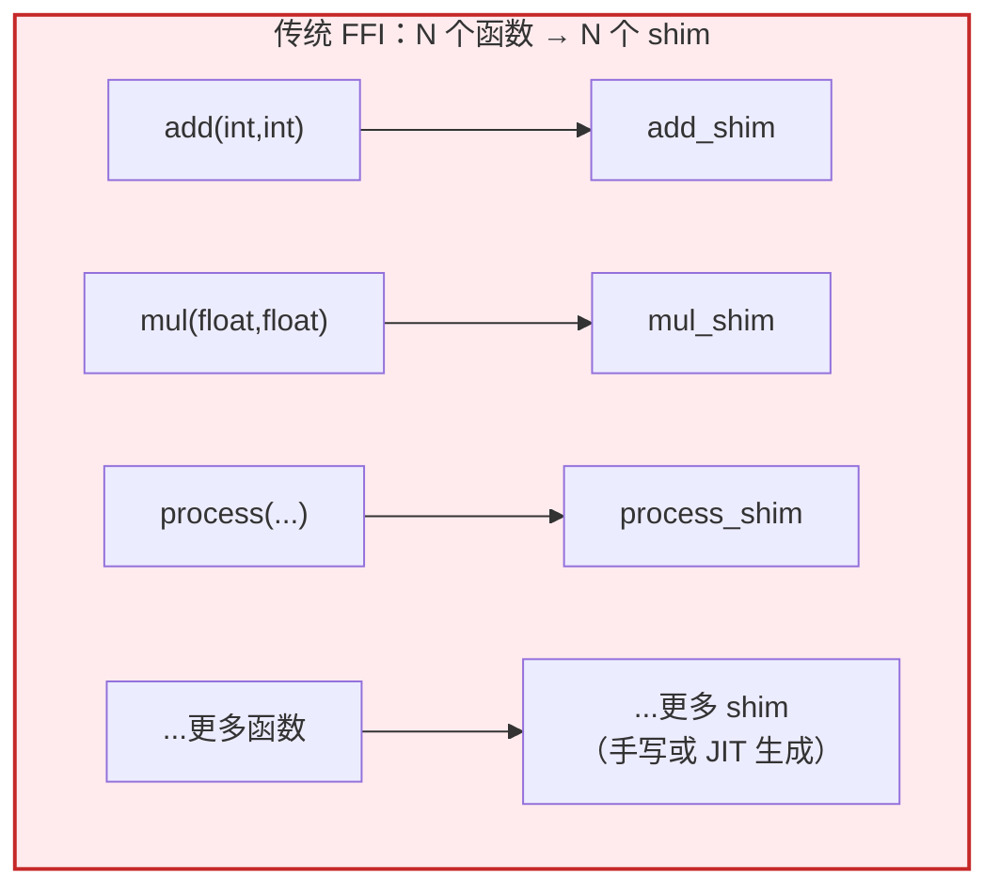
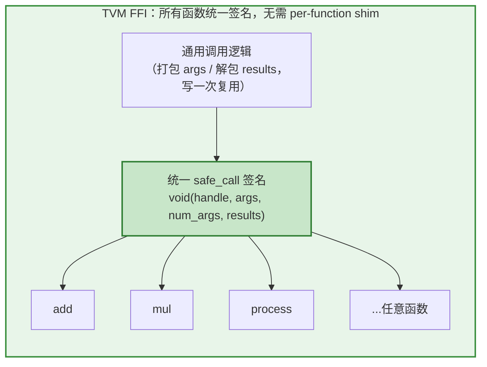

# 什么是 "shim"（垫片）

## 一句话解释

**Shim（垫片 / 填隙片）** 在编程语境中指一段**小型的中间适配代码**，它夹在"调用方"和"被调用方"之间，负责**转换接口、适配参数、桥接差异**，让两个原本不能直接对接的部分能协同工作。

这个词来自现实工程：**shim 本意是"垫片"**——木工/机械中用来填补缝隙、对齐两个不匹配部件的薄片。编程里借用了这个意象：**填补两个接口之间的"缝隙"**。



---

## 在 FFI 语境下，shim 具体指什么

在跨语言调用（FFI）中，**每个 C++ 函数的签名都不一样**：

```cpp
int    add(int a, int b);
float  mul(float x, float y);
void   process(MyTensor* t, const char* name, int flags);
```

Python 要调用它们时，面临一个问题：**Python 的对象（`int`、`str`、`list`……）和 C++ 的强类型参数（`int`、`float`、`MyTensor*`）无法直接对接**。中间必须有代码去做转换——**这段转换代码就是 shim**。

一个针对 `add` 的 shim 大概长这样（伪代码）：

```c
// 专门为 add(int, int) 生成的 shim
void add_shim(void* generic_args, void* generic_result) {
    // 1. 从通用参数里"拆包"出两个 int
    int a = unpack_int(generic_args, 0);
    int b = unpack_int(generic_args, 1);
    // 2. 调用真正的强类型 C++ 函数
    int r = add(a, b);
    // 3. 把结果"打包"回通用返回值
    pack_int(generic_result, r);
}
```

它的职责就是：**把"通用的、类型擦除的调用形式" ↔ "具体的、强类型的函数签名" 之间来回转换。**

---

## 传统 FFI 的痛点：每个函数都要一个 shim

问题在于：**每个不同签名的函数，都需要一个专门的 shim**。

- 有 100 个不同签名的 C++ 函数 → 就要 100 个 shim。
- 这些 shim 要么**手写**（繁琐、易错），要么在运行时**JIT 生成**（如 libffi、ctypes 内部动态构造调用桩）——**JIT 生成 shim 有运行时开销，也增加复杂度**。



---

## TVM FFI 的做法：用 packed function 消灭 shim

回到你引用的那段话——TVM FFI 的巧妙之处正在于此：

> "它**省去了为每个 FFI 调用声明和 JIT 生成 shim 的需要**。"

因为 TVM FFI **让所有函数都使用同一个统一签名**（type-erased packed function）：

```
void safe_call(handle, args, num_args, results)
```

**既然所有函数长得都一样，那么"通用调用形式 ↔ 函数签名"之间就不再有差异需要填补了**——调用方永远按这一个签名去调，参数打包/解包的逻辑是**通用的、写一次即可复用**，而不是每个函数各写一份。



**类比**：
- **传统 FFI** 像给每种规格的插头都配一个专用转接头（shim）——插头种类越多，转接头越多。
- **TVM FFI** 像规定所有设备统一用 USB-C 接口——**只需要一种通用连接方式，不再需要各式各样的转接头**。

---

## 补充：shim 的其他常见用法

"shim" 不止用于 FFI，在软件工程里泛指各种"适配垫片"，帮助你更全面理解这个词：

| 场景 | shim 的作用 |
|------|------------|
| **FFI / 跨语言调用** | 转换参数与调用约定（本文重点） |
| **浏览器兼容（前端）** | 用 JS "polyfill/shim" 在老浏览器上模拟新 API |
| **API 版本兼容** | 在新旧 API 之间加一层，让旧代码调用新库仍能工作 |
| **操作系统兼容** | 拦截系统调用并重定向（如 Windows 的兼容性 shim） |
| **测试** | 用 shim 替换真实依赖（类似 mock/stub） |

> 💡 **核心共性**：shim 永远是一层**薄薄的、专门做适配转换的中间代码**，目的是"让两个接口不完全匹配的东西能对接上"。

---

## 核心结论

- **shim（垫片）= 夹在调用方与被调用方之间的适配/转换代码**，用于填补两者接口之间的"缝隙"。
- 在 FFI 中，shim 负责在**类型擦除的通用调用形式**和**具体强类型函数签名**之间转换参数与返回值。
- **传统 FFI 的痛点**：每个不同签名的函数都需要一个 shim（手写或 JIT 生成），既繁琐又有开销。
- **TVM FFI 的优雅之处**：通过**让所有函数共用一个统一签名（packed function）**，把"逐函数的 shim"变成了"写一次、通用复用"的打包/解包逻辑，从而**免去了声明和 JIT 生成 per-function shim 的需要**，同时保持高效。
