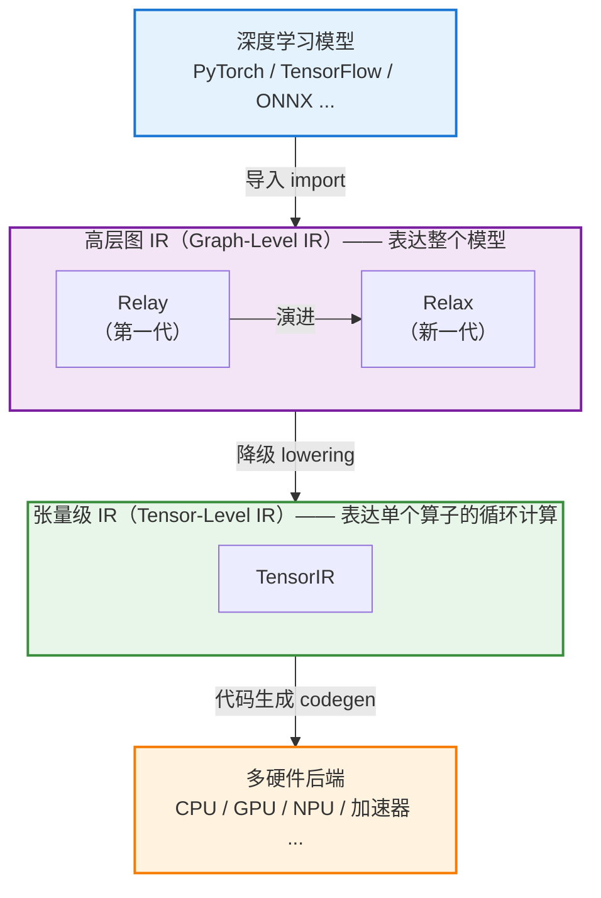
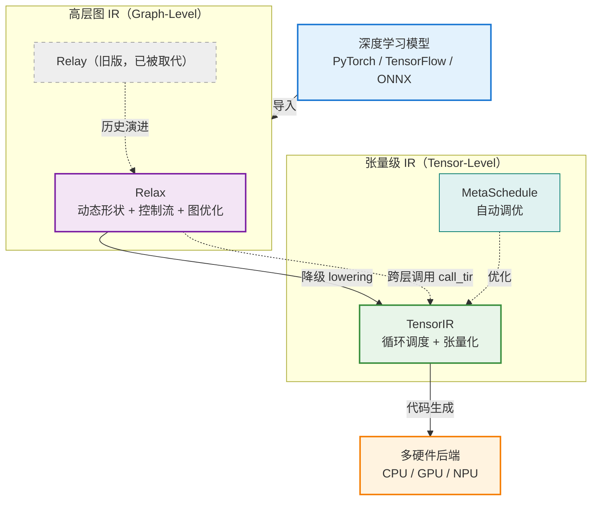

# Apache TVM 三大核心中间表示：Relay、Relax、TensorIR

## 摘要

Relay、Relax、TensorIR（简称 TIR）是 Apache TVM 编译栈中的核心中间表示（IR），分别对应不同的抽象层次与演进阶段：

> **Relay 为旧版高层 IR；Relax 是 Relay 的继任者（新一代高层计算图 IR）；TensorIR 是底层算子循环级 IR。**

三者共同构成现代 TVM「**Relax（高层图）+ TensorIR（底层算子）**」的双层编译架构。

> **说明**：TVM 的 Relax / Unity 方向发展较新，部分技术细节可能存在偏差，关键处已标注，建议以官方文档（tvm.apache.org）与 RFC 核实。

---

## 1. 整体定位：TVM 的分层 IR 体系

以下是整合了**方案一**和**方案二**两个 Mermaid 图的「整体定位」章节，可直接替换原文档中的 ASCII 图部分：

---

## 1. 整体定位：TVM 的分层 IR 体系

TVM 编译栈采用**分层中间表示**，从高层模型逐步降级（lowering）到底层硬件代码。

### 1.1 分层降级总览

下图展示了从模型导入到硬件代码生成的整体分层结构：



### 1.2 跨层协同优化视图

传统编译器采用「逐层严格降级、各层封闭」的模式。而 **TVM Unity** 的一大创新是：Relax 可通过 `call_tir` 机制**跨层直接调用** TensorIR 算子，实现高层图与底层调度的**协同优化**。下图突出这一特性（虚线表示跨层调用与自动调优）：



> **两图分工**：
> 
> - **图 1.1** 呈现清晰的**纵向分层降级主线**，适合快速建立整体认知；
> - **图 1.2** 在分层基础上补充了 **Relax ↔ TensorIR 的跨层协同**与 **MetaSchedule 自动调优**，突出 TVM Unity 相比传统架构的核心创新点。

**核心区别一句话概括：**

| IR           | 抽象层次             | 描述对象                |
| ------------ | ---------------- | ------------------- |
| **Relay**    | 高层（graph-level）  | 整个模型的计算图（算子如何连接）    |
| **Relax**    | 高层（graph-level）  | Relay 的继任者，更强的动态性表达 |
| **TensorIR** | 底层（tensor-level） | 单个算子内部的循环、内存、张量化    |

---

这样两图形成**递进关系**：先总览分层，再深入跨层协同，逻辑上更完整。如果你希望调整两图的先后顺序、配色，或让图 1.2 中再补充如「TE 张量表达式（已被 TensorIR 替代）」等历史节点，我可以继续修改。😊

### 基础定位总览

| IR 名称              | 层级                  | 本质              | 核心职责                        |
| ------------------ | ------------------- | --------------- | --------------------------- |
| **Relay**          | 旧版高层 IR             | 函数式静态数据流图       | 早期 TVM 模型图级优化，仅擅长静态尺寸模型     |
| **Relax**          | 新一代高层 IR（Relay 升级版） | 支持动态形状的函数式计算图   | 大模型、动态 batch、循环/分支控制流、全局图优化 |
| **TensorIR (TIR)** | 底层算子 IR             | 显式循环、内存缓冲区的张量程序 | 单算子调度优化、分块、向量化、线程绑定、硬件代码生成  |

---

## 2. Relay：传统上层中间表示

### 2.1 诞生背景与定位

Relay 是 TVM 0.x 时代唯一的高层函数式 IR，用于承接从 PyTorch、ONNX 等前端导入的深度学习模型，取代了更早的图 IR（NNVM）。

- **相关论文**：《Relay: A New IR for Machine Learning Frameworks》（MAPL 2018，会议归属请核实）

### 2.2 核心特性

- **函数式编程风格**：支持 `let` 绑定、闭包、自动微分、代数数据类型（ADT）等高级语言特性。
- **静态类型系统 + 形状推断**：支持张量类型和形状推断，具备一定的形状多态能力。
- **丰富的图级优化 Pass**：算子融合（operator fusion）、常量折叠、布局转换、死代码消除等。

### 2.3 硬伤与局限

Relay **原生很难支持动态 shape**：对可变 batch-size、循环、分支的处理能力薄弱，难以适配 LLM 动态推理等场景。随着动态模型（动态形状、动态控制流，如 NLP 变长序列、大语言模型）日益普遍，Relay 的表达能力显得力不从心——这正是 Relax 出现的动因。

### 2.4 编译链路

```
模型前端 → Relay → 算子融合 → TE 张量表达式 → TensorIR → 硬件代码
```

---

## 3. Relax：新一代高层 IR（Relay Next）

### 3.1 定位

**Relax（意为 "Relay Next"）** 是 TVM 在 **Unity** 战略方向下推出的新一代高层 IR，目标是取代 Relay，成为更现代、更灵活的高层抽象，也是目前官方主推的方向。

- **相关论文**：《Relax: Composable Abstractions for End-to-End Dynamic Machine Learning》

### 3.2 设计目标

解决 Relay 的动态形状短板，面向大语言模型、动态输入、循环推理、控制流分支等复杂场景。

### 3.3 关键能力

**（1）原生支持符号动态维度（First-Class Dynamic Shape）**

- 将动态形状作为核心设计，能在 IR 层面用符号变量表达和推理形状，例如 `R.Tensor(("n", 512))`。
- **一次编译即可适配任意 batch 大小**，动态模型的编译与优化远比 Relay 自然、高效。

**（2）统一的控制流支持**

- 统一支持数据流图、`if-else` 条件分支、`while` 循环、递归函数。

**（3）跨层抽象（Cross-Level Abstraction）**

- 算子可以直接调用 TIR 底层算子函数（通过 `call_tir` 等机制），**打通高层图与底层调度**。
- 这打破了传统"逐层严格降级、各层封闭"的模式，实现高层与底层的**协同优化**，是 Relax 的重要创新。

**（4）模块化可组合的优化 Pass**

- 提供更模块化、可组合的变换与 pass，适配 Transformer、MoE、动态稀疏等复杂模型结构。

### 3.4 意义

Relax 代表了 TVM 高层 IR 从"静态图 + 逐层封闭降级"向"动态优先 + 跨层协同"的范式转变，是 TVM Unity 方向的核心组成。

**当前新版 TVM 标准流水线：**

```
PyTorch/ONNX → Relax IR → 图优化 → 降级生成 TIR 算子
             → MetaSchedule 自动调度优化 → 硬件机器码
```

---

## 4. TensorIR (TIR)：底层循环级 IR

### 4.1 核心定位

**TensorIR** 是 TVM 的新一代底层张量级 IR，专注于**单个算子内部**的循环嵌套、内存访问与硬件张量指令优化，相当于 AI 编译器里的「**LLVM-IR**」。它替代了老旧的 **TE（Tensor-Expression）张量表达式**，成为 TVM 唯一的底层算子 IR。

- **相关论文**：《TensorIR: An Abstraction for Automatic Tensorized Program Optimization》（ASPLOS 2023）

### 4.2 核心特性

**（1）Block（块）抽象——核心创新**

- 引入 **Block** 作为核心抽象单元，将一段计算及其涉及的读写区域、迭代域封装起来。
- Block 明确记录了计算的**依赖关系和迭代信息**，使编译器能安全、自动地进行调度变换。

**（2）显式内存缓冲区管理**

- 显式定义缓冲区 Buffer，精细控制全局内存、共享内存、寄存器内存等层级。

**（3）完整循环嵌套 + 全套调度原语**

- 提供循环分块（tile）、循环重排（reorder）、向量化（vectorize）、并行绑定（bind）、软件流水线等调度原语。
- 继承 TVM"计算与调度分离"的思想，但提供更强大、更结构化的调度能力。

**（4）面向张量化硬件（Tensorization）**

- 支持张量指令、硬件 intrinsic（如 GPU 的 **Tensor Core**、TPU 的矩阵乘单元 MMA），面向 GPU、NPU、CPU 做代码生成。

### 4.3 与 MetaSchedule 的协同

- TensorIR 配合 **MetaSchedule**（新一代自动调度系统）工作，支持**无模板自动搜索**最优调度方案。
- MetaSchedule 是 AutoTVM / Ansor 之后的统一自动调优框架，能处理张量化等复杂优化。

---

## 5. 三者的演进关系

### 5.1 演进脉络

```
    高层 IR 演进：      NNVM  →  Relay  →  Relax
                      (旧图IR)  (函数式)  (动态优先+跨层)

    底层 IR 演进：   Tensor Expression (TE)  →  TensorIR
                      (原始调度体系)            (Block抽象+张量化)

    自动调优演进：   AutoTVM → Ansor → MetaSchedule
                    (需模板) (无模板)  (基于TensorIR的统一框架)
```

### 5.2 架构变迁

- **初代架构**：`Relay（高层图） → TE → TIR`
- **当前全新架构**：**Relax（新一代动态图） ↔ TensorIR（底层算子）**
  - Relax 负责**全局模型、算子融合、动态形状、控制流**
  - TensorIR 负责**单算子循环优化、内存调度、硬件适配**
  - TE 现已被 TensorIR 彻底替代

### 5.3 对比表

| 维度        | Relay     | Relax                           | TensorIR     |
| --------- | --------- | ------------------------------- | ------------ |
| **层次**    | 高层图 IR    | 高层图 IR                          | 底层张量 IR      |
| **描述对象**  | 整个模型      | 整个模型                            | 单个算子的循环计算    |
| **代际**    | 第一代       | 新一代（Relay Next）                 | 新一代张量 IR     |
| **核心特征**  | 函数式、静态类型  | 动态形状一等公民、跨层抽象                   | Block 抽象、张量化 |
| **动态性支持** | 较弱（偏静态形状） | 强（符号形状）                         | —            |
| **关键论文**  | MAPL 2018 | Relax (Composable Abstractions) | ASPLOS 2023  |
| **配套系统**  | 图级优化 pass | 可组合 pass、`call_tir`             | MetaSchedule |

### 5.4 协同工作方式

在现代 TVM（Unity）中，三者协同构成完整编译流程：

1. **Relax** 承接前端模型，表达整个网络（含动态形状与控制流），做图级优化。
2. 通过 **跨层机制（`call_tir`）**，Relax 可直接调用以 **TensorIR** 表达的底层算子实现。
3. **TensorIR** 负责单个算子的循环级、张量化优化，由 **MetaSchedule** 自动调优。
4. 最终生成多硬件后端代码。

Relax 的"跨层抽象"正是让高层的 Relax 与底层的 TensorIR 能够**协同优化**，而非传统的"层层隔离降级"。

---

## 6. 通俗类比

| IR           | 类比      | 特点                         |
| ------------ | ------- | -------------------------- |
| **Relay**    | 老式静态流程图 | 只能处理固定尺寸神经网络               |
| **Relax**    | 高级编程语言  | 可写循环、`if` 判断，支持动态输入的完整模型程序 |
| **TensorIR** | 汇编级循环代码 | 手动控制内存、线程、循环，压榨硬件算力        |

---

## 7. 核心区别精简总结

1. **Relay** = 老旧静态计算图，现已被 Relax 取代。
2. **Relax** = 现代、动态、带控制流的模型顶层 IR，主打**动态形状**与**跨层协同优化**。
3. **TensorIR** = 算子循环、内存、硬件调度的底层 IR，替代 TE，配合 MetaSchedule 自动调优。

**三者关系**：Relay 与 Relax 是**同一层次（高层图 IR）的两代产品**；TensorIR 处于**不同层次（底层张量 IR）**，与 Relay/Relax 不是替代关系，而是**互补的下游**。它们共同构成 TVM Unity 的分层 IR 体系：**Relax（高层，动态+跨层）→ TensorIR（底层，张量化）→ 硬件后端**，配合 MetaSchedule 自动调优，形成端到端的现代深度学习编译栈。

---

## 附录：核实提示

- **Relax 和 Unity 方向发展较新且演进快**，本文对其机制（如 `call_tir`、跨层抽象的具体实现）的描述可能不完全精确，请以 **TVM 官方文档和 RFC** 为准。
- Relay、Relax 论文的会议/发表场合请核实。
- 建议查阅 **tvm.apache.org** 官方文档、**TVM RFCs（GitHub 上的 apache/tvm-rfcs）** 获取最权威的设计说明。

---

> 如需进一步补充 **Relax 与 TensorIR 的代码示例**，或针对 **TensorIR 的 Block 抽象机制**、**Relax 的动态形状设计**做更深入的技术剖析，可继续展开。


