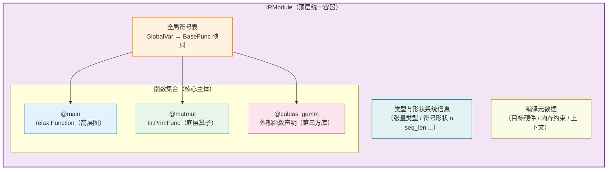

# TVM IRModule 技术文档

## 前置声明

本文梳理 **IRModule** 在 TVM 中的定位、结构、核心能力与常用操作。**请注意**：部分 API 细节和内部实现（尤其是具体方法名、字段名）可能存在记忆偏差，关键处会标注，建议以 **tvm.apache.org 官方文档**及源码核实。

---

## 核心定位：TVM 编译栈的顶层统一容器

**IRModule（Intermediate Representation Module，中间表示模块）** 是 Apache TVM 整个编译栈的**顶层统一容器**，也是所有编译优化、代码生成操作的**核心操作对象**。在 TVM Unity 架构中，它是实现「**高层图 + 底层算子 + 外部库**」全栈统一承载的核心基石。

IRModule 对应传统编译器中的「**编译单元**」概念，它将一个完整模型的所有中间表示、函数定义、符号信息与编译配置封装在一起，贯穿从模型导入、多级优化到最终代码生成的全流程。

> **一句话理解**：一个 IRModule = 一次编译任务中所有函数及相关信息的集合容器。

从概念上类比：

| 类比对象                   | 对应关系                                           |
| ---------------------- | ---------------------------------------------- |
| LLVM 的 `Module`        | 装载所有 LLVM Function                             |
| 一个 Python 模块（`.py` 文件） | 装载多个函数/类定义                                     |
| **TVM 的 `IRModule`**   | 装载多个 `relax.Function` / `tir.PrimFunc` 及外部函数声明 |

### 演进中的定位升级

在 TVM 的演进中，IRModule 的定位有明显升级：

- **传统 Relay 架构**：主要承载高层计算图，底层算子 TIR 多为降级后独立生成的附属产物，两层耦合较弱。
- **TVM Unity 架构**：成为真正的**全栈统一容器**，同时容纳高层动态图、底层张量程序与外部库调用，支持跨层联合优化。

---

## 内部核心组成

IRModule 本质上维护了一张**从全局符号名（GlobalVar）到函数（BaseFunc）的映射表**，并附带类型、形状与编译元数据。



一个标准的 IRModule 主要包含以下内容：

### 2.1 函数集合（核心主体）

IRModule 中存放的函数都是 `BaseFunc` 的子类，主要包括：

- **`relax.Function`**：高层计算图函数，对应模型的整体拓扑、算子连接与控制流，承载**图级优化**。
- **`tir.PrimFunc`**：底层张量原语函数，对应单个算子的循环、内存、调度逻辑，承载**算子级优化**。
- **外部函数声明**：对 cuBLAS、cuDNN、自定义硬件算子库等第三方库的调用接口。

### 2.2 全局符号表

- **GlobalVar** 是函数在模块内的**唯一标识符（名字）**，类似函数名。
- 统一管理所有函数、全局变量的名称与引用关系，确保跨函数、跨层级调用的正确性——例如 Relax 函数用 `call_tir` 调用某个 `tir.PrimFunc` 时，就是通过其 GlobalVar 定位。

### 2.3 类型与形状系统信息

- 包含张量类型、**符号形状变量**（如 `n`、`seq_len`）、类型推导结果。
- 是**动态形状优化**的基础，也是 Relax 支持大模型变长推理的关键。

### 2.4 编译元数据

- 目标硬件平台、功能安全配置、内存约束等编译上下文信息。

---

## TVM Unity 下的核心能力

这是 IRModule 最核心的演进，也是理解 TVM Unity 架构的关键。正是因为 IRModule 能同时容纳多种 IR，才使 Unity 的**跨层抽象**成为可能。

### 3.1 多 IR 同舱，原生互调

同一个 IRModule 内可以同时存在 Relax 图函数和 TensorIR 算子函数。Relax 中的算子可以通过 `call_tir` 直接调用同模块内的 TIR 原语函数，也可以通过 `call_dps_packed` 等机制混合调用外部库函数，**彻底打破了传统架构中「图层与算子层割裂」的壁垒**。

### 3.2 渐进式降级编译

支持从高层图到底层算子的逐步拆解优化，而非一次性黑盒降级。开发者可以先在 Relax 层做算子融合，再将部分融合算子逐步拆解为循环结构，**每一步的中间状态都保存在同一个 IRModule 中**，可调试性和定制化能力大幅提升。

### 3.3 全局优化视野

由于全量信息都收敛在单一 IRModule 中，优化 Pass 可以获得**全局视图**，实现跨算子的内存复用、全局公共子表达式消除、跨控制流的数据流分析，本质上落地了**全局优化**思想，而非单层局部最优。

### 3.4 可组合编译流水线

不再强制固定的编译流程，开发者可以自由组合图级优化、算子调度、内存规划等 Pass，灵活适配不同模型、不同硬件的定制化优化需求。

---

## IRModule 在编译流程中的地位

IRModule 是贯穿整个 TVM 编译流程的**核心载体**。编译过程可以理解为：**对 IRModule 施加一系列变换（Pass），逐步优化和降级，最终生成可执行代码。**

```mermaid
flowchart LR
    A["前端模型<br/>PyTorch / ONNX"] -->|导入| M0["IRModule<br/>（初始 Relax）"]
    M0 -->|图优化 Pass| M1["IRModule<br/>（优化后）"]
    M1 -->|渐进式降级| M2["IRModule<br/>（Relax + TIR 混合）"]
    M2 -->|TIR 调度 / MetaSchedule 调优| M3["IRModule<br/>（优化后 TIR）"]
    M3 -->|build 代码生成| R["runtime.Module<br/>（可执行）"]

    style M0 fill:#e3f2fd,stroke:#1976d2
    style M1 fill:#e3f2fd,stroke:#1976d2
    style M2 fill:#f3e5f5,stroke:#7b1fa2
    style M3 fill:#e8f5e9,stroke:#388e3c
    style R fill:#fff3e0,stroke:#f57c00
    style A fill:#e1f5fe,stroke:#0288d1
```



**关键特点：**

- **Pass 的输入输出都是 IRModule**：TVM 的变换体系（`tvm.ir.transform.Pass`）本质是 `IRModule → IRModule` 的函数，使得优化 Pass 可以自由组合、链式串联（对应 Unity 的"可组合变换"理念）。
- **降级不改变容器类型**：从纯 Relax 到 Relax+TIR 混合，再到纯 TIR，始终是同一个 IRModule 容器，只是内部函数逐步被替换/降级——正体现了 Unity 的"统一 IRModule"设计。

---

## TVMScript：IRModule 的 Python 表达

在 TVM Unity 中，IRModule 可以直接用 **TVMScript**（嵌入 Python 的语法）来书写和打印。下面是一个**示意性**例子：

```python
import tvm
from tvm.script import ir as I
from tvm.script import relax as R
from tvm.script import tir as T

@I.ir_module
class MyModule:
    # 底层算子函数：tir.PrimFunc
    @T.prim_func
    def add(A: T.Buffer((128,), "float32"),
            B: T.Buffer((128,), "float32"),
            C: T.Buffer((128,), "float32")):
        for i in range(128):
            with T.block("add"):
                vi = T.axis.remap("S", [i])
                C[vi] = A[vi] + B[vi]

    # 高层图函数：relax.Function
    @R.function
    def main(x: R.Tensor((128,), "float32"),
             y: R.Tensor((128,), "float32")) -> R.Tensor((128,), "float32"):
        cls = MyModule
        # 通过 call_tir 跨层调用同模块内的底层 add 算子
        z = R.call_tir(cls.add, (x, y), out_sinfo=R.Tensor((128,), "float32"))
        return z
```

> ⚠️ 上述代码用于演示 IRModule "一个容器装载 Relax 函数 + TIR 函数，并跨层调用"的概念，**具体 API 写法（如 `call_tir` 参数、`ir_module` 装饰器细节）请以官方文档核实**。

这段代码清晰展示了 IRModule 的核心价值：`MyModule` 就是一个 IRModule，它同时包含高层 `main`（Relax）和底层 `add`（TIR），且 `main` 通过 `call_tir` **跨层调用** `add`。

---

## 开发者常用核心操作

日常开发中，针对 IRModule 的典型操作包括：

| 操作               | 说明                                                             |
| ---------------- | -------------------------------------------------------------- |
| **构建**           | 通过 PyTorch / ONNX 等前端导入模型，自动生成初始 IRModule；或通过 TVMScript 手动编写构建 |
| **访问 / 更新函数**    | 通过 GlobalVar 或函数名索引取出、替换、新增模块中的函数（Pass 内部常用）                   |
| **Pass 优化**      | 调用 Relax 图优化 Pass、TIR 调度 Pass，在 IRModule 上完成各级优化               |
| **降级（Lowering）** | 将 Relax 算子逐步降级为 TIR 原语函数                                       |
| **代码生成**         | 基于优化后的 IRModule 生成目标硬件的可执行内核与运行时模块（`runtime.Module`）           |
| **序列化 / 打印**     | 导出为文本格式（TVMScript，如 `mod.show()`）或二进制格式，用于部署或调试                |

> ⚠️ 具体函数名（如 `relax.build`、`tvm.compile`、`from_exported_program` 等）在不同版本可能有差异，请以你使用的 TVM 版本文档为准。

---

## 通俗类比

可以把 IRModule 理解为一个完整的「**工程项目文件夹**」：

| 组成部分          | 类比                          |
| ------------- | --------------------------- |
| **Relax 函数**  | 项目的整体架构设计图（整个模型的执行流程）       |
| **TIR 原语函数**  | 每个核心模块的底层实现代码（单个算子的硬件执行逻辑）  |
| **外部函数声明**    | 对接第三方组件的接口                  |
| **编译器（Pass）** | 在这个项目文件夹内逐层优化、调整，最终生成可交付的程序 |

---

## 核心结论

- **IRModule 是 TVM 的顶层编译单元**：一个从 GlobalVar 到函数的映射容器，封装了函数集合、全局符号表、类型/形状信息与编译元数据，是所有 IR、Pass、编译流程的核心载体。
- **它是 Unity 跨层抽象的物理基础**：因为能同时容纳 `relax.Function`（高层图）、`tir.PrimFunc`（底层算子）与外部函数声明，才让"多 IR 同舱、原生互调、渐进降级、全局优化"成为可能。
- **编译 = 对 IRModule 施加变换序列**：TVM 的 Pass 体系以 `IRModule → IRModule` 为范式，支持可组合、渐进式的优化与降级，最终生成 `runtime.Module`。
- **TVMScript 是它的 Python 化表达**：让开发者能直接读写、调试同时包含两层 IR 的 IRModule。

---

## 附录：核实提示

- **具体 API**（`call_tir`、`call_dps_packed`、`ir_module`、`relax.build`、`tvm.compile`、`from_exported_program` 等）的确切签名与用法，请以 **tvm.apache.org 官方文档**及对应版本源码为准。
- IRModule 内部实现（`functions` 字段、`GlobalVar` / `BaseFunc` 类层次）细节，建议查阅源码 `include/tvm/ir/module.h` 及 `python/tvm/ir/module.py`。
- TVMScript 语法演进较快，示例代码仅为概念演示。

---

> 如需进一步展开 **IRModule 上的 Pass 机制（如何编写自定义 Pass）**、**GlobalVar 与跨层函数调用的具体机制**，或 **从 PyTorch 模型导入生成 IRModule 的完整实战流程**，可以告诉我，我可以继续深入。😊
