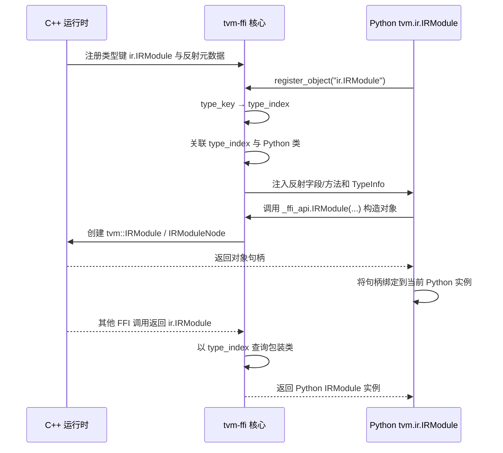

# `@tvm_ffi.register_object("ir.IRModule")`：IRModule 的 Python FFI 绑定

## 摘要

```python
@tvm_ffi.register_object("ir.IRModule")
class IRModule(Node, Scriptable):
```

这不是 Python 层重新定义一份 `IRModule` 数据结构，而是将 Python 类
`IRModule` 注册为 C++ 运行时类型 `ir.IRModule` 的**专用包装类**。注册完成后：

- C++ 侧返回 `ir.IRModule` 时，FFI 会将其包装为 Python `IRModule`；
- C++ 反射导出的字段可在 Python 中以属性形式读取；
- Python 类自身实现的便捷方法（如 `clone()`、`functions_items()`）可作用于同一个底层对象句柄；
- `Node` 与 `Scriptable` 分别补充 IR 对象基础能力和 TVMScript 输出能力。

本文基于当前工作区的 TVM / tvm-ffi 源码，说明从 C++ 类型注册到 Python 对象返回的完整链路，并明确其边界与常见问题。

---

## 1. 要解决的问题：为跨语言对象确定 Python 类型

TVM 的 IR 数据主要存储在 C++ 运行时对象中。Python 调用 FFI 函数时，参数需要转换为 C++ 可识别的值；C++ 返回对象时，运行时也需要回答一个问题：**这个对象应包装成哪个 Python 类？**

`type_key` 和 `type_index` 是这一问题的桥梁：

| 概念 | 含义 | 示例 |
| --- | --- | --- |
| `type_key` | 稳定、可读的跨语言类型名称 | `"ir.IRModule"` |
| `type_index` | 运行时分配的整数类型标识 | 由 C++ 对象系统维护 |
| `IRModuleNode` | C++ 中真正存储模块字段的对象类型 | `tvm::IRModuleNode` |
| `IRModule` | C++ 对 `IRModuleNode` 的受管理引用 | `tvm::IRModule` |
| Python `IRModule` | 持有 C++ 对象句柄的包装类 | `tvm.ir.IRModule` |

`@tvm_ffi.register_object("ir.IRModule")` 的核心职责，是建立：

```text
C++ type_key "ir.IRModule"
          │
          ▼
     type_index
          │
          ▼
Python 类 tvm.ir.IRModule
```

这里的注册发生在 Python 端；它**不会**在 C++ 端创建或声明新类型。因而 C++ 端的类型注册必须先完成。

---

## 2. 全链路概览



链路可分为四层：

1. **C++ 类型声明**：声明 `ir.IRModule` 的类型键与继承关系；
2. **C++ 反射与全局函数注册**：导出字段、结构相等/哈希能力和构造 API；
3. **Python 类注册**：将类型索引关联到 Python `IRModule`；
4. **运行时编解码**：构造参数进入 C++，C++ 返回对象再按类型索引还原为 Python 包装类。

---

## 3. C++ 侧：定义运行时类型与反射信息

### 3.1 `IRModuleNode` 是实际数据载体

C++ 的 `IRModuleNode` 继承 `ffi::Object`，保存模块状态。重要字段如下：

| 字段 | 类型概念 | 用途 |
| --- | --- | --- |
| `functions` | `GlobalVar → BaseFunc` 映射 | 保存模块的全局函数 |
| `source_map` | 源码映射 | 关联 IR 与源文件位置 |
| `attrs` | `DictAttrs` | 保存模块级元数据 |
| `global_infos` | 名称到 `GlobalInfo` 数组的映射 | 保存全局静态信息 |
| `global_var_map_` | 名称到 `GlobalVar` 的映射 | 保证和查询全局名称唯一性 |

对应的 `IRModule` 是管理 `IRModuleNode` 引用的 C++ 对象引用类，并通过写时复制（copy-on-write）支持函数式风格的模块变换。

### 3.2 类型键在 C++ 侧声明

`IRModuleNode` 使用以下宏声明其 FFI 类型信息：

```cpp
TVM_FFI_DECLARE_OBJECT_INFO_FINAL("ir.IRModule", IRModuleNode, ffi::Object);
```

该声明使 C++ 运行时知道：

- 此对象的类型键是 `ir.IRModule`；
- 它继承 `ffi::Object`；
- 它是 final 类型，不能继续在 C++ 对象系统中派生。

`tvm_ffi.register_object` 只会查找并使用该类型键；若 C++ 端未完成此注册，Python 端不能独立补齐。

### 3.3 反射字段决定 Python 可见属性

`IRModuleNode::RegisterReflection()` 使用 `ObjectDef<IRModuleNode>()` 将字段导出。例如：

```cpp
refl::ObjectDef<IRModuleNode>()
    .def_ro("functions", &IRModuleNode::functions)
    .def_ro("global_var_map_", &IRModuleNode::global_var_map_)
    .def_ro("source_map", &IRModuleNode::source_map)
    .def_ro("attrs", &IRModuleNode::attrs)
    .def_ro("global_infos", &IRModuleNode::global_infos);
```

`def_ro` 表示只读反射字段。Python 注册时会把这些元数据转为 property，因此可以直接使用：

```python
mod.functions
mod.attrs
mod.global_infos
```

这些属性读取的是底层 C++ 对象数据，不是 Python 端维护的副本。`global_var_map_` 虽也被反射导出，但其后缀 `_` 表明它是内部实现细节；常规 Python 代码应优先通过公开模块 API 查询全局符号。

同一反射注册还定义 `__s_equal__`、`__s_hash__` 类型属性，用于结构相等与结构哈希等 IR 基础设施。

---

## 4. Python 侧：`register_object` 做了什么

`register_object` 位于 `tvm_ffi.registry`，可接受显式的类型键，也可在未传参时使用 Python 类名。`IRModule` 使用显式类型键，避免 Python 名称与 C++ 名称空间规则耦合：

```python
@tvm_ffi.register_object("ir.IRModule")
class IRModule(Node, Scriptable):
    ...
```

其内部注册步骤如下。

### 4.1 查询 `type_index`

注册器首先执行：

```python
type_index = core._object_type_key_to_index("ir.IRModule")
```

该调用最终查询 C++ 运行时的类型表。

- 找到类型键：返回对应的 `type_index`；
- 找不到类型键：默认抛出 `ValueError`；
- 仅在内部启用 `_SKIP_UNKNOWN_OBJECTS` 时，未知类型会被跳过。

因此，导入时出现 `Cannot find object type index for ir.IRModule` 通常说明：动态库或所需扩展 API 没有正确加载，或 C++ / Python 两侧版本不匹配，而不是 Python 类定义本身有问题。

### 4.2 建立 Python 类型映射并读取 `TypeInfo`

随后注册器调用：

```python
info = core._register_object_by_index(type_index, IRModule)
```

FFI 核心会从 C++ 获取该类型的 `TypeInfo`，其中包含类型键、继承链、字段和方法元数据；再更新内部注册表。不同方向的查找使用不同索引：

| 注册信息 | 主要用途 |
| --- | --- |
| `type_index → Python class` | 将 C++ 返回对象包装为正确 Python 类型 |
| `type_index → TypeInfo` | 根据运行时类型获得反射元数据 |
| `type_key → TypeInfo` | 根据可读名称查找类型信息 |
| `Python class → TypeInfo` | 从 Python 包装类型反查 FFI 类型元数据 |

注册逻辑也会为 `CObject` 子类安装运行时对象分配/释放相关的类型槽位，以维持 Python 包装对象与 C++ 句柄之间的正确生命周期与对象绑定。此部分是 FFI 内部实现，业务代码不应依赖其具体槽位行为。

> **注册时机要求**：父类必须先注册，再注册子类，否则派生类型的 `TypeInfo.parent_type_info` 可能无法正确建立。

### 4.3 将反射字段和方法装配到 Python 类

注册器接着调用 `_add_class_attrs(IRModule, info)`：

- 为每个 C++ 反射字段创建 Python property；
- 为反射方法创建 Python 可调用对象；
- 安装 C++ 导出的 `__ffi_init__`（若存在）；
- 避免覆盖 Python 类体中已经显式定义的字段或方法。

字段和方法的覆盖策略不同：

| 成员类别 | 不覆盖条件 | 含义 |
| --- | --- | --- |
| 反射字段 | 字段名已出现在当前类的 `__dict__` | Python 类体可自行定义同名属性 |
| 反射方法 | 当前类或基类已存在同名属性 | Python 显式实现优先 |

这解释了为什么 `module.py` 未显式声明 `functions`、`attrs`、`global_infos`，它们仍然可作为 `IRModule` 属性使用。

### 4.4 保存类型元数据

注册器还会设置：

```python
IRModule.__tvm_ffi_type_info__ = info
```

该属性保存当前包装类的 `TypeInfo`。它是 FFI 类型检查、自动构造、反射访问与工具链生成类型信息的基础，不应由业务代码手动修改。

### 4.5 构造函数安装策略

若 `init=True`（默认值），`register_object` 会尝试安装 `__init__`：

1. Python 类已经定义 `__init__`：保留该实现；
2. 否则，若 C++ 端提供 `__ffi_init__`：生成一个调用该构造器的 Python `__init__`；
3. 否则，若该类是 `Object` 子类：安装会抛出 `TypeError` 的保护构造器，防止产生没有有效 C++ 句柄的对象。

`IRModule` 在类体中定义了 `__init__`，所以其手写构造过程不会被自动生成的构造器覆盖。

---

## 5. `IRModule(...)` 的实际构造路径

Python 构造函数先规范化输入，再通过 `_ffi_api.IRModule` 调用 C++ 构造函数：

```python
self.__init_handle_by_constructor__(
    _ffi_api.IRModule,
    functions,
    attrs,
    global_infos,
)
```

### 5.1 Python 参数规范化

在进入 FFI 前，`IRModule.__init__` 做了必要的 Python 层转换：

- `functions` 为 `None` 时转换为空映射；
- 函数映射的字符串键转换为 `GlobalVar`；
- 非 `GlobalVar` 键会导致 `TypeError`；
- `attrs` 为非空字典时转换为 `ir.DictAttrs`；
- `global_infos` 为 `None` 时转换为空映射。

因此，构造器接受的是面向 Python 使用者的便利形式，而 C++ 构造器接收的是明确的 TVM FFI 对象。

### 5.2 `_ffi_api.IRModule` 如何获得

`python/tvm/ir/_ffi_api.py` 调用：

```python
tvm_ffi.init_ffi_api("ir", __name__)
```

它会从全局 FFI 函数表中查找 `ir.` 前缀的函数，并把它们挂到 `_ffi_api` 模块。C++ `module.cc` 注册的全局函数 `"ir.IRModule"` 因此成为 `_ffi_api.IRModule`。

这个函数创建 C++ `IRModule`，进而创建并初始化 `IRModuleNode`，最后将对象句柄返回给 Python。

### 5.3 为什么构造结果会写入当前 `self`

`__init_handle_by_constructor__` 调用构造 FFI 函数后，不是返回另一个 Python 对象，而是将返回的 C++ 句柄绑定到当前实例：

```text
Python self  ──持有──> C++ IRModuleNode
```

同时，FFI 会尝试将 `self` 设为该句柄的规范（canonical）Python 包装对象。后续如果同一 C++ 句柄再次经由 FFI 返回，运行时可复用正确的包装关系，从而维持对象身份与生命周期管理的一致性。

---

## 6. C++ 返回对象时如何变回 Python `IRModule`

当任意 FFI 函数返回一个 C++ 对象，FFI 会读取其动态 `type_index`，并按以下规则包装：

```text
返回 C++ 对象
     │
     ▼
读取动态 type_index
     │
     ├── 已注册 Python 类 ──> 用该类创建/复用包装对象
     │
     └── 未注册 Python 类 ──> 创建仅含反射能力的 fallback 类
```

`register_object` 的价值在这一刻体现得最明显：

- **已注册**：返回值是 `tvm.ir.IRModule`，可使用 `clone()`、`functions_items()`、`script()` 等 Python API；
- **未注册**：FFI 仍可根据 C++ 反射元数据创建 fallback 包装类，但该类不包含 `IRModule` 手写的 Python 辅助方法，且不应作为正式 API 使用。

因此，`register_object` 不只是“让类名好看”，而是决定 C++ 动态类型映射到哪一个 Python 行为集合。

---

## 7. `IRModule` 的继承关系

```text
                    tvm_ffi.Object
                           ▲
                           │
                         Node
                           ▲
                           │
IRModule ──────────────────┼──────────── Scriptable
                           │                 │
                           │                 └─ script() / show()
                           └─ FFI 对象包装、IR repr
```

### 7.1 `Node`

`Node` 继承 `tvm.runtime.Object`（即导出的 `tvm_ffi.Object`），使 `IRModule` 成为可持有 C++ 句柄的 FFI 包装对象。`Node.__repr__` 会优先使用 script printer 输出可读 IR；打印异常时回退到基类表示。

### 7.2 `Scriptable`

`Scriptable` 是纯 Python mixin，为 `IRModule` 提供：

- `script()`：生成 TVMScript 文本；
- `show()`：显示格式化后的 IR。

它不保存 C++ 模块数据，也不参与对象句柄转换，只提供面向开发和调试的展示 API。

### 7.3 关于 Python 附加属性

FFI `Object` 的元类默认会为未声明 `__slots__` 的子类注入 `__slots__ = ()`，以避免每个包装对象都拥有 `__dict__`。如果包装类确需保存 Python 专属的实例状态，应显式声明：

```python
__slots__ = ("__dict__",)
```

`IRModule` 构造器中的 `pyfuncs` 是 Python 侧状态，不是 C++ `IRModuleNode` 的反射字段。它与 FFI 类型注册无关；其可用性取决于该分支中包装类是否允许实例 `__dict__` 或通过其他机制保存该属性。不能仅因代码对 `self.pyfuncs` 赋值，就推断该字段来自 C++ 反射。

---

## 8. 常见问题与排查

### 8.1 `Cannot find object type index for ir.IRModule`

**含义**：Python 注册器无法在已加载的 C++ FFI 运行时中找到 `ir.IRModule`。

**优先检查**：

1. TVM 动态库及其扩展 API 是否已正确加载；
2. Python 包与 C++ 动态库是否来自同一构建或兼容版本；
3. 类型键是否拼写为 `ir.IRModule`；
4. 是否在所需 C++ 注册逻辑执行前过早导入相关 Python 模块。

### 8.2 为什么 `IRModule` 中没有声明 `functions`，却可以访问？

`functions` 是 C++ 反射导出的只读字段。`register_object` 在类注册时为它安装了 Python property；真正的值存放于 C++ `IRModuleNode`。

### 8.3 为什么不能直接 `IRModule.__new__(IRModule)` 后使用？

此对象没有绑定有效的 C++ 句柄。应通过正常构造器、FFI 工厂函数或已有 TVM API 获取对象。注册器在没有可用构造方式时还会主动安装 `TypeError` 防护，以避免未初始化句柄引发底层错误。

### 8.4 为什么 C++ 返回的对象不是预期 Python 类？

检查以下条件：

- 返回对象的 C++ 动态类型键是否正确；
- Python 包是否已导入，使 `@register_object` 实际执行；
- 是否有不兼容的重复注册或 fallback 类先被实例化；
- 注册顺序是否满足父类先于子类。

---

## 9. 核心结论

`@tvm_ffi.register_object("ir.IRModule")` 可以概括为一次**跨语言类型认领**：

> Python `IRModule` 声明自己是 C++ `ir.IRModule` 在 Python 中的正式包装类型。

它完成的不是数据复制，而是类型映射与能力装配：

| 机制 | 效果 |
| --- | --- |
| `type_key → type_index` 查询 | 验证并定位 C++ 已注册类型 |
| `type_index → Python class` 映射 | 决定 C++ 返回值的 Python 动态类型 |
| C++ 反射元数据 | 生成字段 property 和反射方法 |
| `TypeInfo` 绑定 | 提供类型、字段、方法和继承链元数据 |
| 构造器句柄绑定 | 让 Python 实例持有新建 C++ 对象 |
| `Node` / `Scriptable` 继承 | 增加 IR 打印与 TVMScript 展示能力 |

最终，Python 与 C++ 操作的是同一个逻辑 `IRModule` 对象：Python 提供易用 API，C++ 保存 IR 数据并执行核心实现。

---

## 10. 关键源码索引

| 主题 | 源码位置 | 关键符号 |
| --- | --- | --- |
| Python `IRModule` 包装类与构造器 | `python/tvm/ir/module.py` | `IRModule`、`__init__` |
| Python FFI API 装载 | `python/tvm/ir/_ffi_api.py` | `init_ffi_api("ir", ...)` |
| Python 类注册器 | `3rdparty/tvm-ffi/python/tvm_ffi/registry.py` | `register_object`、`_add_class_attrs`、`_install_init` |
| FFI 对象、返回值包装与注册表 | `3rdparty/tvm-ffi/python/tvm_ffi/cython/object.pxi` | `Object`、`__init_handle_by_constructor__`、`make_ret_object`、`_register_object_by_index` |
| 自动构造器实现 | `3rdparty/tvm-ffi/python/tvm_ffi/_dunder.py` | `_make_init` |
| C++ `IRModule` 类型与字段反射 | `include/tvm/ir/module.h` | `IRModuleNode`、`RegisterReflection`、`TVM_FFI_DECLARE_OBJECT_INFO_FINAL` |
| C++ 构造函数和全局 FFI API | `src/ir/module.cc` | `IRModule::IRModule`、`refl::GlobalDef().def("ir.IRModule", ...)` |
