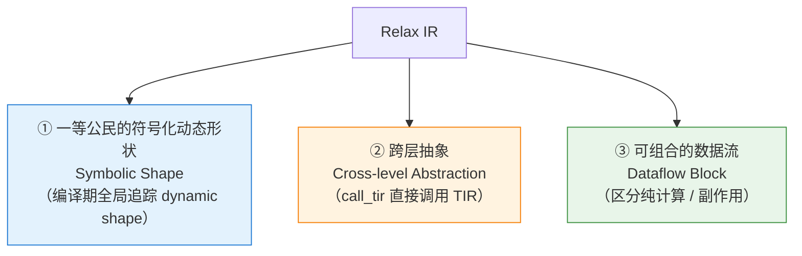
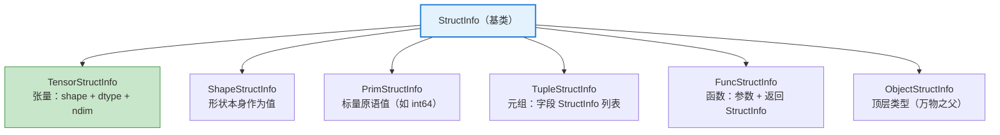
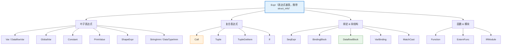
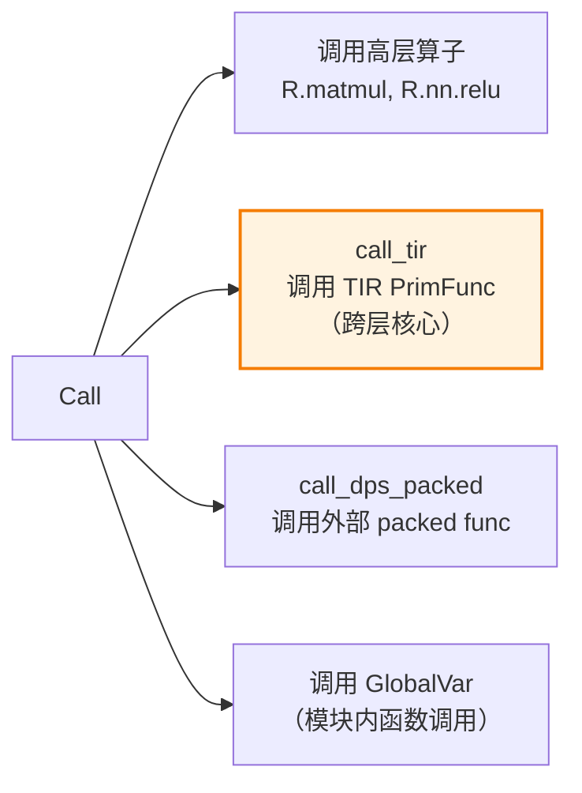
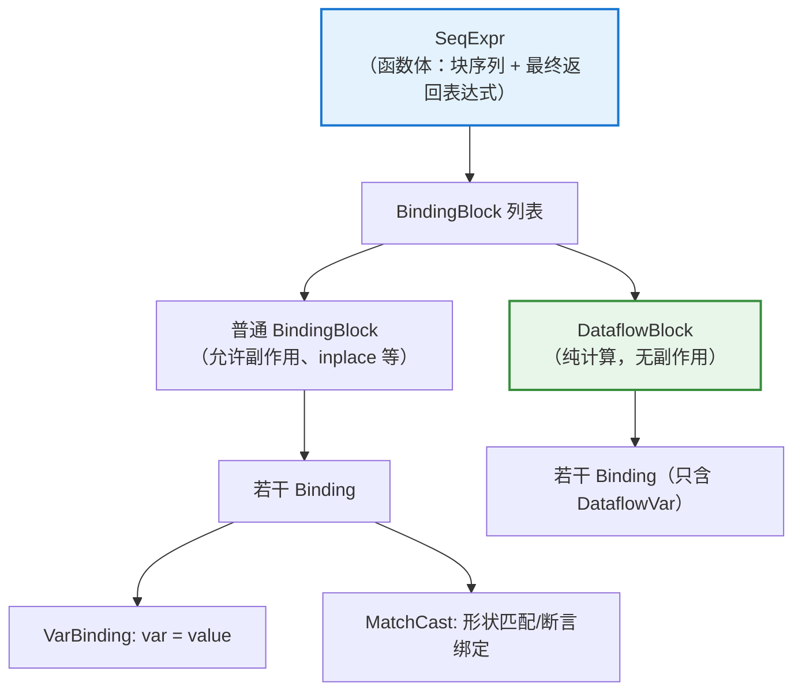
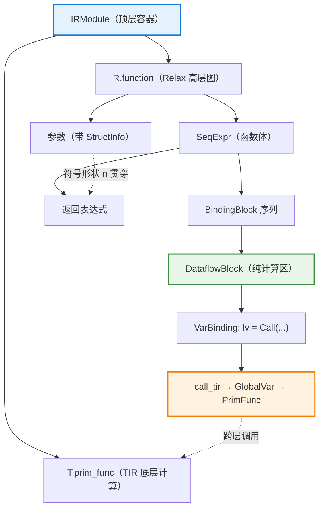
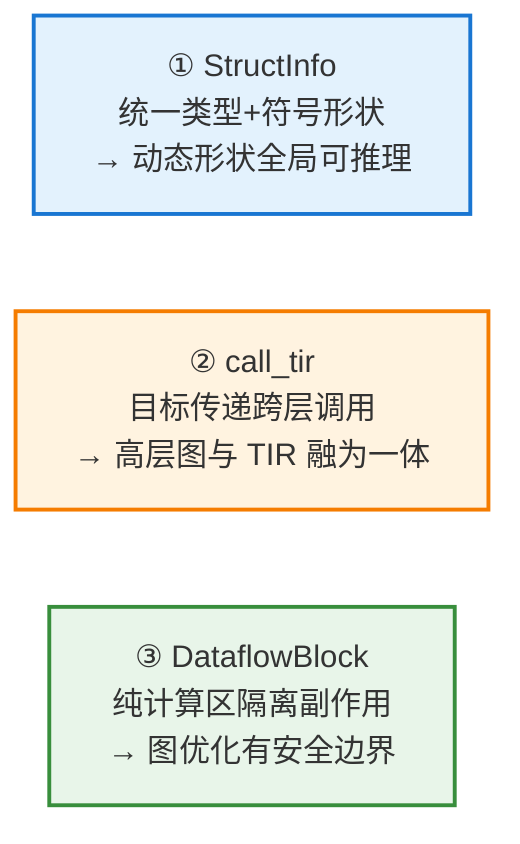

# TVM Relax IR 完整梳理与归纳总结

**文档类型**：编译器 IR 结构技术梳理
**对象**：Apache TVM Relax（下一代高层 IR，用于替代 Relay）
**参考来源**：TVM 官方文档 `deep_dive/relax`、`tvm.relax` API 参考、Relax 论文（arXiv:2311.02103）

> ⚠️ 说明：Relax 处于 TVM Unity 演进中，API 更新较快。本文以官方文档主干概念为准，聚焦**稳定的 IR 结构定义**，具体 Python API 命名以你所用版本为准。

---

## 一、Relax 的定位与三大设计目标

Relax 是一种**图抽象（graph abstraction）**，用于端到端优化 ML 模型。相比 Relay，它的三个核心创新：



理解 Relax IR，本质上就是理解它的**两套核心体系**：

1. **StructInfo 体系**（结构信息 / 类型系统）——描述"值是什么"；
2. **Expr 表达式体系**（AST 节点）——描述"程序怎么算"。

---

## StructInfo 体系：Relax 的类型与形状系统

StructInfo 是 Relax **最重要的创新**，取代了 Relay 中分离的 `Type` + `Shape`。它把**类型信息与形状信息统一**编码在一个层级结构里，支持符号化动态形状。

### 2.1 StructInfo 层级



### 2.2 各 StructInfo 详解

| StructInfo           | 描述                         | TVMScript 记法                    |
| -------------------- | -------------------------- | ------------------------------- |
| **TensorStructInfo** | 张量的结构：形状（可含符号变量）、dtype、维度数 | `R.Tensor((n, 128), "float32")` |
| **ShapeStructInfo**  | 把"形状"本身当作一个值来传递            | `R.Shape([n, 128])`             |
| **PrimStructInfo**   | 标量原语值（对应 TIR 的 `PrimExpr`） | `R.Prim("int64")`               |
| **TupleStructInfo**  | 元组，聚合多个 StructInfo         | `R.Tuple(...)`                  |
| **FuncStructInfo**   | 函数签名信息                     | `R.Callable(...)`               |
| **ObjectStructInfo** | 所有对象的顶层类型                  | `R.Object`                      |

### 2.3 符号化形状（Symbolic Shape）——关键特性

Relax 允许在形状中使用**符号变量**（借用 TIR 的 `tir.Var`），从而在编译期**全局追踪动态形状关系**：

```python
@R.function
def main(
    x: R.Tensor(("n", 784), "float32"),   # n 是符号变量
) -> R.Tensor(("n", 10), "float32"):      # 输出形状与输入 n 关联
    ...
```

这里的 `"n"` 贯穿输入、中间结果、输出，编译器能据此在算子间、函数调用间推理形状关系——这是 Relax 区别于 Relay 的核心能力。

---

## Expr 表达式体系：Relax 的 AST 节点

Relax 的所有程序结构都是 `Expr` 的子类。可分为**叶子表达式**、**复合表达式**、**绑定与块**、**函数与模块**四组。

### 3.1 Expr 总览



### 3.2 叶子表达式（Leaf Expressions）

| 节点                          | 含义                                       |
| --------------------------- | ---------------------------------------- |
| **Var**                     | 普通变量（跨越 dataflow block 边界可见）             |
| **DataflowVar**             | 数据流变量（仅在其所属 DataflowBlock 内可见，是 Var 的子类） |
| **GlobalVar**               | 指向 IRModule 中全局函数的引用（如 `cls.linear`）     |
| **Constant**                | 常量张量（嵌入的权重等）                             |
| **PrimValue**               | 运行期的标量原语值（如动态的 int 值）                    |
| **ShapeExpr**               | 形状字面量表达式，如 `R.shape([n, 128])`           |
| **StringImm / DataTypeImm** | 字符串 / dtype 立即数（作为算子属性传递）                |

> 💡 **Var 与 DataflowVar 的区别是理解 Relax 作用域的关键**：DataflowVar 只在纯数据流块内有效，出块必须"提升"为普通 Var（通过 `R.output`）。

### 3.3 复合表达式（Compound Expressions）

#### （1）Call —— 最核心的节点

`Call` 表示函数/算子调用，是 Relax 中承载计算的主体：

```
Call(op, args, attrs, sinfo_args)
```

- `op` 可以是：Relax 算子（`relax.nn.relu`）、`GlobalVar`（调用模块内函数）、或特殊内建（`call_tir`、`call_dps_packed` 等）。

**几种关键的 Call 形式**：



**`call_tir` —— 跨层抽象的桥梁**（Relax 的招牌特性）：

```python
lv = R.call_tir(cls.linear, (x, w0, b0),
                out_sinfo=R.Tensor((n, 256), "float32"))
```

它采用 **destination-passing（目标传递）** 约定：调用方预先分配输出张量，把输入和输出一起传给底层 `PrimFunc`，函数执行后把结果写入输出。这使得**高层神经网络层**与**底层 TIR 张量计算**能在同一个 IRModule 中无缝衔接。

#### （2）其他复合表达式

| 节点               | 含义                       |
| ---------------- | ------------------------ |
| **Tuple**        | 构造元组，聚合多个值               |
| **TupleGetItem** | 从元组取第 i 个字段              |
| **If**           | 条件分支（true/false 两个分支表达式） |

### 3.4 绑定与块结构（Bindings & Blocks）

这是 Relax **组织程序顺序与副作用**的骨架。



| 结构                | 含义                                                          |
| ----------------- | ----------------------------------------------------------- |
| **SeqExpr**       | 序列表达式，是函数体的顶层结构：一串 BindingBlock，最后跟一个返回表达式                  |
| **BindingBlock**  | 绑定块，包含一组顺序绑定                                                |
| **DataflowBlock** | **纯数据流块**——保证块内全部为无副作用（pure）计算，块内变量为 DataflowVar            |
| **VarBinding**    | 变量绑定 `var = value`                                          |
| **MatchCast**     | 形状匹配转换：在运行期把值的结构信息匹配/断言为指定 StructInfo，是**引入/关联符号形状变量**的关键手段 |

#### DataflowBlock —— 纯计算优化区

**pure（纯）vs side-effect（副作用）** 的区分是 DataflowBlock 的理论基础：

- **纯函数**：只读输入、只通过输出返回结果，不修改程序其他部分（如 `call_tir`）；
- **副作用函数**：如 inplace 操作，会修改已有张量。

`DataflowBlock` 承诺块内**全部为纯计算**，因此编译器可以在其中自由地做**图级优化**（算子融合、死代码消除、重排等）而无需担心副作用顺序。块内的 `DataflowVar` 出块时通过 `R.output(...)` 提升为普通 `Var`。

```python
with R.dataflow():                    # 进入纯数据流块
    lv  = R.call_tir(cls.linear, (x, w0, b0), out_sinfo=...)
    lv1 = R.call_tir(cls.relu,  (lv,),        out_sinfo=...)
    lv2 = R.call_tir(cls.linear, (lv1, w1, b1), out_sinfo=...)
    R.output(lv2)                     # 将 lv2 提升为块外可见的 Var
return lv2
```

### 3.5 函数与模块（Top-level）

| 结构             | 含义                                                          |
| -------------- | ----------------------------------------------------------- |
| **Function**   | Relax 函数，表示高层神经网络执行；由参数、返回 StructInfo、函数体（SeqExpr）构成        |
| **ExternFunc** | 外部函数引用（指向 packed func 等外部实现）                                |
| **IRModule**   | 顶层容器，可**同时容纳** Relax `Function` 与 TIR `PrimFunc`（这是跨层抽象的载体） |

> 💡 **IRModule 的混合性**是 Relax 跨层设计的关键：同一个模块里，`@R.function` 的高层图与 `@T.prim_func` 的底层循环计算共存，通过 `call_tir` + `GlobalVar` 相互调用。

---

## 四、整体结构关系图

把两大体系合起来看，一个完整的 Relax 程序结构如下：



---

## 五、与 Relay 的对比（帮助理解 Relax 的动机）

| 维度          | Relay（旧）        | Relax（新）                           |
| ----------- | --------------- | ---------------------------------- |
| **类型/形状系统** | Type 与 Shape 分离 | **StructInfo 统一**，一等公民符号形状         |
| **动态形状**    | 支持弱、追踪难         | **全局符号追踪**（symbolic shape）         |
| **跨层能力**    | 高层与 TIR 割裂      | **call_tir 直连 TIR**，同一 IRModule 混合 |
| **副作用建模**   | 不显式区分           | **DataflowBlock 显式区分纯/副作用**        |
| **优化边界**    | 全图统一处理          | 纯数据流块内可放心做激进优化                     |

---

## 六、归纳总结

### 6.1 一张表总览所有 Relax IR 要素

| 类别                    | 要素                                                                                              |
| --------------------- | ----------------------------------------------------------------------------------------------- |
| **StructInfo（类型/形状）** | TensorStructInfo、ShapeStructInfo、PrimStructInfo、TupleStructInfo、FuncStructInfo、ObjectStructInfo |
| **叶子表达式**             | Var、DataflowVar、GlobalVar、Constant、PrimValue、ShapeExpr、StringImm、DataTypeImm                    |
| **复合表达式**             | Call（含 call_tir / call_dps_packed）、Tuple、TupleGetItem、If                                        |
| **绑定与块**              | SeqExpr、BindingBlock、DataflowBlock、VarBinding、MatchCast                                         |
| **顶层结构**              | Function、ExternFunc、IRModule                                                                    |

### 6.2 三个必须抓住的核心概念



### 6.3 一句话总结

> Relax IR 由 **StructInfo 结构信息体系**（统一类型与符号动态形状）和 **Expr 表达式体系**（叶子/复合/绑定块/函数模块四层节点）共同构成。其三大标志性设计——**符号形状、call_tir 跨层调用、DataflowBlock 纯计算区**——使得高层神经网络图与底层 TIR 张量计算能够在同一个 IRModule 中协同表达与优化，这正是 TVM Unity 端到端动态编译的基础。

---

如果你希望，我可以进一步展开某个具体主题，例如：

- **StructInfo 的形状推理（shape inference）机制**如何在编译期传播；
- **call_tir vs call_dps_packed vs 直接算子调用**的适用场景对比；
- **Relax 的 Pass / transform 体系**（如算子融合、legalize、静态化等）；
- **TVMScript 中书写 Relax** 的完整语法细节。
