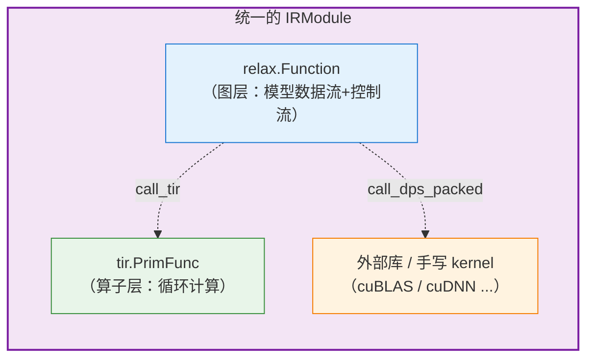
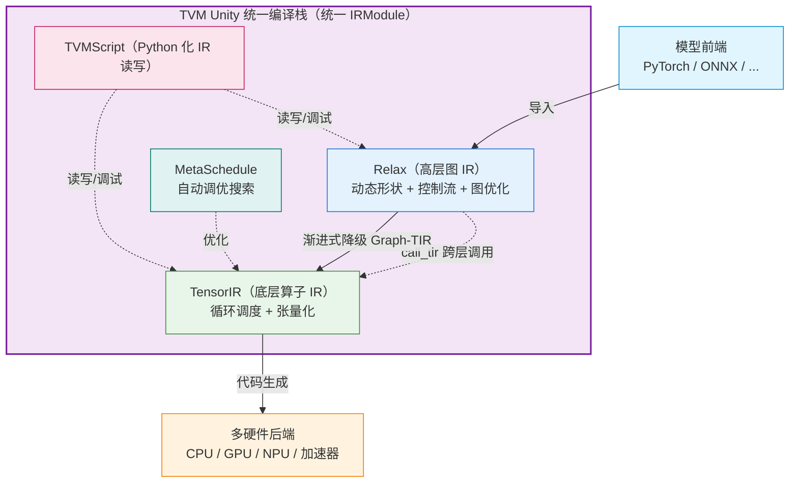

# TVM Unity 技术文档

## 摘要

**TVM Unity 是 Apache TVM 社区推出的下一代统一机器学习编译栈架构**，是 TVM 面向大模型、动态负载场景的核心架构演进，**而非单一的 IR 或工具**。

在 TVM 的 **Relax 框架**中，统一抽象打破了算子层的隔阂，将**高层计算图 IR** 与**底层 TensorIR（TIR）**统一纳入同一个 `IRModule`，实现全流程的**跨层级分析与修改**，从根本上解决了传统优化中「底层信息无法反向指导高层调整」的问题。

> **前置声明**：Unity 是 TVM 近年（约 2022 年起）的重大战略方向，发展快、演进多，部分技术细节和时间线可能存在偏差，关键处已标注，建议以 **tvm.apache.org 官方文档**及 **apache/tvm-rfcs** 为准。

---

## 一、诞生背景：传统 TVM 的架构痛点

传统 TVM 采用「**Relay（高层图 IR）+ TE/TensorIR（底层算子 IR）**」的双层架构，遵循**逐层严格降级（lowering）、各层封闭**的模式：

```
Relay 图层  →  降级  →  TE/算子层  →  降级  →  运行时
```

这一模式在静态 CNN 模型时代表现优异，但面对 Transformer、大语言模型等新负载时暴露了核心短板：

1. **两层 IR 割裂，降级过程陡峭**：Relay 到 TIR 的降级是一次性、黑盒式的，无法渐进式调整，也很难做跨层联合优化——例如图级算子融合无法感知底层硬件调度的实际收益；图层做完决策就"扔"给下层，下层信息也无法反馈给上层。
2. **编译流水线僵化**：只能遵循固定的「Relay 优化 → 算子拆分 → TIR 调度 → 代码生成」流程，难以灵活混合自定义算子、第三方算子库（如 cuBLAS）、BYOC 硬件后端。
3. **动态形状支持薄弱**：Relay 原生对符号动态形状的表达能力有限，无法高效适配 LLM 变长序列、动态 batch 等场景。
4. **硬件适配成本高**：高层图与底层硬件信息不通，新硬件接入需要同时修改多层逻辑。
5. **迭代开发不便**：编译流程偏"黑盒"，研究者难以在 Python 层灵活干预、增量修改。

Unity 正是针对这些痛点的系统性回应。其名称中的 **"Unity（统一）"**，正是强调**消除层与层之间的隔阂**。

---

## 二、核心设计与关键特性

TVM Unity 以**统一 IRModule** 为核心基石，以 **Relax（新一代高层 IR）+ TensorIR（底层算子 IR）** 为两大核心组件。

### 2.1 统一 IRModule：双层 IR 共存于同一模块（核心基石）

同一个 `IRModule` 容器可以同时容纳 `relax.Function`（高层模型计算图）和 `tir.PrimFunc`（底层张量算子函数），两层可以互相调用、互相感知，彻底打破了过去的层级壁垒。

Relax 通过 `call_tir`、`call_dps_packed` 等机制，可以**直接在图层调用底层 TensorIR 函数或外部库函数**。这样，高层与底层不再是"降级后就割裂"，而是**共存、协同优化**。



### 2.2 Graph-TIR 编程范式：平滑渐进式降级

提出 **Graph-TIR** 中间形态，支持从高层图到底层算子的**渐进式降级**：开发者可以逐步把图算子拆解为循环逻辑，也可以随时回退，不必一步完成从图到底层的完整转换，大幅降低了自定义优化的门槛。

### 2.3 原生一流的符号动态形状（First-Class Dynamic Shape）

Relax 内置完整的**符号形状系统**，张量维度可以用符号变量表示（如 `batch_size`、`seq_len`），编译期即可完成形状推导、内存规划与优化，原生适配大模型变长推理、动态输入等场景。

### 2.4 可组合的编译流水线（Composable Transformations）

打破固定流水线限制，编译流程不再是黑盒管线，而是由一系列可自由拼装、增量应用的 Pass 组成。开发者可以自由组合优化 Pass、自定义降级路径，灵活混合三种执行路径：

- 纯 TIR 自动调度优化的算子；
- 调用第三方高性能库（如 cuBLAS、cuDNN）；
- 通过 BYOC 接入自定义硬件加速器。

### 2.5 跨层联合优化能力（Cross-Level Optimization）

这是 Unity 的**灵魂**。高层图优化可以获取底层硬件的调度信息（比如 Tensor Core 的尺寸约束），反过来底层算子调度也能感知图级的融合需求，实现**端到端的全局最优**，而非单层局部最优。

### 2.6 Python-First 的开发体验

Unity 强调 **Python 优先**：通过 **TVMScript**（一种嵌入 Python 的 IR 表示语法），开发者可以直接用 Python 语法**读写、检查、修改** Relax 和 TensorIR，大幅降低开发与调试门槛，便于研究者快速实验。

---

## 三、Unity 的关键组件

| 组件               | 层次      | 作用                                         |
| ---------------- | ------- | ------------------------------------------ |
| **Relax**        | 高层图 IR  | 新一代高层 IR，支持动态形状、控制流、跨层调用（取代 Relay）         |
| **TensorIR**     | 底层算子 IR | 单算子循环级 IR，支持张量化（取代 TE 调度体系）                |
| **MetaSchedule** | 自动调优    | 基于 TensorIR 的无模板自动调度搜索（AutoTVM/Ansor 的继任者） |
| **TVMScript**    | 表示语法    | Python 嵌入式语法，统一读写 Relax 与 TensorIR         |

### 组件协同关系



---

## 四、与传统 TVM（Relay 架构）的核心区别

| 对比维度         | 传统 TVM（Relay 栈）       | TVM Unity（Relax 栈）                  |
| ------------ | --------------------- | ----------------------------------- |
| **核心 IR 组合** | Relay（静态图）+ TE/早期 TIR | Relax（动态图）+ TensorIR，统一 IRModule 承载 |
| **动态形状支持**   | 弱，仅支持有限动态维度           | 原生符号形状系统，**一等公民**支持                 |
| **降级方式**     | 一次性黑盒降级，层级割裂          | 渐进式 Graph-TIR 降级，两层可交互              |
| **编译流水线**    | 固定流程，扩展性弱             | 可组合、可定制，灵活混合多种执行路径                  |
| **跨层优化**     | 无法跨层联合优化              | 支持图-算子跨层全局优化                        |
| **控制流**      | 有限支持                  | 完整支持（if / while / 递归）               |
| **自动调优**     | AutoTVM（模板）/ Ansor    | MetaSchedule（无模板）                   |
| **外部库集成**    | 较僵硬                   | 灵活（`call_dps_packed`、BYOC 等）        |
| **开发体验**     | 偏黑盒                   | Python-First（TVMScript）             |
| **典型适用场景**   | 静态 CNN、固定尺寸模型         | LLM、多模态、动态形状、定制硬件                   |

---

## 五、典型应用与现状

### 5.1 典型应用

1. **MLC-LLM**：TVM 官方的大语言模型部署方案，完全基于 TVM Unity 栈构建，用于将 LLM 编译部署到多样化硬件（包括手机、浏览器等边缘设备），是当前端侧 LLM 部署的主流方案之一。
2. **多模态模型部署**：支持 Stable Diffusion、Whisper 等带动态结构的模型端到端优化。
3. **硬件厂商适配**：通过统一的 BYOC 接口，降低 AI 加速器、端侧 NPU 的接入成本。

### 5.2 为什么重要：面向大模型时代

Unity 的推进与**大语言模型（LLM）时代**的需求高度契合：

- **动态形状是刚需**：LLM 推理中，序列长度、batch 大小天然可变，Relax 的符号动态形状正好适配。
- **跨层协同释放性能**：LLM 优化常需要图层（如 KV Cache 管理、算子融合）与算子层（如 FlashAttention 的定制 kernel）紧密配合，跨层抽象让这种协同成为可能。
- **灵活集成手写/库 kernel**：高性能 LLM 推理往往依赖精心优化的 kernel 或第三方库，Unity 的灵活调用机制便于集成。

### 5.3 发展现状

目前 TVM Unity 已成为 TVM 社区的主流发展方向，**Relax 已正式并入 TVM 主线**，新一代特性、优化均优先基于 Unity 栈落地，传统 Relay 架构逐步进入维护状态。

---

## 六、核心结论

- **TVM Unity 是一次架构级战略升级**，核心是**打破图层、算子层、库层之间的壁垒**，实现"跨层协同优化"。
- **基石是统一 IRModule**：让 `relax.Function` 与 `tir.PrimFunc` 共存于同一模块，配合 `call_tir` 等机制互相调用、互相感知，取代传统"逐层封闭降级"的模式。
- **四大支柱**：Relax（高层图，动态+跨层）、TensorIR（底层算子，张量化）、MetaSchedule（自动调优）、TVMScript（Python 化 IR）。
- **面向大模型与异构硬件时代**：动态形状、控制流、灵活库集成等特性，使 TVM 更适配 LLM、多模态等现代工作负载。

---

## 附录：核实提示

- Unity 相关机制（`call_tir`、`call_dps_packed` 的确切语义与用法）、Graph-TIR 范式细节，以及各组件的时间线，请以 **TVM 官方文档、Relax RFC（apache/tvm-rfcs）** 为准。
- **MLC-LLM 与 Unity 的关系**、Unity 各功能合入主干的具体版本，建议核实。
- Relax 相关论文：《Relax: Composable Abstractions for End-to-End Dynamic Machine Learning》（发表场合请核实）。

---

> 如需进一步补充 **TVM Unity 的入门学习路径**、**跨层抽象 `call_tir` 的具体代码机制**、**TVMScript 语法示例**，或 **TVM Unity 与 MLIR 的架构对比**，可以告诉我，我可以继续展开。😊


## see also

[如何评价 TVM 在 Relay 之后的新 IR Relax？ - 冯思远的回答 - 知乎](https://www.zhihu.com/question/522101384/answer/2392699729)


[新一代深度学习编译技术变革和展望](https://zhuanlan.zhihu.com/p/446935289)
