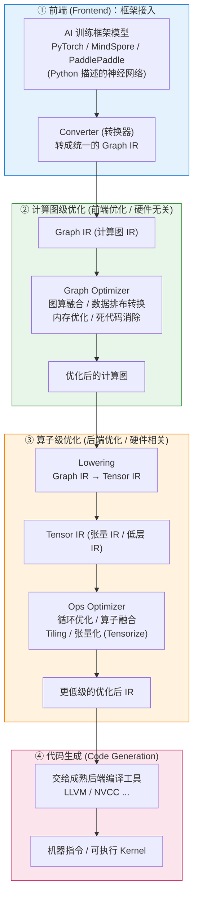

# AI-compiler

## AI 编译器设计目标

AI 编译器在 AI 领域的应用主要分为两个场景：推理场景和训练场景。这两个场景分别对应了 AI 模型生命周期中的不同阶段，并且对编译器的要求也有所不同。

### 推理场景

**推理场景**指的是 AI 模型已经训练完成，并且需要在实际应用中对新的数据进行预测的过程。在这个阶段，模型的权重和结构已经固定，编译器的任务是将训练好的模型文件转换成能够在特定硬件上高效执行的程序。推理场景的关键点包括：

- 性能优化：推理时对性能要求很高，因为通常需要实时或近实时的响应。编译器需要优化模型以减少延迟和提高吞吐量。
- 资源利用：在推理时，编译器需要高效地利用硬件资源，如 CPU、GPU 或专用 AI 加速器，以实现最佳的能效比。
- 模型压缩：编译器可能会进行模型压缩，减少模型大小，以适应资源受限的部署环境，如移动设备或[嵌入式系统](https://cloud.tencent.com/developer/techpedia/1954?from_column=20065&from=20065)。
- 硬件兼容性：编译器需要确保生成的程序能够在不同的硬件平台上运行，包括不同的处理器架构和加速器。

### 训练场景

**训练场景**是指使用大量标注数据来训练神经网络模型的过程。在这个阶段，模型的参数（权重和偏置）是未知的，需要通过学习数据来确定。编译器在此阶段的任务是将用高级语言编写的神经网络代码转换成能够在硬件上高效执行的训练程序。训练场景的关键点包括：

- 代码生成：编译器需要将高级语言描述的神经网络算法转换成可以执行的低级代码。
- 梯度计算：在训练过程中，编译器需要支持自动微分，以计算损失函数相对于模型参数的梯度。
- 并行计算：编译器需要优化数据并行和模型并行策略，以利用多个处理器或多个设备进行训练。
- 内存管理：由于训练过程中数据和中间结果可能非常庞大，编译器需要有效管理内存，以避免内存溢出和提高计算效率。

推理场景和训练场景是 AI 编译器应用的两个主要领域，它们各自有着不同的优化目标和挑战。推理场景更注重性能和资源利用，而训练场景则更侧重于代码生成、梯度计算和并行优化。AI 编译器的发展需要同时满足这两个场景的需求，以支持 AI 模型从开发到部署的整个生命周期。

> NOTE: 参考自 [【AI系统】AI 编译器历史阶段](https://cloud.tencent.com/developer/article/2471987?policyId=1003) 

## AI 编译器完整流程（Pipeline）

在深入具体优化技术之前，先建立一个全局观：一个 AI 模型从**框架代码**到**能在硬件上高效执行的机器指令**，中间到底经历了哪些阶段。理解这条主线，能让后续所有的「图优化、算子融合、tiling、张量化、代码生成」等技术点都各归其位。

AI 编译器采用**多层架构**设计，核心是「**两层 IR + 两类优化**」：

- **高层 IR（Graph IR / 计算图 IR）** + **前端优化**（硬件无关）
- **低层 IR（Tensor IR / 张量 IR）** + **后端优化**（硬件相关）

### 端到端总览

这条流水线可以浓缩为一句话：

> **框架模型 → Graph IR →（前端优化）→ Tensor IR →（后端优化）→ 低层 IR → 机器码**

### 两层 IR、两类优化的对比

AI 编译器的核心设计哲学，是把**硬件无关**的优化和**硬件相关**的优化解耦到两层 IR 上，各司其职：

| 维度        | 前端优化（Graph 级）          | 后端优化（算子 / Tensor 级）       |
| --------- | ---------------------- | ------------------------- |
| **对象**    | 整个计算图的拓扑结构             | 单个算子的内部实现                 |
| **视野**    | 局部或全局视野                | 只关注单个算子节点                 |
| **关注点**   | 算子节点的融合、消除、化简          | 输入输出、内存、循环方式、计算逻辑的编排与转换   |
| **目标**    | 使计算图整体的计算与存储开销最小       | 使单个算子在目标硬件上性能最优           |
| **硬件相关性** | 硬件无关（通用优化）             | 硬件相关（依赖 ISA、内存带宽、算力、存储层次） |
| **典型手段**  | 图算融合、数据排布转换、内存优化、死代码消除 | 循环优化、算子融合、Tiling、张量化      |
| **IR 层级** | Graph IR（高层）           | Tensor IR（低层）             |

## Books

AI编译器领域迭代极快，专门的系统专著不多，核心知识分散在编译原理、GPU高性能计算、AI系统三大领域。下面按「打底→核心→专项→进阶补充」整理权威书单]\\\。

### 基础打底：编译原理核心（必补根基）

AI编译器是领域专用编译器的分支，所有优化技术都根植于经典编译原理，优先建立完整知识框架。

1. **《编译原理》（龙书）Compilers: Principles, Techniques, and Tools** 编译领域圣经，系统讲解词法/语法分析、中间表示、数据流分析、指令调度、寄存器分配等核心概念。AI编译器中的图优化、算子调度、内存分配，本质都是经典编译技术在深度学习领域的延伸。
2. **《Engineering a Compiler》（工程编译器）** 比龙书更偏向现代编译器工程实现，对中间表示设计、代码生成、优化流水线的讲解更贴合工业界实践，适合想动手做编译器开发的读者。

## 核心对口：AI编译器专属专著

1. **《Deep Learning Systems: Algorithms, Compilers, and Processors for Large-Scale AI》** 目前AI系统与编译器领域最权威的英文专著，全链路覆盖计算图优化、算子分块调度、内存层次优化、Tensor Core硬件映射、自动调优等核心技术，同时串联GPU硬件架构与大模型算力需求，和你关注的SM、Blackwell/Rubin架构适配度极高。
2. **《深度学习编译器入门与实战：基于TVM框架》** 国内少有的实战向AI编译器书籍，以TVM为载体，从计算图IR、算子融合、循环分块到AutoTVM自动调优，配套完整代码案例，适合从零上手实操。
3. **《机器学习系统：设计与实现》** 对应CMU经典课程15-442，其中编译优化是核心章节，深度对比了XLA、TVM、TensorRT等主流框架的设计思路，兼顾训练与推理场景。

## 三、后端根基：GPU高性能计算（读懂底层优化）

AI编译器的最终性能取决于对GPU硬件的利用效率，不懂GPU架构就做不好深度优化。

1. **《大规模并行处理器编程实战》（Programming Massively Parallel Processors）** CUDA领域“红宝书”，讲透SIMT架构、SM执行模型、内存层次、分块复用、流水线延迟隐藏等底层逻辑，是理解算子级优化、FlashAttention显存优化的必备基础。
2. **《CUDA C编程权威指南》** 国内更易读的CUDA进阶教材，配套大量可运行的内核案例，能帮你直观理解AI编译器最终生成的GPU指令形态。

## 四、前沿专项：大模型编译与推理优化

传统AI编译器书籍对Transformer、MoE、长上下文等新场景覆盖有限，优先看这两本贴合当前工业界的新作：

1. **《大模型系统：原理与工程实践》** 国内最新的大模型系统专著，专门章节讲解大模型专属编译优化，包括FlashAttention融合、PagedAttention内存调度、KV缓存压缩、MoE路由与通信流水化等你之前关注的技术点。
2. **《Large Language Models: Foundations, Systems, and Applications》** 英文权威著作，系统梳理大模型推理系统的编译优化、显存管理、并发调度，对长上下文、Agent推理等场景的编译优化有深度拆解。

## 五、进阶补充：最新技术必读（书籍天然滞后）

AI编译器迭代速度远超出版周期，FlashAttention、FP8量化、MoE稀疏编译等前沿技术均以论文和开源文档形式发布，是进阶必看：

- 核心论文：TVM原理论文、FlashAttention系列论文、MLIR架构论文、PagedAttention论文
- 官方文档：TVM官方文档、MLIR官方文档、TensorRT-LLM开发者指南、Triton官方教程
- 开源课程：CMU 15-442 机器学习系统、Stanford CS231n 系统模块

### 阅读路径建议

- 入门：编译原理基础 → TVM实战书 → CUDA红宝书
- 进阶：《Deep Learning Systems》 → 大模型系统专项 → 啃论文+读源码

需要我按你的基础（入门/进阶）帮你精简成一份3本的必读书单吗？

## [AI 编译器历史阶段](https://cloud.tencent.com/developer/article/2471987?policyId=1003)
