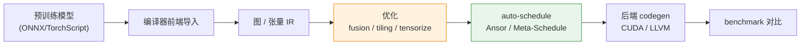
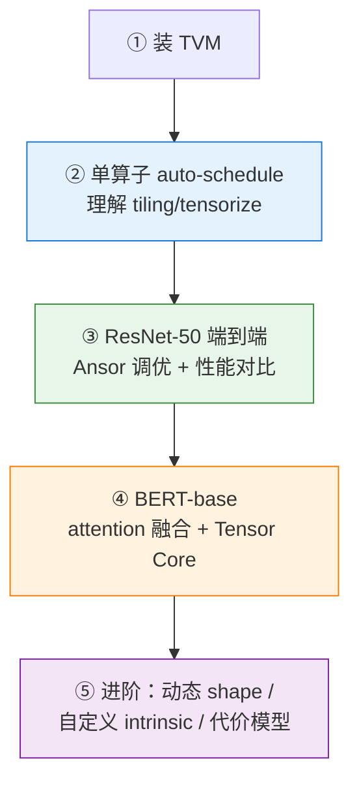

# 用预训练模型实践深度学习编译技术：一份入门实践指南

> 本文面向想要动手实践深度学习编译（DL Compiler）技术的读者，介绍如何选择、获取并使用**预训练模型**作为编译负载，逐步实践 tiling、tensorize、算子融合、auto-scheduling 与后端 codegen 等核心技术。

---

## 目录

1. [一个容易被忽视的前提：编译实践如何选模型](#一一个容易被忽视的前提编译实践如何选模型)
2. [选模型的核心原则](#二选模型的核心原则)
3. [入门模型阶梯：从单算子到 Transformer](#三入门模型阶梯从单算子到-transformer)
4. [模型获取渠道](#四模型获取渠道)
5. [配套编译框架的选择](#五配套编译框架的选择)
6. [一条完整的实践路径](#六一条完整的实践路径)
7. [常见避坑提示](#七常见避坑提示)
8. [总结](#八总结)

---

## 一、一个容易被忽视的前提：编译实践如何选模型

当我们谈"使用预训练模型"时，大多数人想到的是**用**模型完成推理任务（分类、生成、检测等）。但在深度学习编译的语境下，目的完全不同：

> **模型不是"要解决的任务"，而是"编译器的输入负载（workload）"。**

我们把一个训练好的模型喂给编译器，目的是去观察和实践：循环 tiling、映射到硬件张量指令（tensorize）、算子融合、自动调度（auto-scheduling）、后端代码生成（codegen）等编译技术。

```
普通 ML 用户：追求"最强 / 最新"的模型
编译技术实践：追求"好导入、算子有代表性、shape 明确、易 benchmark"的模型
        ↓
    重点不是模型多聪明，
    而是它能否顺利跑通编译流程、能否覆盖你想优化的算子类型
```

理解这个前提，才能避免"一上来就抱着最大最新的 LLM 硬啃"的弯路。

---

## 二、选模型的核心原则

| 关注点 | 说明 |
| --- | --- |
| **算子代表性** | GEMM、Conv、Attention 是编译优化的核心战场，优先覆盖 |
| **导入顺畅** | 优先选能干净导出 ONNX / TorchScript 的模型 |
| **shape 静态** | 静态 shape 编译成熟；动态 shape 属于进阶挑战 |
| **规模适中** | 太大的模型难调试、auto-tune 极慢，应从小模型起步 |
| **有 baseline** | 便于和 cuDNN / cuBLAS、原生框架对比性能 |

```
一句话总结选型标准：
    不追新追强，
    追【算子典型 + 易导入 + 静态 shape + 规模适中】
```

---

## 三、入门模型阶梯：从单算子到 Transformer

建议按下面三个阶段循序渐进，不要跳级。

### 阶段 1：单算子 / 微基准（先跑通工具链）

```
不要一上来就编译整个模型！先从单算子开始：
    • 一个 GEMM（矩阵乘）
    • 一个 Conv2d
    • 一个 fused MLP block
        ↓
    这些甚至不需要"预训练模型"，直接在 TVM / MLIR 里定义即可
    目的：跑通 tiling / tensorize / auto-schedule 的完整流程
```

> TVM 的 tutorials、MLIR 的 `linalg` 示例都自带这类微基准。**这是最应该先完成的一步**——先理解工具链如何工作，再谈整模型。

### 阶段 2：经典 CNN（算子清晰、导入成熟）

| 模型 | 为什么适合编译实践 |
| --- | --- |
| **ResNet-18 / 50** 🌟 | 编译器界的"Hello World"，几乎所有论文的 baseline，以 Conv 为主 |
| **MobileNet V2 / V3** | 含 depthwise conv，考验特殊算子优化 |
| **VGG** | 结构简单，纯 conv + fc，便于分析 |

```python
# 典型流程
model = torchvision.models.resnet50(pretrained=True)
# 导出
torch.onnx.export(...)           # 或 torch.jit.trace(...)
# 导入编译器
# TVM:  relay.frontend.from_onnx / from_pytorch
# MLIR: torch-mlir 导入
```

### 阶段 3：Transformer / Attention（当前热点）

| 模型 | 编译价值 |
| --- | --- |
| **BERT-base** 🌟 | Attention + LayerNorm + GEMM，融合优化的经典对象 |
| **ViT** | Transformer 应用于 CV |
| **小型 GPT / LLaMA** | 自回归、KV-cache，带来动态 shape 挑战 |

```
Attention 是当前编译优化的主战场：
    • fused multi-head attention（类 FlashAttention 的 codegen）
    • GEMM + softmax 融合
    • Tensor Core 的 tensorize
        ↓
    BERT-base 是最好的练手对象（静态 shape、算子典型）
```

---

## 四、模型获取渠道

针对编译实践，推荐以下渠道：

| 渠道 | 用法 |
| --- | --- |
| **torchvision / timm** | CNN / ViT，一行加载后导出 ONNX 🌟 |
| **Hugging Face transformers** | BERT / GPT 等，`.from_pretrained()` 后导出 |
| **ONNX Model Zoo** 🌟 | **已是 ONNX 格式**，省去导出麻烦，编译器前端可直接导入 |
| **MLPerf Inference 模型** | 工业界 benchmark 标准模型（ResNet50、BERT、SSD 等），带精度/性能参考 |

```
💡 最省事路线：ONNX Model Zoo
    直接下载 .onnx 文件 → 编译器前端直接导入
    避免"导出 ONNX 时算子不支持"这个高频坑
```

---

## 五、配套编译框架的选择

预训练模型只是输入，真正的实践发生在编译框架里。典型的编译流水线如下：



常见框架对比：

| 框架 | 适合练什么 | 上手难度 |
| --- | --- | --- |
| **Apache TVM** 🌟 | tiling、tensorize、Ansor / Meta-Schedule 全流程 | 中，文档全、社区大 |
| **MLIR (linalg / affine)** | 多层 IR、渐进式 lowering、pass 开发 | 较高，偏基础设施 |
| **IREE** | 基于 MLIR 的端到端部署 | 中高 |
| **torch-mlir** | PyTorch → MLIR 桥接 | 中 |
| **Triton** | GPU kernel、block-level 编程 | 中，偏 kernel |

> **建议**：如果你关注的是 **auto-tiling / auto-tensorize**，**Apache TVM 是最佳起点**——它的 Ansor、Meta-Schedule、tensorize 原语都能直接动手，且有大量成体系的 tutorial。

---

## 六、一条完整的实践路径

把上述内容串成一条可执行的学习路线：

```
① 安装 TVM（或使用官方 docker 镜像）
    ↓
② 跑通官方 tutorial：单个 conv / matmul 的 auto-scheduling
    → 理解 tiling / tensorize 是如何被搜索出来的
    ↓
③ 从 torchvision 取 ResNet-50 → 导出 ONNX → TVM 导入
    → 端到端编译到 GPU / CPU，运行 Ansor 调优
    → 与原生 PyTorch / cuDNN 对比性能
    ↓
④ 换成 BERT-base，实践 attention 融合 + Tensor Core tensorize
    ↓
⑤ 进阶：动态 shape（TVM Relax）、自定义 tensorize intrinsic、
        改进代价模型（结合 TenSet 数据集）
```



---

## 七、常见避坑提示

```
⚠️ 高频坑点：
    ① ONNX 导出算子不支持 → 优先用 ONNX Model Zoo 现成文件
    ② 模型太大 auto-tune 极慢 → 先用 ResNet-18 / BERT-base 等中小模型
    ③ 动态 shape 一开始别碰 → 先把静态 shape 全流程跑通
    ④ 性能对比要控变量 → 固定 batch / shape / 硬件，warm-up 后再测
    ⑤ Tensor Core 有约束 → 需要特定 dtype(fp16) 和 shape 对齐
```

---

## 八、总结

```
用预训练模型实践深度学习编译技术，关键在于转变视角：
模型是"编译负载"，而非"要完成的任务"。

【选模型】不追新追强，追【算子典型 + 易导入 + 静态 shape + 规模适中】
    阶梯：单算子 → ResNet-50 → BERT-base → 小 LLM

【拿模型】
    • 最省事：ONNX Model Zoo（现成 .onnx）
    • 更灵活：torchvision / timm / HF transformers 导出

【练什么】tiling、tensorize、fusion、auto-schedule、codegen

【用什么框架】
    TVM 起步（最贴合 auto-tiling / auto-tensorize），
    进阶再看 MLIR / IREE / Triton
```

> 📌 **核心心法**：深度学习编译实践的第一课，是想清楚"预训练模型在这里扮演什么角色"——它不是被崇拜的智能体，而是被解剖的实验样本。基于这个定位，选型的一切标准都随之明朗：要算子有代表性（GEMM/Conv/Attention 是主战场）、要能干净导入（ONNX Model Zoo 最省心）、要 shape 静态且规模适中（便于调试与 auto-tune）、要有可对比的 baseline（cuDNN/cuBLAS）。实践路径同样要克制——先啃单算子跑通工具链，再上 ResNet-50 打通端到端，进而用 BERT-base 触碰 attention 融合与 Tensor Core，最后才涉足动态 shape、自定义 intrinsic 与代价模型这些硬骨头。**先跑通，再优化；先静态，再动态；先小模型，再大模型**——遵循这条由简入繁的阶梯，你会发现每一步都在踏实地积累对 tiling、tensorize、fusion 与 codegen 的真实理解，而不是被环境配置和性能玄学消耗掉热情。
