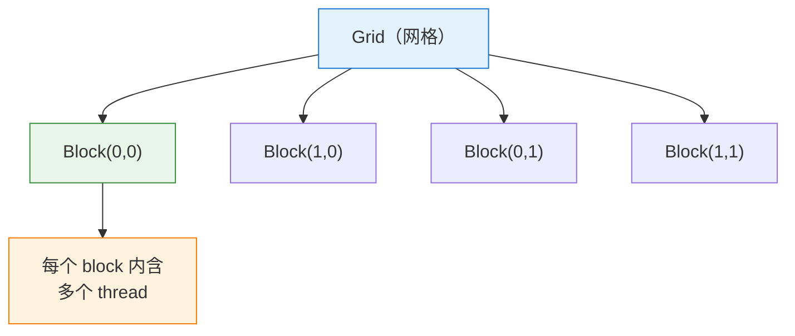
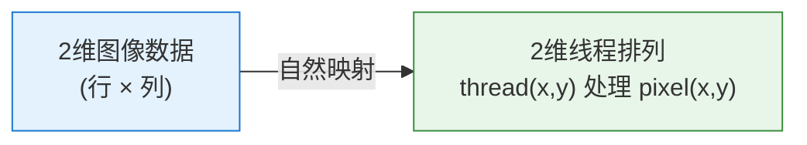
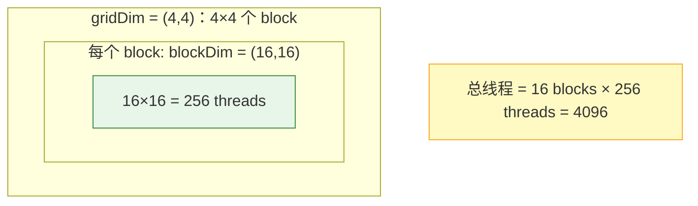
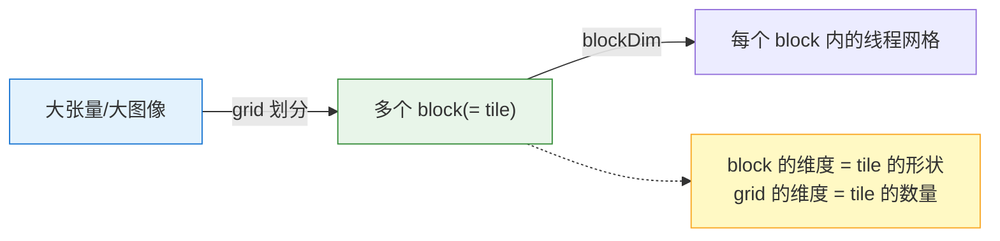

# CUDA 线程层级中的 "Dimension" 是什么意思

你引用的这段话描述了 CUDA 的**线程组织层级**：thread → block → grid。其中反复出现的 **dimension（维度）** 是理解 CUDA 编程模型的关键。本文专门讲清楚这里的 "dimension" 到底指什么、为什么要有它。

---

## 目录

1. [先回顾：thread / block / grid 的三层结构](#一先回顾threadblockgrid-的三层结构)
2. [Dimension 的核心含义：数据块的"形状"](#二dimension-的核心含义数据块的形状)
3. [为什么要有多维？——匹配数据的天然形状](#三为什么要有多维匹配数据的天然形状)
4. [两个层级的 dimension：blockDim 与 gridDim](#四两个层级的-dimensionblockdim-与-griddim)
5. [用一个例子把维度串起来](#五用一个例子把维度串起来)
6. [维度与索引：如何定位一个线程](#六维度与索引如何定位一个线程)
7. [与前文的连接：维度就是 tile 的划分](#七与前文的连接维度就是-tile-的划分)
8. [总结](#八总结)

---

## 一、先回顾：thread / block / grid 的三层结构

```
launch kernel（启动核函数）
    → 产生百万级 threads（线程）
        ↓ 组织成
    thread block（线程块）：一组线程
        ↓ 组织成
    grid（网格）：一组线程块
        ↓
    整个层级：grid → 多个 block → 每个 block 有多个 thread
```



现在关键问题来了：**这些 thread 在 block 里怎么排列？这些 block 在 grid 里怎么排列？** 这就是 dimension 要回答的。

---

## 二、Dimension 的核心含义：数据块的"形状"

```
dimension（维度）在这里 = 线程/块的【排列形状】
        ↓
    不是简单地排成一条直线，
    而是可以排成【1维、2维、或 3维】的规则阵列
```

一个 block 里的线程，可以按不同维度组织：

```
1维 block：线程排成一条线
    T T T T T T T T          （比如 8 个线程，dim = 8）

2维 block：线程排成一个矩形网格
    T T T T
    T T T T                  （比如 4×2，dim = 4×2）

3维 block：线程排成一个立方体
    （多个 2维平面堆叠）       （比如 4×2×2）
```


> **一句话**：这里的 dimension 指的是线程（在 block 内）和线程块（在 grid 内）的**排列形状与各方向上的数量**——可以是 1 维、2 维或 3 维。

引用中说 "all the thread blocks in a grid have the same size and dimensions" —— 意思是：一个 grid 里所有 block 的**形状（几维、每维多大）完全相同**。

---

## 三、为什么要有多维？——匹配数据的天然形状

这才是理解 dimension 的**关键**。为什么不干脆全排成一维？

```
回顾我们之前聊过的：深度学习数据天然是多维的
    图像 = 2维(高×宽)
    图像批 = 4维(N×C×H×W)
    矩阵 = 2维
        ↓
    如果处理 2维图像，却用 1维线程排列
    → 每个线程还得手动换算"我对应图像的哪一行哪一列"
    → 麻烦且易错
        ↓
    直接用 2维线程排列！
    → 线程 (x, y) 天然对应像素 (x, y)
    → 索引直观、代码清晰
```



| 数据形状           | 用几维的线程组织最自然 |
| -------------- | ----------- |
| 一维数组（向量加法）     | 1 维         |
| 矩阵 / 图像        | 2 维         |
| 体数据 / 一批带通道的图像 | 3 维         |

> **多维 dimension 的意义**：让**线程的排列形状去匹配数据的天然形状**，使"哪个线程处理哪块数据"的对应关系变得直观自然。

---

## 四、两个层级的 dimension：blockDim 与 gridDim

CUDA 里有**两个层级**都有维度，别混淆：

```
① blockDim（块的维度）
    = 一个 block 里，线程按什么形状排列、每维多少个线程
    例：blockDim = (16, 16) → 每个 block 有 16×16 = 256 个线程

② gridDim（网格的维度）
    = 整个 grid 里，block 按什么形状排列、每维多少个 block
    例：gridDim = (4, 4) → grid 里有 4×4 = 16 个 block
        ↓
    总线程数 = gridDim × blockDim
             = (4×4) × (16×16) = 16 × 256 = 4096 个线程
```



> 每个层级都可以独立选择 1/2/3 维，来最好地匹配你的问题结构。

---

## 五、用一个例子把维度串起来

假设要处理一张 **64 × 64 的图像**，每个像素一个线程：

```cuda
// 设定维度
dim3 blockDim(16, 16);   // 每个 block 是 16×16 = 256 个线程（2维）
dim3 gridDim(4, 4);      // grid 是 4×4 = 16 个 block（2维）
                         // 覆盖 64×64 = (4×16) × (4×16) 个像素 ✓

myKernel<<<gridDim, blockDim>>>(...);  // 启动 kernel
```

```
维度如何拼出整张图：
    grid 方向：  4 个 block × 每 block 16 线程 = 64（覆盖一行 64 像素）✓
    → 2维的 grid × 2维的 block，恰好铺满 2维的 64×64 图像

图示（每个 □ 是一个 block，内部又是 16×16 线程）：
    ┌────┬────┬────┬────┐
    │ □  │ □  │ □  │ □  │
    ├────┼────┼────┼────┤
    │ □  │ □  │ □  │ □  │   4×4 个 block
    ├────┼────┼────┼────┤   每个 block 16×16 线程
    │ □  │ □  │ □  │ □  │   合计覆盖 64×64 像素
    ├────┼────┼────┼────┤
    │ □  │ □  │ □  │ □  │
    └────┴────┴────┴────┘
```

> 维度设计的目标：**让 grid × block 的总形状，恰好覆盖你要处理的数据形状。**

---

## 六、维度与索引：如何定位一个线程

有了维度，每个线程就能算出"我是谁、我该处理哪个数据"。CUDA 提供内置变量：

```cuda
// 内置变量（都是 3 维的，含 .x .y .z）
threadIdx   // 线程在自己 block 内的坐标
blockIdx    // block 在 grid 内的坐标
blockDim    // block 的维度（每维线程数）
gridDim     // grid 的维度（每维 block 数）

// 计算这个线程负责的全局坐标（2维为例）：
int x = blockIdx.x * blockDim.x + threadIdx.x;  // 全局列
int y = blockIdx.y * blockDim.y + threadIdx.y;  // 全局行
// → (x, y) 就是这个线程要处理的像素坐标
```

```
定位逻辑（一维方向图解）：
    blockIdx.x=2, blockDim.x=16, threadIdx.x=5
        ↓
    全局索引 = 2 × 16 + 5 = 37
        ↓
    "我是全局第 37 个线程，处理第 37 列数据"
```

> 维度（blockDim/gridDim）+ 索引（threadIdx/blockIdx）= 让每个线程精确知道自己的"岗位"。

---

## 七、与前文的连接：维度就是 tile 的划分

把这个概念接回我们之前讨论的 **tile / tiling**：

```
grid 把整个大问题，切成一个个 block  ← 这正是"分块(tiling)"！
    • 一个 block = 一个 tile（一块数据 + 处理它的一组线程）
    • block 的 dimension = tile 的形状
    • grid 的 dimension = 一共切成多少个 tile
        ↓
    我们讲 Triton "block-level 编程"、TileLang "以 tile 为单位"
    → 底层正是对应 CUDA 的这套 grid/block 维度划分
```



> 所以 dimension 不是孤立概念——**block 的维度本质上就是在定义 tile 的形状，grid 的维度就是在定义把数据切成多少块**。这正是我们反复讲的 tiling 在 CUDA 编程模型里的直接体现。

---

## 八、总结

```
引用中 "dimension" 的含义：

【核心定义】
    dimension = 线程/线程块的【排列形状】
    可以是 1维（线）、2维（矩形）、3维（立方体）

【两个层级】
    blockDim = 一个 block 内线程的形状（每维多少线程）
    gridDim  = 一个 grid 内 block 的形状（每维多少 block）
    总线程数 = gridDim × blockDim

【为什么要多维】
    让线程排列形状 匹配 数据的天然形状
    （2维图像 → 2维线程，thread(x,y)↔pixel(x,y)，直观）

【引用那句话的意思】
    "same size and dimensions" =
    一个 grid 里所有 block 的形状（几维+每维大小）完全相同

【和前文的连接】
    grid 划分 = tiling（分块）
    block 维度 = tile 的形状
    grid 维度 = tile 的数量
    → Triton/TileLang 的"block/tile 编程"就建立在这套维度模型上
```

> 📌 **核心洞察**：这里的 dimension，本质上是 CUDA 为了**让"线程的组织结构"去贴合"数据的天然结构"**而设计的机制。回想我们之前反复强调的——深度学习的数据本身就是多维张量（图像是 2 维、图像批是 4 维），如果 CUDA 只允许线程排成一维直线，那么每个线程都要手动做繁琐的坐标换算才能对应到它该处理的那个像素或元素。于是 CUDA 让线程和线程块都可以组织成 1/2/3 维的规则阵列，使得"哪个线程处理哪块数据"的映射变得**自然而直观**——处理 2 维图像就用 2 维线程网格，`thread(x,y)` 直接对应 `pixel(x,y)`。而更深一层看，grid 把大问题切成一个个 block 的过程，其实就是我们一路讨论下来的 **tiling（分块）**：block 的维度定义了每个 tile 的形状，grid 的维度定义了切成多少个 tile。所以当你理解了这里的 dimension，你就同时理解了 CUDA 的线程组织模型、以及它与 tile 抽象、乃至 Triton/TileLang 那套 "block-level / tile 编程" 之间一脉相承的关系——**它们都是同一个思想在不同抽象层次上的体现：把规则的多维数据，划分成规则的多维块，交给规则的多维线程阵列去并行处理**。
