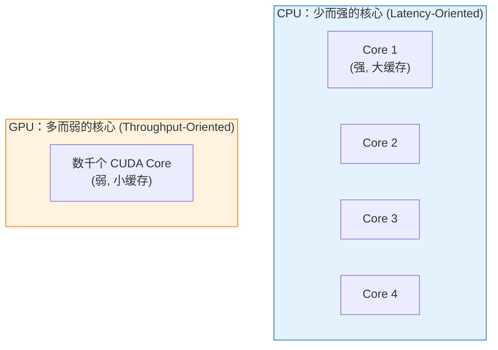
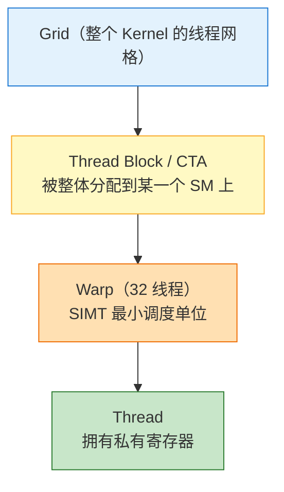
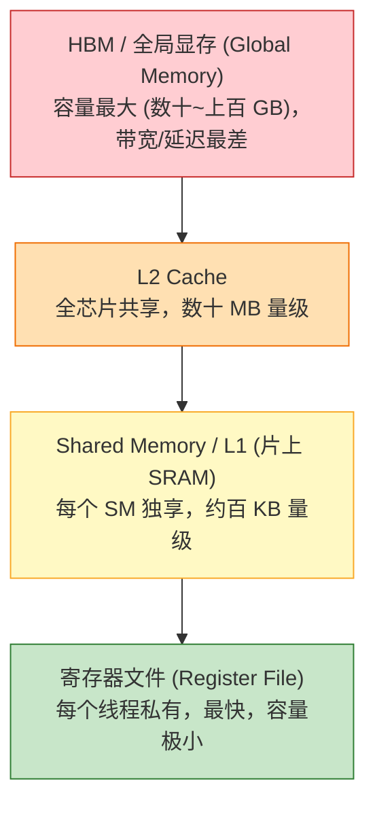
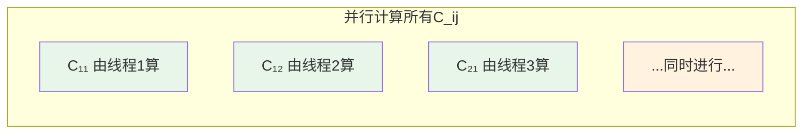
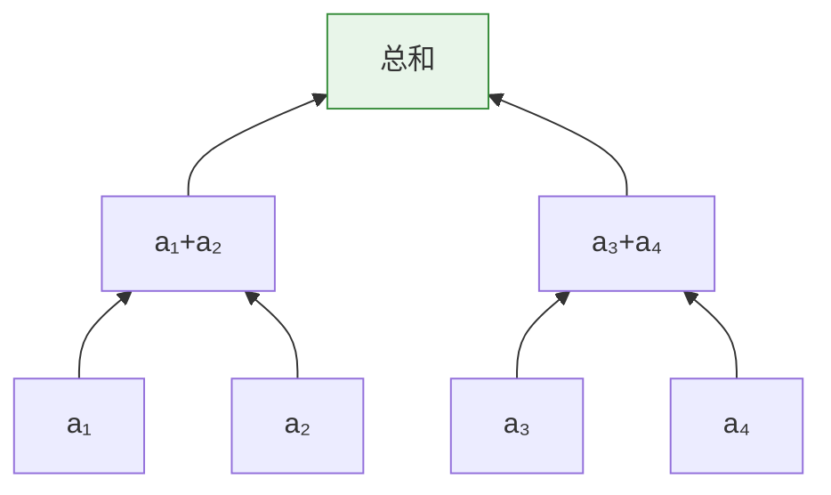
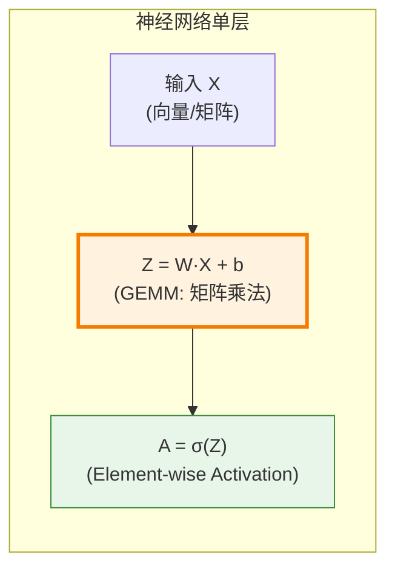

# GPU Architecture & Computation & DNN（GPU 架构、计算特性与深度学习）

> 本文系统梳理四个层层递进的主题：
> 
> 1. **GPU 架构（Architecture）**：GPU 的硬件组织，从整芯片到 SM、Warp、Core，再到存储层次；
> 2. **GPU 的计算特性（Computation）**：SIMT 执行模型，以及 GPU 擅长与不擅长的计算类型；
> 3. **GPU 的优势（Advantages）**：相比 CPU 为什么能带来数十到上百倍的吞吐；
> 4. **为什么深度学习离不开 GPU（DNN & GPU）**：以 CNN、Transformer 为代表的现代神经网络为何与 GPU / Tensor Core 流水线高度契合，而 Capsule Network 的动态路由却难以高效执行。
> 
> 参考资料：
> 
> - NVIDIA CUDA C++ Programming Guide：<https://docs.nvidia.com/cuda/cuda-c-programming-guide/>
> - NVIDIA GPU Architecture Whitepapers（Volta / Ampere / Hopper / Blackwell）：<https://www.nvidia.com/en-us/data-center/resources/>
> - Hennessy & Patterson, *Computer Architecture: A Quantitative Approach*（6th ed.）Ch.4 "Data-Level Parallelism"
> - Goodfellow, Bengio, Courville, *Deep Learning*, MIT Press, 2016：<https://www.deeplearningbook.org/>
> - Kirk & Hwu, *Programming Massively Parallel Processors*（4th ed., 2022）

---

# 第一部分：GPU 架构（GPU Architecture）

要理解 GPU 擅长什么、为什么深度学习离不开它，必须先理解它的硬件是怎么组织的。GPU 的架构可以自顶向下拆成三层：**整芯片的并行组织** → **SM 内部结构** → **存储层次**。

## 一、GPU vs CPU：设计哲学的根本差异

GPU 与 CPU（Central Processing Unit，中央处理器）的设计哲学根本不同。理解“GPU 擅长什么”，关键要先理解其硬件架构（hardware architecture），再看它匹配哪类计算。这也直接关系到为什么深度学习（Deep Learning）——尤其是反向传播（Backpropagation, BP）——离不开 GPU。



| 维度                        | CPU                                          | GPU                                      |
| ------------------------- | -------------------------------------------- | ---------------------------------------- |
| **核心数（#Cores）**           | 几个 ~ 几十个                                     | 几千 ~ 上万个（CUDA Cores）                     |
| **单核性能（Per-core Perf.）**  | 强（高主频、复杂控制、乱序执行 OoOE、分支预测 Branch Prediction） | 弱（低主频、简单控制、In-order）                     |
| **缓存层级（Cache Hierarchy）** | 大（L1/L2/L3 多级缓存）                             | 小（L1/L2 + Shared Memory / Register File） |
| **设计目标（Design Goal）**     | 低延迟（Low Latency）                             | 高吞吐（High Throughput）                     |
| **擅长任务**                  | 复杂逻辑、串行、多分支                                  | 大规模并行、重复的简单计算                            |

> **形象比喻**：
> 
> - **CPU** = 几位博士，能解决复杂难题，但人少。
> - **GPU** = 几千名小学生，只会做简单算术，但人海战术下算 100 万道加法题飞快。

CPU 把大量晶体管用在控制逻辑和缓存上，追求把**单个线程**跑得尽可能快；GPU 则把大量晶体管用在**计算单元**上，靠海量线程并发和快速切换来掩盖延迟、榨干吞吐。这是一种典型的**异构计算（Heterogeneous Computing）**分工。

延伸阅读：

- NVIDIA 官方博文 *"CPU vs GPU"*：<https://blogs.nvidia.com/blog/whats-the-difference-between-a-cpu-and-a-gpu/>
- Flynn's Taxonomy（弗林分类法：SISD / SIMD / MISD / MIMD）：<https://en.wikipedia.org/wiki/Flynn%27s_taxonomy>
- [CUDA Programming Guide](https://docs.nvidia.com/cuda/cuda-programming-guide/index.html) # [1. Introduction to CUDA](https://docs.nvidia.com/cuda/cuda-programming-guide/part1.html) # [1.1.2. The Benefits of Using GPUs](https://docs.nvidia.com/cuda/cuda-programming-guide/01-introduction/introduction.html#the-benefits-of-using-gpus)
  - 官方文档其实比上面的内容更好

---

## 二、整芯片组织：Grid、SM 与执行层次

一块 GPU 由许多个 **SM（Streaming Multiprocessor，流式多处理器）** 组成，SM 是 NVIDIA GPU 的**基本计算单元**。程序（Kernel）启动时，工作被组织成 **Grid → Block → Warp → Thread** 的层次，并映射到硬件上：



- **Grid**：一次 Kernel 启动的全部线程。
- **Thread Block（CTA, Cooperative Thread Array）**：会被**整体分配到某一个 SM 上**执行，块内线程可通过 Shared Memory 协作。
- **Warp**：32 个线程为一组，是 SIMT 的**最小调度单位**——同一 warp 内的线程执行同一条指令。
- **Thread**：拥有私有寄存器，是最小的执行流。

### 用工厂类比理解 SM

可以把整块 GPU 想象成一座工厂：

- **GPU** = 整座工厂
- **SM** = 工厂里的一条条独立生产线（有几十上百条）
- **CUDA / Tensor Core** = 生产线上的工人
- **寄存器 / Shared Memory** = 每条生产线**旁边**的小料架（容量小但拿取快）
- **HBM 全局显存** = 工厂的中央大仓库（容量大但来回搬运慢）

每条生产线（SM）都相对独立地领取任务（Thread Block）、从中央仓库（HBM）取料到旁边的小料架（Shared Memory / 寄存器）上加工。GPU 的高吞吐，来自“几十上百条生产线同时开工”。

### SM 内部结构

每个 SM 都是一个相对独立的处理单元，内部包含：

- **CUDA Core**：执行通用的标量 / 向量浮点与整数运算；
- **Tensor Core**：执行矩阵乘累加（MMA），专门加速低精度矩阵乘（后文详述）；
- **寄存器文件（Register File）**：每 SM 约 256 KB，供该 SM 上的线程私有使用；
- **Shared Memory / L1 Cache**：该 SM 上的线程块（Block）共享的片上高速存储；
- **Warp 调度器（Warp Scheduler）**：负责在多个就绪 warp 之间快速切换，用计算掩盖访存延迟。

各代数据中心 GPU 的 SM 数量：例如 V100 有 80 个、A100 有 108 个、H100 有 132 个。

---

## 三、存储层次（Memory Hierarchy）

GPU 的存储不是均质的，而是一个金字塔：**容量越大，速度越慢；速度越快，容量越小**。存储层次与执行层次是对应的，且**都以 SM 为界**。



| 存储层级               | 大致容量                       | 相对速度 | 作用范围          | 典型延迟       |
| ------------------ | -------------------------- | ---- | ------------- | ---------- |
| 寄存器 File           | 每线程极小（每 SM 256 KB 共享给众多线程） | 最快   | 单线程私有         | 约 1 周期     |
| Shared Memory / L1 | 每 SM 约百 KB 量级              | 很快   | 线程块（Block）内共享 | 约 20–30 周期 |
| L2 Cache           | 数十 MB 量级                   | 中等   | 全芯片共享         | 约 200 周期   |
| HBM 全局显存           | 数十 ~ 上百 GB                 | 最慢   | 全局            | 数百周期       |

一个 **Thread Block** 会被分配到**某一个 SM 上**执行，只能使用**这个 SM 的** Shared Memory 和寄存器。因此“每个 SM 约 100~228 KB Shared Memory”指的是**单个 SM 内部**片上存储的容量上限——这也是许多 GPU 算子（如 Tiled GEMM）分块大小的物理约束：一块数据要放进 Shared Memory，就不能超过它所在 SM 的容量。

### NVIDIA 近几代 GPU 的存储参数

**片上存储：每个 SM 的寄存器与 Shared Memory**（V100 / A100 / H100）

| 架构 / GPU      | 计算能力 | 寄存器文件 / SM              | L1+Shared 合并容量 / SM | 可配置 Shared Memory 上限 / SM |
| ------------- | ---- | ----------------------- | ------------------- | ------------------------- |
| Volta / V100  | 7.0  | 65536 × 32-bit ≈ 256 KB | 128 KB              | 96 KB                     |
| Ampere / A100 | 8.0  | 65536 × 32-bit ≈ 256 KB | 192 KB              | 164 KB                    |
| Hopper / H100 | 9.0  | 65536 × 32-bit ≈ 256 KB | 256 KB              | 228 KB                    |

- **寄存器文件三代都是每 SM 256 KB**（65536 个 32-bit 寄存器），且被该 SM 上所有并发线程**瓜分**——一个线程用寄存器越多，能同时驻留的线程（Occupancy）就越少。
- **Shared Memory 可配置且有上限**（如 H100 每 SM 最高 228 KB）；为兼容旧架构，静态分配上限为 48 KB，超过需使用动态 Shared Memory。

**片外存储：L2 Cache 与 HBM 全局显存**

| 架构 / GPU            | L2 Cache（全 GPU 共享） | 全局显存类型与容量             | 显存带宽（约）           |
| ------------------- | ------------------ | --------------------- | ----------------- |
| Volta / V100        | 6 MB               | HBM2，16 / 32 GB       | ~0.9 TB/s         |
| Ampere / A100       | 40 MB              | HBM2e，40 / 80 GB      | ~2.0 TB/s（80GB 版） |
| Hopper / H100 (SXM) | 50 MB              | HBM3，80 / 96 GB       | ~3.35 TB/s        |
| Hopper / H200       | 50 MB              | HBM3e，141 GB          | ~4.8 TB/s         |
| Blackwell / B200    | —                  | HBM3e，约 192 GB（单 GPU） | ~8 TB/s           |

> 数据来源：NVIDIA 各代架构白皮书与官方产品页；H200 / B200 部分为公开规格，可能随版本调整，B200 片上细节以官方 Blackwell 白皮书为准。**HBM（High-Bandwidth Memory，高带宽显存）** 是 GPU 显存的核心技术，参考：<https://en.wikipedia.org/wiki/High_Bandwidth_Memory>

存储层次的核心含义是：**片上存储极快但极小，片外显存很大但很慢**。因此高性能 GPU 计算的通用套路，就是把数据分块（tile）加载到片上快速存储中反复复用，尽量减少对慢速 HBM 的访问——这在后文的 GEMM 与流水线中会反复出现。

---

# 第二部分：GPU 的计算特性（Computation）

## 四、SIMT 执行模型

GPU 的核心执行模型是 **SIMT（Single Instruction, Multiple Threads，单指令多线程）**——同一条指令，成千上万个线程（thread）同时对不同数据执行。SIMT 是 NVIDIA 在 **SIMD（Single Instruction, Multiple Data）** 基础上的扩展，以 **warp**（32 线程为一组）为最小调度单位。

参考：NVIDIA CUDA Programming Guide §5 *SIMT Architecture*：<https://docs.nvidia.com/cuda/cuda-c-programming-guide/index.html#simt-architecture>

**SIMT 与 SIMD 的关系**：

- **SIMD** 用一条指令操作一个固定宽度的向量寄存器（如 CPU 的 AVX-512 一次处理 16 个 float），由编译器/程序员显式向量化；
- **SIMT** 把“向量的每个通道”抽象成一个独立的**线程**，由硬件的 warp 调度器管理。程序员写的是“单个线程”的逻辑，硬件把 32 个线程打包成 warp 一起执行。

这带来 SIMT 的两个关键行为，直接决定 GPU 上程序的效率：

- **Warp Divergence（线程束发散 / 线程分裂）**：同一 warp 内的 32 个线程若走入不同分支（`if/else`），硬件需**串行**执行两条路径，有效算力减半甚至更多。参考：<https://developer.nvidia.com/blog/using-cuda-warp-level-primitives/>
- **Memory Coalescing（合并访存）**：同一 warp 内的线程若访问**连续**显存地址，可合并为一次内存事务，带宽利用率最高；反之随机/跨步访问会浪费带宽。参考：CUDA Best Practices Guide §9.2 *Coalesced Access to Global Memory*。
- **Occupancy（占用率）**：SM 上活跃 warp 数与最大可容纳 warp 数之比。占用率高，才能在某些 warp 等待访存时切换到其他 warp 执行，从而用计算**掩盖访存延迟（Latency Hiding）**。

## 五、GPU 擅长与不擅长的计算

因此 GPU 擅长满足以下特征的计算：

```
✅ 高度并行 (High Parallelism)          —— 大量独立、可同时进行的运算
✅ 数据并行 (Data Parallelism)          —— 对海量数据执行【相同】操作 (SIMD/SIMT)
✅ 计算密集 (Compute-bound)             —— 算术操作多，内存访问相对少
✅ 规则/可预测 (Regular / Predictable) —— 无复杂分支、控制流简单
✅ 高算术强度 (High Arithmetic Intensity) —— 每次数据读取对应多次计算（FLOPs / Byte 高）
```

> **Arithmetic Intensity（算术强度）** 是 Roofline Model 的核心指标，用于判断一个算子是 *compute-bound* 还是 *memory-bound*。参考：Williams et al., *"Roofline: An Insightful Visual Performance Model for Multicore Architectures"*, CACM 2009. <https://dl.acm.org/doi/10.1145/1498765.1498785>

反之，GPU **不擅长**：

```
❌ 强串行依赖 (Serial Dependency)          —— 后一步严重依赖前一步的结果
❌ 复杂分支 (Complex Branching)            —— 大量 if-else 导致线程发散 (Warp Divergence)
❌ 频繁随机访存 (Random / Uncoalesced Access) —— 内存访问不规则，无法合并访存 (Memory Coalescing)
❌ 低并行度 (Low Occupancy)                —— 任务量小，无法填满数千核心
```

## 六、GPU 擅长的典型计算类型

### 6.1 矩阵 / 向量运算（General Matrix Multiplication, GEMM）⭐

这是 GPU 最擅长、也是深度学习最依赖的运算，业内通称 **GEMM**（BLAS Level-3 的核心算子），由 **cuBLAS**、**cuDNN** 等库高度优化。

- cuBLAS：<https://docs.nvidia.com/cuda/cublas/>
- cuDNN：<https://docs.nvidia.com/deeplearning/cudnn/>
- BLAS 标准：<https://netlib.org/blas/>

**矩阵乘法** $C = A \times B$：每个输出元素 $C_{ij}$ 的计算彼此独立，可完全并行。

$$
C_{ij} = \sum_{k} A_{ik} B_{kj}
$$



> 一个 $1000\times1000$ 的矩阵乘法有 100 万个独立的输出元素，GPU 可让数千线程同时开算。实际实现会使用 **分块矩阵乘（Tiled GEMM）**，将大矩阵划分为适配 Shared Memory 的小块，兼顾并行度与数据复用（data reuse）——这正是前面存储层次一节所说“把数据分块加载到片上快速存储反复复用”的直接体现。

### 6.2 逐元素运算（Element-wise Operations）

对张量（Tensor）每个元素独立执行相同操作，天然并行（Embarrassingly Parallel）：

$$
\mathbf{c} = \mathbf{a} + \mathbf{b},\quad \mathbf{y} = \text{ReLU}(\mathbf{x}),\quad \mathbf{y}=\sin(\mathbf{x})
$$

以 $y = x_2 \cdot \sin(x_1)$ 为例：如果 $x_1, x_2$ 是**百万维向量**，GPU 可让百万线程同时计算每个分量的 $\sin$ 和乘法。

> 注意：逐元素算子通常是 **memory-bound**（访存瓶颈），因此工程上会做 **算子融合（Kernel Fusion / Operator Fusion）**，将多个逐元素 kernel 合并为一个，避免中间张量反复读写显存。这也是 PyTorch 2.x `torch.compile` / TorchInductor、XLA、TensorRT 的核心优化之一。参考：<https://pytorch.org/get-started/pytorch-2.0/>

### 6.3 归约运算（Reduction）

求和（Sum）、求最大值（Max）、求均值（Mean）、Softmax 归一化等。虽然有依赖，但可用 **树形并行归约（Tree Reduction / Parallel Scan）** 高效实现：



> $n$ 个数求和，串行需 $n-1$ 步，树形并行只需 $\log_2 n$ 步（时间复杂度 $O(\log n)$）。

参考：Mark Harris, *"Optimizing Parallel Reduction in CUDA"*, NVIDIA Tech Report. <https://developer.download.nvidia.com/assets/cuda/files/reduction.pdf>

### 6.4 卷积运算（Convolution）

CNN 的核心。每个输出位置的卷积彼此独立，可并行；工程上通常通过 **im2col**（image-to-column，图像展开）技巧转化为矩阵乘法，从而复用高度优化的 GEMM 内核。

- im2col 原始出处：Chellapilla et al., *"High Performance Convolutional Neural Networks for Document Processing"*, 2006.
- cuDNN 支持多种卷积算法：Implicit GEMM、Winograd、FFT-based Convolution 等。参考：<https://docs.nvidia.com/deeplearning/cudnn/developer-guide/index.html#cudnnConvolutionFwdAlgo_t>

### 6.5 其他适配领域

```
• 图形渲染 (Graphics Rendering)   —— GPU 的老本行（每个像素独立着色，Shader）
• 图像/视频处理 (Image / Video)    —— 每个像素独立滤波
• 科学计算 (Scientific Computing) —— 有限元 FEM、分子动力学 MD、CFD 流体模拟
• 密码学 / 挖矿 (Cryptography)     —— 大量并行哈希（SHA-256 等）
• 蒙特卡洛模拟 (Monte Carlo)       —— 大量独立随机采样
```

---

# 第三部分：GPU 的优势（Advantages）

## 七、GPU 加速的量化直觉

假设一个矩阵乘法需要 $10^9$ 次浮点运算（FLOPs）：

| 硬件                                                      | 并行核心        | 峰值算力（FP32）                                         | 相对速度     |
| ------------------------------------------------------- | ----------- | -------------------------------------------------- | -------- |
| CPU（16 核，AVX-512）                                       | 16 路 × SIMD | ~1 TFLOPS                                          | 1×       |
| NVIDIA A100（6912 CUDA Cores + 432 Tensor Cores）         | 数千路并行       | 19.5 TFLOPS (FP32) / 312 TFLOPS (TF32 Tensor Core) | 数十 ~ 上百× |
| NVIDIA H100（16896 CUDA Cores + 528 Tensor Cores，Hopper） | 数千路并行       | 67 TFLOPS (FP32) / 989 TFLOPS (BF16 Tensor Core)   | 更高       |

数据来源：

- NVIDIA A100 Datasheet：<https://www.nvidia.com/en-us/data-center/a100/>
- NVIDIA H100 Datasheet：<https://www.nvidia.com/en-us/data-center/h100/>

> **前提**：任务本身必须**足够并行**。如果是强串行任务，GPU 的数千核心大部分闲置，反而不如 CPU（这就是所谓的 *Amdahl's Law* 的实践含义）。参考：<https://en.wikipedia.org/wiki/Amdahl%27s_law>

## 八、GPU 优势小结

```
GPU 擅长：
    大规模并行 + 数据并行 + 计算密集 + 规则无分支
        ↓
核心武器：GEMM (矩阵乘法) + Element-wise + Reduction + Convolution
        ↓
杀手级应用：Deep Learning (Forward / Backward = 海量矩阵运算)
        ↓
本质原因：数千核心用"人海战术"同时处理海量【相同且独立】的简单计算
```

> 📌 **核心洞察**：GPU 与 CPU 不是谁强谁弱，而是**分工不同（Heterogeneous Computing，异构计算）**——CPU 追求“低延迟处理复杂串行任务”，GPU 追求“高吞吐处理海量并行任务”。如果你的算法充满串行依赖和复杂分支（如某些图算法、递归逻辑、动态路由），GPU 未必是最优选择，这时 CPU、FPGA 或专用 ASIC（如 Google TPU、Graphcore IPU、Cerebras WSE）可能更合适。

---

# 第四部分：为什么深度学习离不开 GPU（DNN & GPU）

## 九、训练与推理的本质：大规模矩阵运算

深度学习的两个核心过程——**前向传播（Forward Propagation）** 和 **反向传播（Backward Propagation / Reverse-mode Automatic Differentiation）**——本质上都是**大规模矩阵运算**。

参考：Baydin et al., *"Automatic Differentiation in Machine Learning: A Survey"*, JMLR 2018. <https://jmlr.org/papers/v18/17-468.html>



**关联到自动微分（Autodiff, AD）：**

| AD 概念                                  | 在 GPU 上的体现                       |
| -------------------------------------- | -------------------------------- |
| 前向求值（保存中间值 $v_i$）                      | 大批量矩阵乘法 + 激活，GPU 并行执行            |
| 反向传播（计算伴随变量 $\bar{v}_i$，adjoint）       | 梯度也是矩阵乘法（链式法则 Chain Rule），GPU 并行 |
| 乘法节点 $\partial v_4/\partial v_3 = v_2$ | 逐元素乘法，百万线程同时算                    |
| 梯度汇聚（多路径相加）                            | Reduction / Sum，GPU 树形并行         |

**关键点**：训练时一个 batch 有成百上千个样本，每个样本独立地做相同的矩阵运算——**这正是数据并行（Data Parallelism）的完美场景**。此外还有 **模型并行（Model Parallelism）**、**张量并行（Tensor Parallelism）**、**流水线并行（Pipeline Parallelism）** 等大模型训练策略，参考：

- Shoeybi et al., *"Megatron-LM: Training Multi-Billion Parameter Language Models Using Model Parallelism"*, 2019. <https://arxiv.org/abs/1909.08053>
- Huang et al., *"GPipe: Efficient Training of Giant Neural Networks using Pipeline Parallelism"*, NeurIPS 2019. <https://arxiv.org/abs/1811.06965>

```
神经网络训练的计算 = 海量矩阵乘法 + 逐元素运算 + 归约
                    ↓
              全部是 GPU 最擅长的并行计算
                    ↓
        GPU 相比 CPU 可带来 10~100 倍加速
```

深度学习之所以在 GPU 上爆发，正是因为神经网络的前向与反向传播**本质上就是可高度并行的大规模矩阵运算**。理解这一点，就理解了为什么“算力（compute）”在 AI 时代如此关键——它直接决定了我们能训练多大的模型、处理多少数据（*Scaling Laws*，参考 Kaplan et al. 2020: <https://arxiv.org/abs/2001.08361>）。

## 十、Tensor Core：为矩阵乘而生的专用硬件

**Tensor Core** 是 NVIDIA 从 Volta 架构（V100，2017）开始引入的专用**矩阵乘累加（MMA, Matrix Multiply-Accumulate）** 硬件单元，专为加速低精度矩阵乘（FP16 / BF16 / TF32 / FP8 / INT8）设计。它一次吞吐 16×16×16 / 32×8×16 等小块矩阵（对应 PTX 指令 `mma.sync` / WMMA API），FP16/BF16 算力比通用 CUDA Core 高 10 倍以上。

只要算子是标准 MatMul，**cuDNN**、**cuBLAS**、**CUTLASS**、**TensorRT** 会自动把计算调度给 Tensor Core，硬件跑满。

参考：

- NVIDIA Tensor Core 官方介绍：<https://www.nvidia.com/en-us/data-center/tensor-cores/>
- Markidis et al., *"NVIDIA Tensor Core Programmability, Performance & Precision"*, IPDPSW 2018. <https://arxiv.org/abs/1803.04014>
- CUTLASS（NVIDIA 开源的 CUDA 模板矩阵运算库）：<https://github.com/NVIDIA/cutlass>
- TensorRT：<https://developer.nvidia.com/tensorrt>

## 十一、CNN、Transformer 为何适配 GPU / Tensor Core 流水线

GPU 天生擅长「大批量、同一种计算、顺序流水、无判断分支」的矩阵乘法。一旦出现循环、if 分支、不规则访存，硬件利用率会暴跌。CNN 与 Transformer 恰好满足前者，可以从三个关键词理解。

### 11.1 批量矩阵乘（Batch Matrix Multiplication, BMM / MatMul）

CNN 卷积、Transformer 自注意力（Self-Attention）的核心数学本质，都可以等价转化为 **稠密批量矩阵乘法（Dense Batched GEMM）**：

1. **CNN 卷积（Convolution）**
   卷积通过 **im2col** 把滑动窗口变成二维矩阵，`输出特征图 = 卷积核矩阵 × 图像窗口矩阵`；一次前向传播就是连续多层大矩阵相乘，所有样本（batch）、所有通道（channel）并行批量计算。
   
   - LeCun et al., *"Gradient-Based Learning Applied to Document Recognition"*, Proc. IEEE 1998. <http://yann.lecun.com/exdb/publis/pdf/lecun-01a.pdf>
   - Krizhevsky et al., *"ImageNet Classification with Deep Convolutional Neural Networks"* (AlexNet), NeurIPS 2012. <https://papers.nips.cc/paper/4824-imagenet-classification-with-deep-convolutional-neural-networks>

2. **Transformer 自注意力（Self-Attention）**
   Query / Key / Value 全部是矩阵，注意力分数计算、多头拼接（Multi-Head Concatenation）、FFN 前馈层，全程都是标准矩阵乘：
   
   $$
   \text{Attention}(Q,K,V)=\text{Softmax}\!\left(\frac{QK^\top}{\sqrt{d_k}}\right)V
   $$
   
   多头（Multi-Head Attention, MHA）只是多组独立矩阵乘并行，依然是批量稠密乘。
   
   - Vaswani et al., *"Attention Is All You Need"*, NeurIPS 2017. <https://arxiv.org/abs/1706.03762>
   - FlashAttention（IO 感知的 Attention 实现）：Dao et al., 2022. <https://arxiv.org/abs/2205.14135>

对照 **Capsule Network** 的 **动态路由（Dynamic Routing-by-Agreement）**：核心是**迭代投票循环**，每轮要单独计算耦合系数 $c_{ij}$、加权求和、Softmax 归一化，不是整块批量矩阵乘，矩阵尺寸零散、计算碎片化，Tensor Core 无法生效，只能退化到低效通用 CUDA Core。

- Sabour, Frosst, Hinton, *"Dynamic Routing Between Capsules"*, NeurIPS 2017. <https://arxiv.org/abs/1710.09829>

### 11.2 单向（Feed-Forward，前馈无循环、无数据回流依赖）

CNN / MLP / Transformer 都是**严格前向数据流（strict feed-forward dataflow）**：

- 第 $l$ 层计算只依赖第 $l-1$ 层输出；
- 计算完一层即可丢弃中间临时缓存（activation 除非需要用于反传，否则可释放）；数据只向前流动；
- 数据流固定、计算顺序固定，GPU 可以做 **软件流水线预取（Software Pipelining / Prefetching）**：计算当前层的同时，通过 **异步拷贝（`cp.async`，Ampere+）** 提前把下一层权重 / 特征从 HBM 加载到片上 Shared Memory / 寄存器，掩盖访存延迟（Latency Hiding）。

对照 **Capsule 动态路由是循环迭代依赖（Iterative Dependency）**（原生论文迭代 3 次）：第 $t$ 轮耦合系数 $c_{ij}^{(t)}$ 完全依赖第 $t-1$ 轮胶囊输出，必须等上一轮全部算完才能启动下一轮，数据来回读写，GPU 流水线无法预取并行，等待空转时间大幅增加，**显存带宽瓶颈（memory-bandwidth-bound）被放大**。

> 类似的循环依赖问题也出现在 **RNN / LSTM** 的时间步（timestep）展开中——这也是为什么 Transformer 取代 RNN 成为大模型主流的一个重要 *硬件层面* 原因。

### 11.3 无分支（No Branching）

GPU 是 SIMT 架构：同一 warp 内所有线程必须执行完全相同的指令；一旦某个线程触发 `if / else` 分支，GPU 会串行走完两条分支（**Warp Divergence**），算力直接腰斩甚至更多。

- CUDA C++ Programming Guide §5.4.2：<https://docs.nvidia.com/cuda/cuda-c-programming-guide/index.html#simt-architecture>

**CNN / Transformer** 每层运算逻辑统一：全部是矩阵乘 + 逐元素激活（**ReLU** / **GELU** / **Softmax** / **LayerNorm**），**没有条件判断、没有动态分支**；所有样本、通道执行一模一样的计算流程，warp 不会分裂，硬件接近满载利用率。

**Capsule 动态路由**包含大量条件逻辑：迭代次数循环、耦合系数加权筛选、**Squash 函数**归一化更新，大量分支判断，大量线程走不同计算路径，warp 分裂严重，流水线频繁中断。

## 十二、什么是 GPU / Tensor Core 流水线？

GPU 计算可抽象为三段硬件流水线，理想状态三段完全重叠并行（overlapped），无空闲：

1. **访存阶段（Memory Access）**：从 HBM 显存读取权重、特征 → 送入片上共享内存 / 寄存器；
2. **计算阶段（Compute）**：Tensor Core / CUDA Core 执行批量矩阵乘（MMA）；
3. **写回阶段（Write-back）**：把计算结果写回显存 / 传给下一层。

现代大 kernel（如 FlashAttention、CUTLASS GEMM）通过 **多级流水（multi-stage pipeline）** + **异步拷贝 `cp.async`** + **Warp Specialization**，让访存和计算完全重叠。

### CNN / Transformer 的适配效果

因为「无分支 + 单向 + 整块批量矩阵乘」：

1. 访存是**连续规整内存块（Coalesced Memory Access）**（矩阵是连续存储，行主序 row-major / 列主序 column-major），HBM 带宽吃满；
2. 计算是大块 GEMM，Tensor Core 持续满载，没有中断；
3. 单向数据流让 GPU 可以做**软件流水线**：当前层计算时，后台预加载下一层数据，访存延迟被完全掩盖；

最终硬件算力（FLOPs）、显存带宽（Bandwidth）几乎跑满，训练 / 推理速度极快。这也是 **Model FLOPs Utilization (MFU)** 指标关注的重点——业界大模型训练 MFU 可达 50%–60%（Chowdhery et al., *"PaLM"*, 2022: <https://arxiv.org/abs/2204.02311>）。

### Capsule 动态路由的不适配效果

1. 循环迭代导致**频繁零散随机访存（uncoalesced random access）**，内存地址不连续，HBM 带宽利用率暴跌；
2. 分支判断触发 warp divergence，Tensor Core 无法启用，只能退化到慢速通用核心；
3. 迭代依赖打断流水线，计算单元频繁空闲等待数据读写；

同等输入规模下，速度慢几倍到几十倍，显存占用翻倍。这也是 Capsule Network 尽管在建模思想上颇具吸引力，却在工业界迟迟未能大规模应用的关键 **硬件层面原因**。

## 十三、一句话对比总结

| 维度             | CNN / Transformer  | Capsule Dynamic Routing |
| -------------- | ------------------ | ----------------------- |
| 主要算子           | 大块 GEMM（BMM）       | 碎片化小矩阵 + 迭代循环           |
| 控制流            | 无分支、单向前馈           | 条件分支 + 迭代依赖             |
| Tensor Core 利用 | 拉满（FP16/BF16/TF32） | 无法启用                    |
| HBM 带宽         | 合并访存，吃满            | 随机访存，利用率低               |
| GPU 流水线        | 三段完全并行             | 频繁中断、等待                 |
| 相对性能           | 100%（基线）           | 慢几倍 ~ 几十倍               |

- **CNN、Transformer**：计算流程规整、全是大块矩阵乘法（GEMM / BMM），无循环无判断，GPU 流水线三段完全并行，Tensor Core 专用硬件加速拉满；
- **Capsule 动态路由**：带迭代循环、条件分支、碎片化小矩阵运算，破坏 GPU 流水线并行能力，Tensor Core 无法加速，算力与带宽双双成为瓶颈。

---

## 附录：延伸阅读与工具链

- **深入 GPU 架构与编程**
  - NVIDIA CUDA C++ Programming Guide：<https://docs.nvidia.com/cuda/cuda-c-programming-guide/>
  - NVIDIA CUDA Best Practices Guide：<https://docs.nvidia.com/cuda/cuda-c-best-practices-guide/>
  - Kirk & Hwu, *Programming Massively Parallel Processors*（4th ed., 2022）
- **性能建模**
  - Roofline Model：<https://crd.lbl.gov/divisions/amcr/computer-science-amcr/par/research/roofline/>
- **深度学习框架的 GPU 后端**
  - PyTorch：<https://pytorch.org/docs/stable/notes/cuda.html>
  - JAX / XLA：<https://jax.readthedocs.io/> ； <https://openxla.org/>
  - TensorFlow XLA：<https://www.tensorflow.org/xla>
- **算子优化实战**
  - FlashAttention：<https://github.com/Dao-AILab/flash-attention>
  - CUTLASS：<https://github.com/NVIDIA/cutlass>
  - Triton（OpenAI，Python DSL for GPU kernels）：<https://triton-lang.org/>
- **专用加速器（对比视角）**
  - Google TPU：Jouppi et al., *"In-Datacenter Performance Analysis of a TPU"*, ISCA 2017. <https://arxiv.org/abs/1704.04760>
  - Graphcore IPU、Cerebras WSE、AWS Trainium 等
