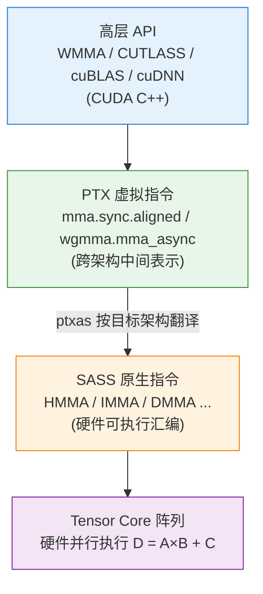
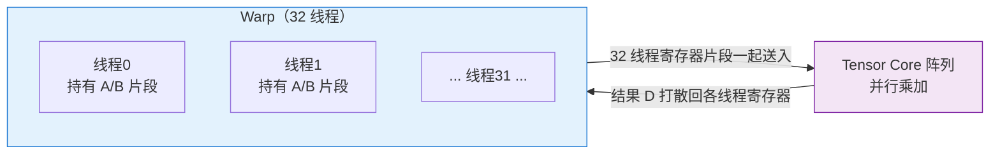
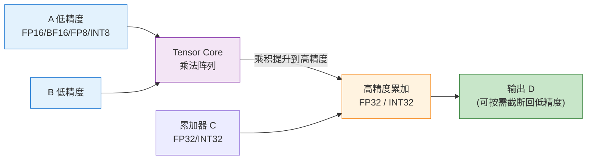
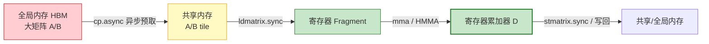
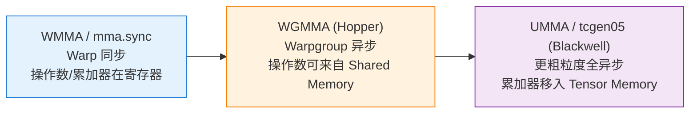

# 张量核心 MMA 指令（Matrix Multiply-Accumulate）

> 本文自顶向下讲清 NVIDIA Tensor Core 的核心原语 **MMA（矩阵乘累加）**：从数学定义、软硬件分层链路（CUDA C++ → PTX → SASS → Tensor Core），到 Warp 协同的 Fragment 执行模型、固定分块尺寸约束、混合精度机制，再到完整算子流水线、性能调优要点，以及从 **WMMA → WGMMA → UMMA(tcgen05)** 的架构演进。
> 
> 参考资料：
> 
> - NVIDIA PTX ISA §9.7.14 *Warp Level Matrix Multiply-Accumulate Instructions*：<https://docs.nvidia.com/cuda/parallel-thread-execution/index.html#warp-level-matrix-instructions>
> - NVIDIA CUDA C++ Programming Guide §*Warp Matrix Functions (WMMA)*：<https://docs.nvidia.com/cuda/cuda-c-programming-guide/index.html#warp-matrix-functions>
> - CUTLASS 文档与 Tutorial：<https://github.com/NVIDIA/cutlass>
> - Markidis et al., *"NVIDIA Tensor Core Programmability, Performance & Precision"*, IPDPSW 2018：<https://arxiv.org/abs/1803.04014>

---

## 一、基础定义

**MMA = Matrix Multiply-Accumulate（矩阵乘累加）**，是 NVIDIA **Tensor Core（张量核心）** 的**专属硬件原语**。在硬件底层，它对应一条 **SASS 汇编指令**（Volta/Turing 为 `HMMA`；Ampere 及之后统一在 PTX 层用 `mma` 表达，SASS 层仍以 `HMMA/IMMA/DMMA` 等出现），完成标准的矩阵乘累加：

$$
D = A \times B + C
$$

- 形状约定：$A \in \mathbb{R}^{M\times K}$、$B \in \mathbb{R}^{K\times N}$、$C, D \in \mathbb{R}^{M\times N}$，即 $A$ 是 $M\times K$、$B$ 是 $K\times N$、$C/D$ 是 $M\times N$。
- **由整个 Warp（32 线程）协同执行**：单个线程只持有矩阵块的一小部分寄存器片段（**Fragment**），不能单线程单独调用一条 MMA。
- 与普通 CUDA Core 的对比：CUDA Core 一次只能做单元素的 **FMA（Fused Multiply-Add，$d = a\cdot b + c$）**；而一条 MMA **一次吞吐一整块小矩阵**，在低精度下算力比 CUDA Core 高一个数量级以上，是大模型训练/推理的核心加速来源。

> **一句话**：CUDA Core 是“标量乘加”，Tensor Core 的 MMA 是“小矩阵块乘加”——把 $M\times K$ 和 $K\times N$ 两个小块一次算完并累加。

---

## 二、分层链路（CUDA C++ → PTX → SASS → Tensor Core）

MMA 在软件栈中存在多个抽象层，理解这条链路是读懂 Tensor Core 的关键：



### 1. 高层 API：WMMA / CUTLASS Warp MMA

CUDA C++ 提供 `nvcuda::wmma` 命名空间，用户以 **Fragment** 为单位写矩阵块的加载、乘加、存储，屏蔽底层寄存器排布：

```cpp
#include <mma.h>
using namespace nvcuda;

// 声明 16x16x16 的 fragment（WMMA 层的 tile 概念）
wmma::fragment<wmma::matrix_a, 16, 16, 16, half, wmma::row_major> a_frag;
wmma::fragment<wmma::matrix_b, 16, 16, 16, half, wmma::col_major> b_frag;
wmma::fragment<wmma::accumulator, 16, 16, 16, float> c_frag;

wmma::load_matrix_sync(a_frag, a_ptr, lda);   // 从内存加载到 fragment
wmma::load_matrix_sync(b_frag, b_ptr, ldb);
wmma::mma_sync(c_frag, a_frag, b_frag, c_frag); // D = A*B + C
wmma::store_matrix_sync(c_ptr, c_frag, ldc, wmma::mem_row_major);
```

> 注意区分两种“tile 尺寸”：WMMA API 暴露给用户的是较大的**逻辑 tile**（如 `16×16×16`），编译器会把它拆分成若干条底层 PTX `mma` 指令，而底层 `mma` 的**硬件 shape 更小且固定**（见下文）。CUTLASS、cuBLAS、cuDNN 则在更高层做多级分块与调度。

### 2. 中间层：PTX 虚拟指令 `mma.sync.aligned`

PTX（Parallel Thread Execution）是**跨架构的虚拟指令集**。编译时 `ptxas` 会根据目标 GPU 架构把它翻译成对应 SASS 硬件指令：

```ptx
mma.sync.aligned.m16n8k16.row.col.f32.f16.f16.f32  %d, %a, %b, %c;
```

命名分段含义：

| 分段                 | 含义                                                    |
| ------------------ | ----------------------------------------------------- |
| `.sync`            | 强制 warp 内 32 线程同步：所有线程必须执行到同一条 `mma` 才继续              |
| `.aligned`         | 声明 warp 内所有线程都参与（对齐执行），否则行为未定义                        |
| `m16n8k16`         | 硬件固定分块尺寸：单条指令计算 $M{=}16, N{=}8, K{=}16$ 的矩阵乘          |
| `.row.col`         | A 为行主序（row-major）、B 为列主序（col-major），是硬件最优布局           |
| `.f32.f16.f16.f32` | 依次为 **D / A / B / C** 的数据类型（此例：D、C 为 FP32，A、B 为 FP16） |

### 3. 硬件层：SASS 原生指令（真正驱动 Tensor Core 执行）

| 架构世代                            | SASS 指令助记符（示例）                    | 典型输入精度              |
| ------------------------------- | --------------------------------- | ------------------- |
| Volta / Turing (SM70/75)        | `HMMA.884`                        | FP16                |
| Ampere / Ada / Hopper (SM80~90) | `HMMA.16816` 等                    | FP16 / BF16 / TF32  |
| Ampere+（整数 / 双精度）               | `IMMA`（整数）/ `DMMA`（FP64）          | INT8/INT4、FP64      |
| Hopper (SM90)                   | `HGMMA` 等（对应 warpgroup 级 `wgmma`） | FP16/BF16/TF32/FP8  |
| Blackwell (SM100)               | tcgen05 系列（UMMA）                  | 扩展至 FP4 / MX 等低精度格式 |

> SASS 助记符中的数字（如 `.884`、`.16816`）对应该指令的 M/N/K 规格，但具体命名随架构和 `nvcc`/`ptxas` 版本有差异。用 `cuobjdump -sass a.cubin`（或 `nvdisasm`）反汇编 cubin，即可直接看到 SASS 层的 `HMMA/IMMA/...` 指令——这正是 **GPU 硬件实际可执行的 SASS 指令**。

---

## 三、硬件执行核心规则

### 1. Warp 协同的 Fragment 模型

一条 `mma.sync` 处理一块固定尺寸的小矩阵 tile，其数据**分散存储在 warp 内 32 个线程的寄存器**中：



- 整块 A、B、C 按硬件规定的映射拆分给 warp 内 32 个线程；
- 每个线程只持有少量向量寄存器（如 FP16 用 `.f16x2`，一个 32-bit 寄存器打包两个 FP16）；
- 执行 `mma` 时，SM 自动把全部 32 线程的寄存器片段送入 Tensor Core 阵列并行完成乘加；
- 结果 D 再打散回各线程寄存器。**全程数据都在寄存器文件中流转**，不经过片上共享内存（这也是它极快的原因之一）。

### 2. 分块尺寸 (M, N, K) 约束（硬件固化，不可随意改）

底层 `mma` 的 shape 是**硬件固定的**，只能从有限集合中选择，并与数据类型绑定。常见组合（以 PTX ISA 为准）：

| 输入精度 (A/B)      | 累加/输出 (C/D) | 典型硬件 shape (M×N×K)                      | 说明              |
| --------------- | ----------- | --------------------------------------- | --------------- |
| FP16            | FP16 / FP32 | `m8n8k4`（Volta 初代）、`m16n8k8`、`m16n8k16` | 训练/推理最常用        |
| BF16            | FP32        | `m16n8k8`、`m16n8k16`                    | Ampere+ 训练主力    |
| TF32            | FP32        | `m16n8k4`、`m16n8k8`                     | K 维较小，Ampere 引入 |
| INT8 (s8/u8)    | INT32       | `m8n8k16`、`m16n8k16`、`m16n8k32`         | 量化推理            |
| INT4 (s4/u4)    | INT32       | `m8n8k32`、`m16n8k32`、`m16n8k64`         | 极低比特量化          |
| FP8 (e4m3/e5m2) | FP16 / FP32 | Hopper+ 的 FP8 组合                        | 大模型低精度          |

关键点：

- **K 是累加维度**，其大小随精度不同而不同（精度越低，单条指令能吃的 K 越大）。
- 外层循环沿 **K 维迭代累加**，把若干条 MMA 的结果加起来，才能得到完整大矩阵的一块。
- 完整的、权威的“shape × 数据类型”对照表以 **PTX ISA §9.7.14.1 / §9.7.14.2** 为准，不同架构支持的组合不同。

### 3. 混合精度机制（MMA 的核心优势）

MMA 用**低精度做乘法、高精度做累加**，兼顾速度、带宽与数值稳定性：



1. A、B 以低精度送入 Tensor Core 乘法阵列；
2. 乘积自动提升到高精度（FP32 / INT32）；
3. 与累加器 C（FP32/INT32）相加，得到高精度输出 D；
4. 按需再截断回低精度写回内存。

> 这样既降低了访存带宽和寄存器占用（输入是低精度），又避免了大量小数相加的累积误差（累加是高精度）。这是深度学习能大规模使用 FP16/BF16/FP8 而基本不损精度的硬件基础。

---

## 四、HMMA / IMMA / DMMA 区分（SASS 指令分类）

| 指令族      | 全称              | 支持数据类型             | 典型用途                |
| -------- | --------------- | ------------------ | ------------------- |
| **HMMA** | Half MMA（浮点）    | FP16、BF16、TF32、FP8 | 深度学习训练 / 推理主力       |
| **IMMA** | Integer MMA（整型） | INT8、INT4（部分 INT1） | 大模型量化推理、推荐系统        |
| **DMMA** | Double MMA（双精度） | FP64               | 科学计算、有限元；算力远低于 HMMA |

> 三者本质都是同一套“Warp 协同 Fragment + 固定 shape + 混合精度累加”模型，区别只在输入/累加的数据类型与对应的硬件通路。

---

## 五、完整计算流水线（算子标准流程）

一个基于 Tensor Core 的 GEMM/Attention 算子，典型的一轮 K 迭代如下：



1. **`cp.async`（Ampere+）**：把 A/B tile 从 HBM **异步**加载到共享内存，与计算重叠以掩盖访存延迟；
2. **`ldmatrix.sync`**：共享内存 → 寄存器，warp 批量把 A/B tile 加载为 Fragment（并完成 MMA 要求的特殊布局重排）；
3. **`mma.sync`（SASS: `HMMA` 等）**：寄存器片段送入 Tensor Core 执行 $D = A\times B + C$；
4. **外层沿 K 维滑动**，多轮 MMA 累加；
5. **`stmatrix.sync` / 普通写回**：把寄存器结果写回共享 / 全局内存。

> 现代高性能 kernel（FlashAttention、CUTLASS GEMM）会用**多级软件流水（multi-stage pipeline）** + `cp.async` + **Warp Specialization** 让访存与计算完全重叠，逼近硬件峰值。

---

## 六、关键性能约束（调优重点）

1. **布局要求**：A 行主序、B 列主序最优。布局不当会让 `ldmatrix` 产生大量 **shared memory bank conflict**，MMA 打不满硬件峰值。
2. **Warp 整束执行、不可分支**：`.sync` 要求 warp 内 32 线程必须同步走到同一条 `mma`；warp divergence 会破坏其正确性与性能。
3. **寄存器压力**：Fragment 占用大量寄存器，过大 tile 容易触发**寄存器溢出（register spill）到本地内存**，性能急剧下降，同时降低 Occupancy。
4. **分块对齐 / 尾块处理**：大矩阵 M/N/K 最好是硬件 tile 尺寸的整数倍，否则需要边界填充（padding）或专门的尾块（epilogue）处理。
5. **访存与计算重叠**：仅靠 MMA 快还不够，必须用异步拷贝和流水线把 HBM 访存隐藏起来，否则会退化为 memory-bound。

---

## 七、架构演进：WMMA → WGMMA → UMMA(tcgen05)

Tensor Core 的编程范式随架构不断演进，总体趋势是：**执行粒度更粗、执行更异步、操作数更靠近专用存储、累加器独立化**，以减少指令发射开销、释放寄存器、让计算与搬运充分重叠。

| 特性      | **WMMA / `mma.sync`**               | **WGMMA**（Hopper, SM90）                             | **UMMA / tcgen05**（Blackwell, SM100） |
| ------- | ----------------------------------- | --------------------------------------------------- | ------------------------------------ |
| 执行粒度    | Warp 级（32 线程协作）                     | **Warpgroup 级**（4 warp / 128 线程协作）                  | 更粗粒度，单线程发起、Tensor Core 集群级执行         |
| 同步 / 异步 | 同步                                  | **异步**，需 `wgmma.commit_group` / `wait_group` 管理     | 完全异步，独立于 warp 执行流                    |
| 操作数来源   | 均来自寄存器                              | 操作数可**直接来自 Shared Memory**（B 通常在 smem，A 可 reg/smem） | 来自 Shared Memory / **Tensor Memory** |
| 累加器位置   | 寄存器                                 | 寄存器                                                 | **Tensor Memory (TMEM)**：新增的专用累加器存储  |
| 编程接口    | `nvcuda::wmma` C++ / PTX `mma.sync` | PTX `wgmma.mma_async`（多经 CUTLASS 封装）                | PTX `tcgen05.*` 指令族                  |



演进逻辑：

1. **粒度递增**：warp → warpgroup → 更大的协作单元，摊薄指令发射开销；
2. **异步化**：同步 → 异步，让 Tensor Core 计算与数据搬运、其他计算充分重叠；
3. **数据路径优化**：操作数从“必须先搬进寄存器”转为可直接使用 Shared Memory / Tensor Memory，降低寄存器压力和搬运开销；
4. **专用累加器存储**：Blackwell 引入 **Tensor Memory (TMEM)** 作为独立累加器空间，进一步释放寄存器资源。

> 参考：CUTLASS WGMMA Tutorial（Colfax）：<https://research.colfax-intl.com/cutlass-tutorial-wgmma-hopper/>

---

## 八、一句话总结

```text
MMA = Tensor Core 专用的“小矩阵块乘累加”原语，D = A×B + C
    ↓ 分层
CUDA C++ (WMMA/CUTLASS) → PTX (mma.sync / wgmma) → SASS (HMMA/IMMA/DMMA/...) → Tensor Core
    ↓ 执行
以整个 Warp（新架构为 Warpgroup）为单位、按固定 shape、混合精度（低精度乘 + 高精度累加）
    ↓ 落地
全程寄存器/专用存储流转 + 异步搬运流水线 → 逼近硬件峰值
```

> 📌 **核心洞察**：MMA 之所以是 GPU 深度学习算力的核心来源，在于它把“矩阵乘”这一深度学习最主要的计算，从 CUDA Core 的“逐元素标量乘加”提升为 Tensor Core 的“整块小矩阵一次乘加”，并用混合精度在速度、带宽与数值稳定性之间取得平衡。理解 MMA，需要同时看清三条线：**软硬件分层链路**（谁在哪一层做了什么）、**Warp/Warpgroup 协同的 Fragment 模型**（数据如何在 32/128 线程的寄存器与专用存储间分布），以及 **WMMA→WGMMA→UMMA 的演进方向**（更粗、更异步、更靠近专用存储）。这三条线共同决定了一个 Tensor Core 算子能否真正打满硬件峰值。

---

### 延伸阅读（仓库内）

- [GPU 架构、计算特性与深度学习](../Architecture&Computation&DNN/index.md)
