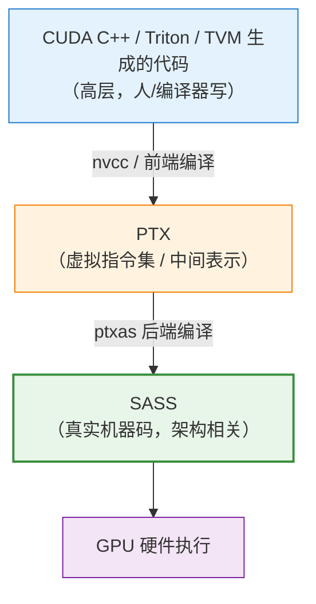
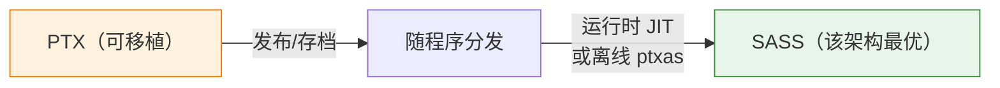
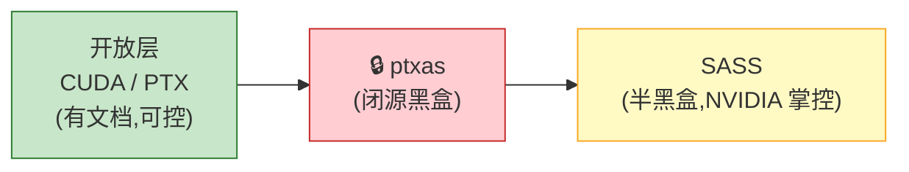
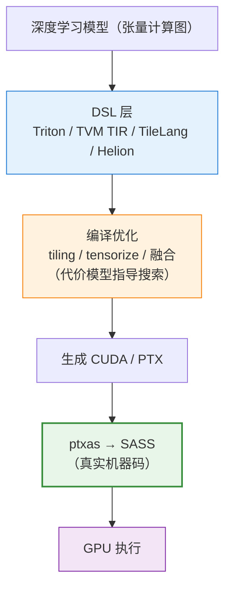

# NVIDIA SASS：GPU 的真正机器语言


## SASS 是什么

```
SASS = Streaming ASSembler
     （NVIDIA GPU 的【原生汇编指令集】/ 机器码）
        ↓
    它是 GPU 硬件【真正执行】的指令
        ↓
    每一代 GPU 架构（架构代号）都有自己的 SASS：
        Volta / Turing / Ampere / Hopper / Blackwell ...
        指令集各不相同（架构相关！）
```

| 特征       | 说明                                 |
| -------- | ---------------------------------- |
| **层次**   | 最底层——GPU 实际跑的机器指令，ISA              |
| **架构相关** | 每代 GPU 的 SASS 不同，不通用               |
| **谁生成**  | 由 NVIDIA 的后端编译器 `ptxas` 从 PTX 编译而来 |
| **封闭性**  | NVIDIA 未公开完整规范（半黑盒）                |

> **一句话**：SASS 是 NVIDIA GPU 的"真·机器语言"，是所有上层代码（CUDA、Triton、TVM 生成的 kernel）最终都要落到的地方。

---

## 关键：SASS vs PTX vs CUDA 的三层关系

这是理解 SASS 最重要的一张图。NVIDIA 的编译栈是**分层**的：



| 层   | 名称                | 类比                 | 特点                 |
| --- | ----------------- | ------------------ | ------------------ |
| 高层  | CUDA C++ / Triton | C 语言               | 人类/编译器编写           |
| 中层  | **PTX**           | **LLVM IR / 虚拟汇编** | 架构无关的虚拟 ISA，稳定、可移植 |
| 底层  | **SASS**          | **真实 x86/ARM 机器码** | 架构相关的真实指令          |

### PTX 和 SASS 的核心区别

```
PTX（Parallel Thread eXecution）：
    • 是【虚拟】指令集，不是硬件真正跑的
    • 架构无关 → 一份 PTX 可在多代 GPU 上（经再编译）运行
    • 相对稳定、有公开文档
    • 类比：Java 字节码 / LLVM IR

SASS：
    • 是【真实】机器码，硬件直接执行
    • 架构相关 → 换 GPU 架构就是另一套 SASS
    • 由 ptxas 从 PTX 编译产生
    • NVIDIA 未完整公开 → 半黑盒
    • 类比：特定 CPU 的原生机器码
```

---

## 为什么 PTX 之下还要有 SASS

一个自然的疑问：既然有了 PTX，为什么还要一层 SASS？

```
原因：可移植性 vs 硬件极致性能 的经典矛盾
        ↓
PTX 解决【可移植】：
    你发布一份 PTX，未来的新 GPU 也能用（forward compatibility）
    GPU 驱动会在运行时把 PTX 即时编译(JIT)成该硬件的 SASS
        ↓
SASS 解决【极致性能】：
    真正的指令调度、寄存器分配、指令延迟隐藏
    必须针对【具体架构的真实硬件特性】来做
    这些优化只能在 SASS 层完成
        ↓
    分两层 = 上层保移植、下层保性能
```



> 这与我们前面讲 DSL 时反复出现的"**可移植性 vs 硬件极致性能**"取舍轴，是完全一致的思想——只不过这里发生在 NVIDIA 编译栈的内部分层上。

---

## SASS 长什么样

SASS 指令直接暴露了 GPU 的硬件细节。一个简化片段（不同架构语法略有差异）：

```
/*0000*/  MOV R1, c[0x0][0x28] ;          // 寄存器移动
/*0010*/  S2R R0, SR_CTAID.X ;            // 读取 block 索引
/*0020*/  S2R R3, SR_TID.X ;              // 读取 thread 索引
/*0030*/  IMAD R0, R0, c[0x0][0x0], R3 ;  // 整数乘加算全局索引
/*0040*/  LDG.E R2, [R4] ;                // 从全局内存加载 (Load Global)
/*0050*/  FFMA R2, R2, R5, R6 ;           // 浮点乘加 (Fused Multiply-Add)
/*0060*/  STG.E [R4], R2 ;                // 存回全局内存 (Store Global)
        ...
        HMMA / IMMA / WGMMA ...           // Tensor Core 矩阵乘指令
```

```
可以看到 SASS 暴露的硬件真相：
    • 真实的寄存器编号（R0, R1, ... 寄存器数量有限！）
    • 内存层级指令：LDG/STG(全局)、LDS/STS(共享)
    • FFMA 融合乘加、HMMA/WGMMA(Tensor Core 指令)
    • 指令调度、控制信息(stall/barrier)
        ↓
    这些正是决定 kernel 快慢的最终因素
```

---

## 如何查看 SASS：工具链

想看到你的代码最终变成什么 SASS，有这些工具：

| 工具                              | 用途                            |
| ------------------------------- | ----------------------------- |
| **`cuobjdump -sass`**           | 从编译好的 cubin/可执行文件反汇编出 SASS    |
| **`nvdisasm`**                  | 反汇编 cubin，还能画控制流图             |
| **`nvcc -cubin` / `-ptx`**      | 分别生成 cubin（含 SASS）和 PTX       |
| **Nsight Compute** 🌟           | 性能分析器，可把 SASS 与性能计数器**对应**起来看 |
| **Godbolt (compiler explorer)** | 在线查看 CUDA → PTX / SASS        |

```
典型查看流程：
    nvcc kernel.cu -cubin -arch=sm_90 -o kernel.cubin
        ↓
    cuobjdump -sass kernel.cubin
        ↓
    看到真实的 SASS 指令序列
        ↓
    配合 Nsight Compute → 定位到底哪条指令是瓶颈
```

---

## SASS 为什么对性能分析至关重要

对追求极致性能的人（写 kernel、做编译器、调 LLM 推理），SASS 是**最终真相**：

```
高层看不出的问题，SASS 全暴露：
    ① 寄存器压力
        SASS 里能看到到底用了多少寄存器
        → 太多会导致 occupancy 下降 / 寄存器溢出到本地内存
    ② 是否真的用了 Tensor Core
        看有没有 HMMA/WGMMA 指令
        → 你以为 tensorize 了，SASS 说了算
    ③ 访存指令模式
        LDG/STG 是否合并(coalesced)、有没有多余的搬运
    ④ 指令数与调度
        编译器到底生成了多少指令、有没有冗余
    ⑤ 控制流开销
        分支、同步(BAR)带来的代价
```

> **关键点**：CUDA/PTX 层的"看起来对"，不代表 SASS 层"真的高效"。`ptxas` 会做大量优化（寄存器分配、指令调度），**最终性能由 SASS 决定**。所以顶级性能调优最终都要下到 SASS 层验证。

---

## SASS 的"封闭性"难题

```
SASS 是半黑盒：
    • NVIDIA 只公开了部分文档（指令列表有，细节语义不全）
    • 没有官方的 SASS 汇编器（你不能直接写 SASS 编译）
        ↓
影响：
    ① 想在 SASS 层手工优化极难（社区有逆向工具如 MaxAs/CuAssembler）
    ② 编译器（TVM/Triton）也只能生成到 PTX，
       把最后一步(PTX→SASS)交给闭源的 ptxas
        ↓
    这也是为什么 PTX 成了"事实上的公开接口"，
    而 SASS 是"NVIDIA 掌控的最后一公里"
```



> 这也是 NVIDIA 生态护城河的一部分——**把最底层的性能钥匙握在自己手里**。

---

## 与前文整条线索的连接

现在可以把 SASS 放进我们讨论过的完整链条里，看它处于最底端：



```
串起来看：
    • 我们讲的 tile / tiling → 目的就是让 SASS 层的访存/计算高效
    • 我们讲的 tensorize    → 最终要变成 SASS 里的 HMMA/WGMMA 指令
    • 我们讲的代价模型      → 预测的正是这些 SASS 执行的快慢
    • 我们讲的 Triton/TVM   → 它们生成到 PTX，SASS 由 ptxas 完成
        ↓
    SASS 是整条优化链的【终点与真相】：
    所有上层的努力，最终都要在 SASS 层兑现为真实性能
```
