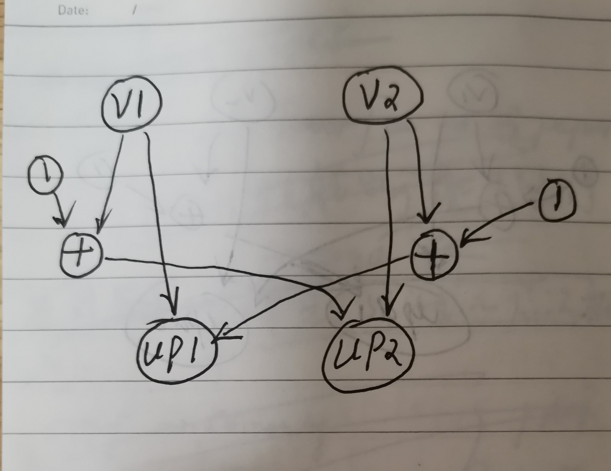
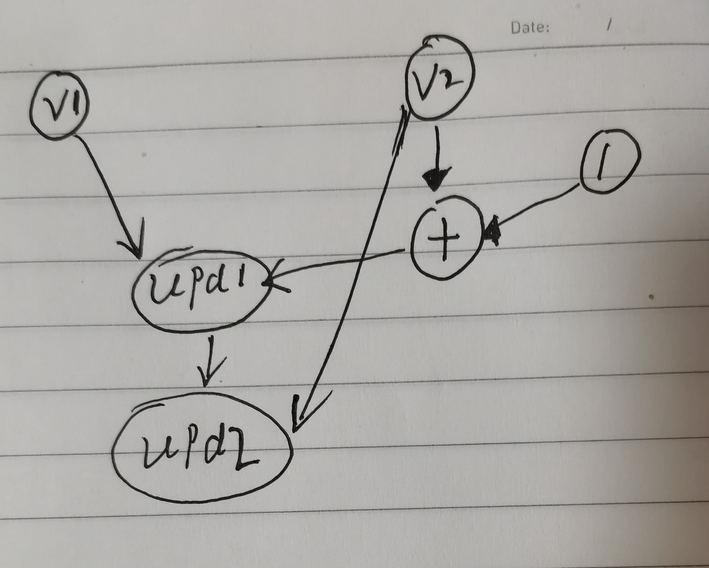
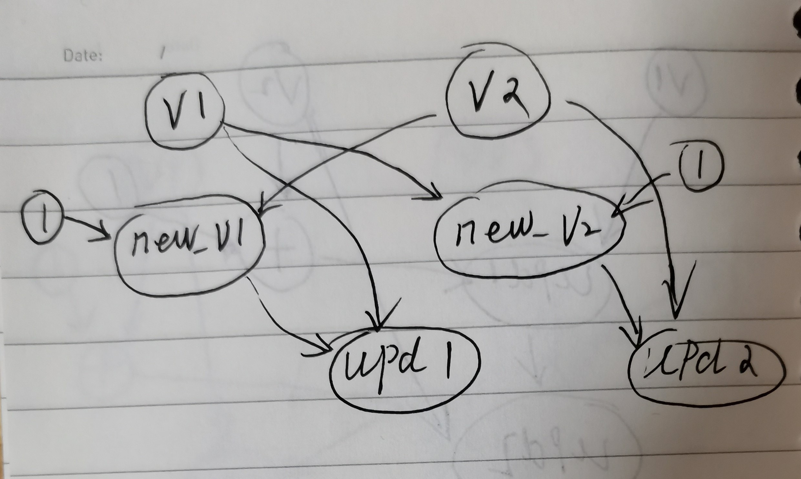

# `tf.control_dependencies`

是在阅读[TensorFlow: Large-Scale Machine Learning on Heterogeneous Distributed Systems](http://download.tensorflow.org/paper/whitepaper2015.pdf)时，其中有关于Control dependency edge的描述。

## haosdent [`tf.control_dependencies(control_inputs)`](https://haosdent.gitbooks.io/tensorflow-document/content/api_docs/python/framework.html) 


## haosdent `tf.Graph.control_dependencies(control_inputs)`

Use with the `with` keyword to specify that all operations constructed within the context should have control dependencies on `control_inputs`. For example:

```python
with g.control_dependencies([a, b, c]):
  # `d` and `e` will only run after `a`, `b`, and `c` have executed.
  d = ...
  e = ...
```

## stackoverflow [Understanding Tensorflow control dependencies](https://stackoverflow.com/questions/55094952/understanding-tensorflow-control-dependencies)

[A](https://stackoverflow.com/questions/55094952/understanding-tensorflow-control-dependencies/55099970#55099970)

In most cases, **control flow** in TensorFlow is "obvious", in the sense that there is only one way to make a **computation** correctly. However, when **stateful objects** (i.e. variables) are involved, there are situations that may be ambiguous. Consider the following example:

```python
import tensorflow as tf

v1 = tf.Variable(0)
v2 = tf.Variable(0)
upd1 = tf.assign(v1, v2 + 1)
upd2 = tf.assign(v2, v1 + 1)
init = tf.global_variables_initializer()
```

> NOTE: computation graph如下:
>
> 

`v1` and `v2` are both variables initialized to `0` and then updated. However, each use the value of the other variable in the update. In a regular Python program things would run sequentially, so `upd1` would run first (so `v1` would be `1`) and `upd2` after (so `v2` would be `2`, because `v1` was `1`). But TensorFlow does not record the **order** in which operations are created, only their **dependencies**. So it may also happen that `upd2` runs before `upd1` (so `v1` would be `2` and `v2` would be `1`) or that both update values (`v2 + 1` and `v1 + 1`) are computed before the assignments (so both `v1` and `v2` would be `1` in the end). 

> NOTE: 有多种可能的运行情况。

Indeed, if I run it several times:

```python
import tensorflow as tf

v1 = tf.Variable(0)
v2 = tf.Variable(0)
upd1 = tf.assign(v1, v2 + 1)
upd2 = tf.assign(v2, v1 + 1)
init = tf.global_variables_initializer()
for i in range(10):
    with tf.Session() as sess:
        sess.run(init)
        sess.run([upd1, upd2])
        print(*sess.run([v1, v2]))
```

I do not always get the same result (personally I get `1 1` and `2 1`, although technically `1 2` would also be possible). If for example you wanted to compute the new value for `v2` after `v1` has been updated, you could just do the following:

```python
import tensorflow as tf

v1 = tf.Variable(0)
v2 = tf.Variable(0)
upd1 = tf.assign(v1, v2 + 1)
upd2 = tf.assign(v2, upd1 + 1)
init = tf.global_variables_initializer()
```

> NOTE: 和前面的相比，差异在于`upd2 = tf.assign(v2, upd1 + 1)`，入参是`upd1` 。
>
> computation graph如下:
>
> 
>
> 上述输出为`1, 2`

Here the new value `v2` is computed using `upd1`, which is guaranteed to be the value of the variable after the update. So here `upd2` would have an **implicit dependency** to the assignment, and so things would work as expected.

But what if you wanted to always compute the new values for `v1` and `v2` using the non-updated variable values (that is, consistently end up with both `v1` and `v2` being `1`)? In that case you can use [`tf.control_dependencies`](https://www.tensorflow.org/api_docs/python/tf/control_dependencies):

```python
import tensorflow as tf

v1 = tf.Variable(0)
v2 = tf.Variable(0)
new_v1 = v2 + 1
new_v2 = v1 + 1
with tf.control_dependencies([new_v1, new_v2]):
    upd1 = tf.assign(v1, new_v1)
    upd2 = tf.assign(v2, new_v2)
init = tf.global_variables_initializer()
```

> NOTE: computation graph如下:
>
> 

Here, the assignment operations cannot happen until the new values for `v1` and `v2` have been computed, so their final values will always be `1` in both cases.