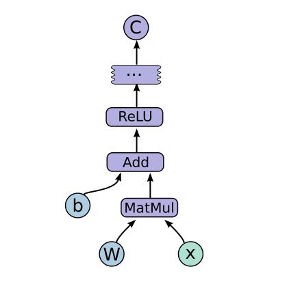
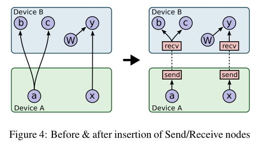
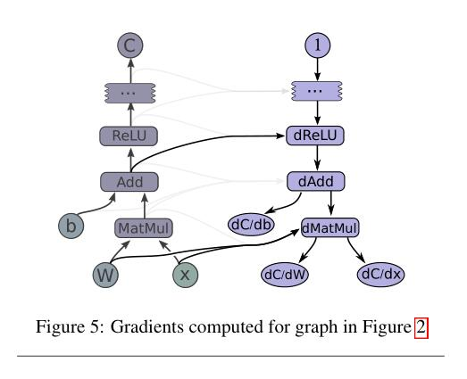

# [TensorFlow: Large-Scale Machine Learning on Heterogeneous Distributed Systems](http://download.tensorflow.org/paper/whitepaper2015.pdf)

## Abstract

TensorFlow [1] is an interface for expressing machine learning algorithms, and an implementation for executing such algorithms. 

> NOTE: tensorflow即实现了interface（front end）也实现了computation engine（back end），而[Keras](https://en.wikipedia.org/wiki/Keras)则仅仅提供interface，而将tensorflow等作为back end。

A computation expressed using TensorFlow can be executed with little or no change on a wide variety of heterogeneous（异构的） systems, ranging from mobile devices such as phones and tablets up to large-scale distributed systems of hundreds of machines and thousands of computational devices such as GPU cards. 

> NOTE: 显然，tensorflow类似于一个抽象层，通过这个抽象层，我们的algorithm可以运行在heterogeneous system上。

The system is flexible and can be used to express a wide variety of algorithms, including training and inference algorithms for deep neural network models, and it has been used for conducting research and for deploying machine learning systems into production across more than a dozen areas of computer science and other fields, including speech recognition, computer vision, robotics, information retrieval, natural language processing, geographic information extraction, and computational drug discovery. 

> NOTE: machine learning的广泛应用。

This paper describes the TensorFlow interface and an implementation of that interface that
we have built at Google. The TensorFlow API and a reference implementation were released as an open-source package under the Apache 2.0 license in November, 2015 and are available at www.tensorflow.org.

## 1 Introduction

Based on our experience with DistBelief and a more complete understanding of the desirable system properties and requirements for training and using neural networks, we have built TensorFlow, our second-generation system for the implementation and deployment of large-scale machine learning models. 


TensorFlow takes computations described using a **dataflow-like model** and maps them onto a wide variety of different hardware platforms, ranging from running inference on mobile device platforms such as Android and iOS to modest-sized training and inference systems using single machines containing one or many GPU cards to large-scale training systems running on hundreds of specialized machines with thousands of GPUs. 

Having a single system that can span such a broad range of platforms significantly simplifies the real-world use of machine learning system, as we have found that having separate systems for large-scale training and small-scale deployment leads to significant maintenance burdens and leaky abstractions. 

> NOTE: 统一的优势

TensorFlow computations are expressed as **stateful dataflow graphs** (described in more detail in Section 2), and we have focused on making the system both flexible enough for quickly experimenting with new models for research purposes and sufficiently high performance and robust for production training and deployment of machine learning models. 

For scaling neural network training to larger deployments, TensorFlow allows clients to easily express various kinds of **parallelism** through replication and parallel execution of a **core model dataflow graph**, with many different computational devices all collaborating to update a set of **shared parameters** or other **state**. Modest changes in the description of the computation allow a wide variety of different approaches to parallelism to be achieved and tried with low effort [14, 29, 42]. Some TensorFlow uses allow some flexibility in terms of the consistency of parameter updates, and we can easily express and take advantage of these relaxed synchronization requirements in some of our larger deployments. Compared to DistBelief, TensorFlow’s programming model is more flexible, its performance is significantly better, and it supports training and using a broader range of models on a wider variety of heterogeneous hardware platforms

> NOTE: 这一段作者所要表达的核心思想是：如果将tensorflow的interface看做是一门programming language，这个programming language是flexible、expressive的。使用它，client能够轻松地表述各种parallelism。
>
> 需要注意的是，tensorflow的设计者是将它定位为“Large-Scale Machine Learning on Heterogeneous Distributed Systems”，所以在上面这段话中，**parallelism** 、consistency 等distributed computing领域的术语是不足为奇的。


Although these applications have concentrated on machine learning and deep neural networks in particular, we expect that TensorFlow’s **abstractions** will be useful in a variety of other domains, including other kinds of machine learning algorithms, and possibly other kinds of **numerical computations**. 

> NOTE: tensorflow的本质是一个numerical computation framework。

The rest of this paper describes TensorFlow in more detail. 

Section 2 describes the **programming model** and basic concepts of the TensorFlow interface.

Section 3 describes both our **single machine** and **distributed implementations**. 

Section 4 describes several extensions to the basic programming model.

Section 5 describes several optimizations to the basic implementations. 

Section 6 describes some of our experiences in using TensorFlow.

Section 7 describes several **programming idioms** we have found helpful when using TensorFlow.

Section 9 describes several auxiliary tools we have built around the core TensorFlow system. 

Sections 10 and 11 discuss future and related work, respectively.

Section 12 offers concluding thoughts.

## 2 Programming Model and Basic Concepts

A TensorFlow computation is described by a directed ***graph***, which is composed of a set of ***nodes***. The graph represents a **dataflow computation**, with extensions for allowing some kinds of nodes to maintain and update **persistent state**（`tf.Variable`） and for **branching** and **looping** control structures within the graph in a manner similar to Naiad [[36]](http://research.microsoft.com:8082/pubs/201100/naiad_sosp2013.pdf). Clients typically construct a **computational graph** using one of the supported front end languages (`C++` or Python). An example fragment to construct and then execute a TensorFlow graph using the Python front end is shown in Figure 1, and the resulting computation graph
in Figure 2.

> NOTE: 需要注意的是， TensorFlow的computation model是借鉴的[Naiad](https://www.microsoft.com/en-us/research/project/naiad/) 

```python
import tensorflow as tf
b = tf.Variable(tf.zeros([100])) # 100-d vector, init to zeroes
W = tf.Variable(tf.random_uniform([784,100],-1,1)) # 784x100 matrix w/rnd vals
x = tf.placeholder(name="x") # Placeholder for input
relu = tf.nn.relu(tf.matmul(W, x) + b) # Relu(Wx+b)
C = [...] # Cost computed as a function
# of Relu
s = tf.Session()
for step in xrange(0, 10):
input = ...construct 100-D input array ... # Create 100-d vector for input
result = s.run(C, feed_dict={x: input}) # Fetch cost, feeding x=input
print step, result
```




Figure 2: Corresponding computation graph for Figure 1

> NOTE: 正如这个图片中所展示的，`b`、`W`、`X`都是node；

In a TensorFlow graph, each ***node*** has zero or more inputs and zero or more outputs, and represents the instantiation of an ***operation***. Values that flow along normal edges in the graph (from outputs to inputs) are ***tensors***, arbitrary dimensionality arrays where the underlying element type is specified or inferred at graph-construction time. Special **edges**, called ***control dependencies***, can also exist in the graph: no data flows along such edges, but they indicate that the **source node for the control dependence** must finish executing before the **destination node for the control dependence** starts executing. Since our model includes **mutable state**, **control dependencies** can be used directly by clients to enforce **happens before**
**relationships**. Our implementation also sometimes inserts **control dependencies** to enforce orderings between otherwise independent operations as a way of, for example, controlling the peak memory usage.

> NOTE: 上面引入了非常重要的概念：
>
> | graph | tensorflow graph              |
> | ----- | ----------------------------- |
> | node  | operation                     |
> | edge  | tensor、 control dependencies |
>
> 

### Operations and Kernels

An ***operation*** has a name and represents an abstract computation (e.g., “matrix multiply”, or “add”). An operation can have ***attributes***, and all attributes must be provided or inferred at graph-construction time in order to instantiate a node to perform the operation. One common use of attributes is to make operations polymorphic over different tensor element types (e.g., add of two tensors of type float versus add of two tensors of type int32). 

A ***kernel*** is a particular implementation of an **operation** that can be run on a particular type of device (e.g., CPU or GPU). A TensorFlow binary defines the sets of **operations** and **kernels** available via a registration mechanism, and this set can be extended by linking in additional operation and/or kernel definitions/registrations. Table 1 shows some of the kinds of **operations** built into the core TensorFlow library.

> NOTE: 上面描述了operation和kernel之间的关系

| Category                             | Examples                                                  |
| ------------------------------------ | --------------------------------------------------------- |
| Element-wise mathematical operations | Add, Sub, Mul, Div, Exp, Log, Greater, Less, Equal, ...   |
| Array operations                     | Concat, Slice, Split, Constant, Rank, Shape, Shuffle, ... |
| Matrix operations                    | MatMul, MatrixInverse, MatrixDeterminant, ...             |
| Stateful operations                  | Variable, Assign, AssignAdd, ...                          |
| Neural-net building blocks           | SoftMax, Sigmoid, ReLU, Convolution2D, MaxPool, ...       |
| Checkpointing operations             | Save, Restore                                             |
| Queue and synchronization operations | Enqueue, Dequeue, MutexAcquire, MutexRelease, ...         |
| Control flow operations              | Merge, Switch, Enter, Leave, NextIteration                |

Table 1: Example TensorFlow operation types

> NOTE: tensorflow是一个distributed system，所以它提供了”Queue and synchronization operations“

> NOTE: 训练数据需要流经整个网络，我们需要对训练数据执行一定的运算；训练数据可能会和weight，bias等进行运算，显然weight和bias等是和训练数据不同的，它们是需要由模型来进行学习的，在具体编码的时候，训练数据往往使用`tf.placeholder`来表示，而weight和bias等则是使用`tf.Variable`来表示；理解两者最最简单的方式是实现一个MLP；


### Sessions

Clients programs interact with the TensorFlow system by creating a ***Session***. To create a **computation graph**, the Session interface supports an ***Extend*** method to augment（扩展） the current graph managed by the session with additional nodes and edges (the initial graph when a session is created is empty). The other primary operation supported by the session interface is ***Run***, which takes a set of output names that need to be computed, as well as an optional set of **tensors** to be fed into the graph in place of certain outputs of nodes. Using the arguments to Run, the TensorFlow implementation can compute the **transitive closure** of all nodes that must be executed in order to compute the outputs that were requested, and can then arrange to execute the appropriate nodes in an order that respects their dependencies (as described in more detail in 3.1). Most of our uses of TensorFlow set up a Session with a graph once, and then execute the full graph or a few distinct subgraphs thousands or millions of times via Run calls.

> NOTE: tensorflow的computation graph其实也可以看做是一个dependency graph，显然最终的输出节点是依赖于所有流向它的输入tensor的，而这些tensor又进一步依赖于流入它的tensor的，显然这种dependency关系是transitive的，也就是为了计算出output，需要计算出所有的transitive closure。这就是在graph theory中总结的dependency model。
>
> 第一次阅读这一段的时候，我想到了在《[compile principle](https://dengking.github.io/compiler-principle/)》
>
> - 4.6 Introduction to LR Parsing: Simple LR[#](https://dengking.github.io/compiler-principle/Chapter-4-Syntax-Analysis/4.6-Introduction-to-LR-Parsing-Simple-LR/#46-introduction-to-lr-parsing-simple-lr)
>
> - 5.2 Evaluation Orders for SDD's[#](https://dengking.github.io/compiler-principle/Chapter-5-Syntax-Directed-Translation/5.2-Evaluation-Orders-for-SDD's/#52-evaluation-orders-for-sdds)


### Variables

In most computations a graph is executed multiple times. Most tensors do not survive past a single execution of the graph. However, a Variable is a special kind of operation that returns a handle to a persistent mutable tensor that survives across executions of a graph. Handles to these persistent mutable tensors can be passed to a handful of special operations, such as Assign and `AssignAdd` (equivalent to +=) that mutate the referenced tensor. For machine learning applications of TensorFlow, the parameters of the model are typically stored in tensors held in variables, and are updated as part of the Run of the training graph for the model.

## 3 Implementation

The main components in a TensorFlow system are the ***client***, which uses the Session interface to communicate with the ***master***, and one or more ***worker processes***, with each worker process responsible for arbitrating（仲裁） access to one or more computational devices (such as CPU cores or GPU cards) and for executing graph nodes on those devices as instructed by the master. 

We have both ***local*** and ***distributed*** implementations of the TensorFlow interface. 

The **local implementation** is used when the client, the master, and the worker all run on a single machine in the context of a single operating system process (possibly with multiple devices, if for example, the machine has many GPU cards installed). 

The **distributed implementation** shares most of the code with the local implementation, but extends it with support for an environment where the client, the master, and the workers can all be in different processes on different machines. In our distributed environment, these different tasks are containers in jobs managed by a cluster scheduling system [51]. These two different modes are illustrated in Figure 3. 


Most of the rest of this section discusses issues that are common to both implementations, while Section 3.3 discusses some issues that are particular to the distributed implementation.


### Devices

Devices are the computational heart of TensorFlow. Each worker is responsible for one or more devices, and each device has a **device type**, and a **name**. **Device names** are composed of pieces that identify the **device’s type**, the device’s index within the worker, and, in our distributed setting, an identification of the job and task of the worker (or localhost for the case where the devices are local to the process). Example device names are"`/job:localhost/device:cpu:0`"or "`/job:worker/task:17/device:gpu:3`". 

We have implementations of our Device interface for CPUs and GPUs, and new device implementations for other device types can be provided via a registration mechanism. Each device object is responsible for managing allocation and deallocation of device memory, and for arranging for the execution of any kernels that are requested by higher levels in the TensorFlow implementation.

### Tensors

A tensor in our implementation is a typed, multi-dimensional array. We support a variety of tensor element types, including signed and unsigned integers ranging in size from 8 bits to 64 bits, IEEE float and double
types, a complex number type, and a string type (an arbitrary byte array). Backing store of the appropriate size is managed by an allocator that is specific to the device on which the tensor resides. Tensor backing store buffers are reference counted and are deallocated when no references remain.


### 3.1 Single-Device Execution

Let’s first consider the simplest execution scenario: a single worker process with a single device. The nodes of the graph are executed in an order that respects the dependencies between nodes. In particular, we keep track of a count per node of the number of dependencies of that node that have not yet been executed. Once this count drops to zero, the node is eligible for execution and is added to a ready queue. 

The ready queue is processed in some unspecified order, delegating execution of the kernel for a node to the device object. When a node has finished executing, the counts of all nodes that depend on the completed node are decremented.

### 3.2 Multi-Device Execution

Once a system has multiple devices, there are two main complications: deciding which device to place the computation for each node in the graph, and then managing the required communication of data across device boundaries implied by these placement decisions. This subsection discusses these two issues.

#### 3.2.1 Node Placement

Given a computation graph, one of the main responsibilities of the TensorFlow implementation is to map the computation onto the set of available devices. A simplified version of this algorithm is presented here. See Section 4.3 for extensions supported by this algorithm.

One input to the **placement algorithm** is a **cost model**, which contains estimates of the sizes (in bytes) of the input and output tensors for each graph **node**, along with estimates of the computation time required for each **node** when presented with its input tensors. This **cost model** is either statically estimated based on heuristics associated with different **operation types**, or is measured based on an actual set of placement decisions for earlier executions of the graph. 

> NOTE: 

The placement algorithm first runs a simulated execution of the graph. The simulation is described below and ends up picking a device for each node in the graph using greedy heuristics. The node to device placement generated by this simulation is also used as the placement for the real execution.

The **placement algorithm** starts with the sources of the **computation graph**, and simulates the activity on each device in the system as it progresses. For each node that is reached in this traversal, the set of feasible devices is considered (a device may not be feasible if the device does not provide a kernel that implements the particular operation). For nodes with multiple feasible devices, the **placement algorithm** uses a greedy heuristic that examines the effects on the completion time of the node of placing the node on each possible device. This heuristic takes into account the estimated or measured execution time of the operation on that kind of device from the cost model, and also includes the costs of any communication that would be introduced in order to transmit inputs to this node from other devices to the considered device. 

> NOTE: 思考：source of computation graph是computation graph的哪一端？
>
> 上面这一段所描述的是“The placement algorithm first runs a simulated execution of the graph”，即“simulation ”

The device where the node’s operation would finish the soonest is selected as the device for that operation, and the placement process then continues onwards to make placement decisions for other nodes in the graph, including downstream nodes that are now ready for their own simulated execution. Section 4.3 describes some extensions that allow users to provide hints and partial constraints to guide the placement algorithm. The placement algorithm is an area of ongoing development within the system.

#### 3.2.2 Cross-Device Communication

Once the node placement has been computed, the graph is partitioned into a set of subgraphs, one per device. Any cross-device edge from x to y is removed and replaced by an edge from x to a new **Send node** in x’s subgraph and an edge from a corresponding **Receive node** to y in y’s subgraph. See Figure 4 for an example of this graph transformation.




At runtime, the implementations of the **Send** and **Receive nodes** coordinate to transfer data across devices. This allows us to isolate all communication inside Send and Receive implementations, which simplifies the rest of the runtime. 

When we insert Send and Receive nodes, we canonicalize（规范化转换） all users of a particular tensor on a particular device to use a single **Receive node**, rather than one Receive node per downstream user on a particular device. This ensures that the data for the needed tensor is only transmitted once between a source device → destination device pair, and that memory for the tensor on the destination device is only allocated once, rather than multiple times (e.g., see nodes `b` and `c` in Figure 4) 

By handling communication in this manner, we also allow the scheduling of individual nodes of the graph on different devices to be decentralized into the workers: the Send and Receive nodes impart the necessary **synchronization** between different workers and devices, and the master only needs to issue a single **Run request** per graph execution to each worker that has any nodes for the graph, rather than being involved in the scheduling of every node or every cross-device communication. This makes the system much more scalable and allows much finer-granularity node executions than if the scheduling were forced to be done by the master.


### 3.3 Distributed Execution

Distributed execution of a graph is very similar to multidevice execution. After device placement, a subgraph is created per device. Send/Receive node pairs that communicate across worker processes use remote communication mechanisms such as TCP or RDMA to move data across machine boundaries.

> NOTE: 这些workerprocess位于不同的machine，所以需要通过network进行communicate。

#### Fault Tolerance

Failures in a distributed execution can be detected in a variety of places. The main ones we rely on are (a) an error in a communication between a Send and Receive node pair, and (b) periodic health-checks from the master process to every worker process. 

When a failure is detected, the entire graph execution is aborted and restarted from scratch. Recall however that Variable nodes refer to tensors that persist across executions of the graph. We support consistent checkpointing and recovery of this state on a restart. In partcular, each **Variable node** is connected to a **Save node**. These Save nodes are executed periodically, say once every N iterations, or once every N seconds. When they execute, the contents of the variables are written to persistent storage, e.g., a distributed file system. Similarly each Variable is connected to a Restore node that is only enabled in the first iteration after a restart. See Section 4.2 for details on how some nodes can only be enabled on some executions of the graph.

## 4 Extensions

In this section we describe several more advanced features of the basic programming model that was introduced in Section 2.

### 4.1 Gradient Computation

Many optimization algorithms, including common machine learning training algorithms like stochastic gradient descent [45], compute the **gradient** of a cost function with respect to a set of inputs. Because this is such a common need, TensorFlow has built-in support for **automatic gradient computation**. If a tensor `C` in a TensorFlow graph depends, perhaps through a complex subgraph of operations, on some set of tensors `{X k }`, then there is a built-in function that will return the tensors `{dC/dX k }`（这就是gradient）. **Gradient tensors** are computed, like other tensors, by extending the TensorFlow graph, using the following procedure.

When TensorFlow needs to compute the gradient of a tensor `C` with respect to some tensor `I` on which `C`
depends, it first finds the path in the computation graph from `I` to `C`. Then it backtracks from `C` to `I`, and for each operation on the **backward path** it adds a node to the TensorFlow graph, composing the **partial gradients** along the **backwards path** using the **chain rule**. The newly added node computes the “**gradient function**” for the corresponding operation in the **forward path**. A **gradient function** may be registered by any operation. This function takes as input not only the partial gradients computed already along the backward path, but also, optionally, the inputs and outputs of the **forward operation**. Figure 5 shows gradients for a cost computed from the example of Figure 2. Grey arrows show potential inputs to **gradient functions** that are not used for the particular operations shown. The addition needed to Figure 1 to compute these gradients is:

```mathematica
[db,dW,dx] = tf.gradients(C, [b,W,x])
```



> NOTE: **gradient function**的概念没有搞懂

### 4.2 Partial Execution

### 4.3 Device Constraints

### 4.4 Control Flow

### 4.5 Input Operations

### 4.6 Queues

### 4.7 Containers


## 5 Optimizations

In this section, we describe some of the optimizations in the TensorFlow implementation that improve performance or resource usage of the system.

### 5.1 Common Subexpression Elimination

Since the construction of computation graphs is often done by many different layers of abstractions in the client code, computation graphs can easily end up with redundant copies of the same computation. To handle this, we have implemented a common subexpression pass similar to the algorithm described by Click [[12](https://courses.cs.washington.edu/courses/cse501/06wi/reading/click-pldi95.pdf)] that runs over the **computation graph** and canonicalizes multiple copies of operations with identical inputs and operation types to just a single one of these nodes, and redirects graph edges appropriately to reflect this canonicalization（标准化）.

### 5.2 Controlling Data Communication and Memory Usage

### 5.3 Asynchronous Kernels

### 5.4 Optimized Libraries for Kernel Implementations

### 5.5 Lossy Compression

## 6 Status and Experience

The TensorFlow interface and a reference implementation have been open sourced under an Apache 2.0
license, and the system is available for download at www.tensorflow.org. The system includes detailed documentation, a number of tutorials, and a number of examples demonstrating how to use the system for a variety of different machine learning tasks. The examples include models for classifying hand-written digits from the MNIST dataset (the “hello world” of machine learning algorithms) [32], classifying images from the CIFAR-10 dataset [30], doing language modeling using a recurrent LSTM [22] network, training word embedding vectors [35] and more.


## 7 Common Programming Idioms

TensorFlow’s basic **dataflow graph model** can be used in a variety of ways for machine learning applications. One domain we care about is speeding up training of computationally intensive neural network models on large datasets. This section describes several techniques that we and others have developed in order to accomplish this, and illustrates how to use TensorFlow to realize these various approaches.

The approaches in this subsection assume that the model is being trained using stochastic gradient descent (SGD) with relatively modest-sized mini-batches of 100 to 1000 examples.

### Data Parallel Training

One simple technique for speeding up SGD is to parallelize the computation of the gradient for a mini-batch across mini-batch elements. For example, if we are using a mini-batch size of 1000 elements, we can use 10 replicas of the model to each compute the gradient for 100 elements, and then combine the gradients and apply updates to the parameters synchronously, in order to behave exactly as if we were running the sequential SGD algorithm with a batch size of 1000 elements. In this case, the TensorFlow graph simply has many replicas of the portion of the graph that does the bulk of the model computation, and a single client thread drives the entire training loop for this large graph. This is illustrated in the top portion of Figure 7.


## 8 Performance


## 9 Tools


## 10 Future Work


## 11 Related Work


## 12 Conclusions