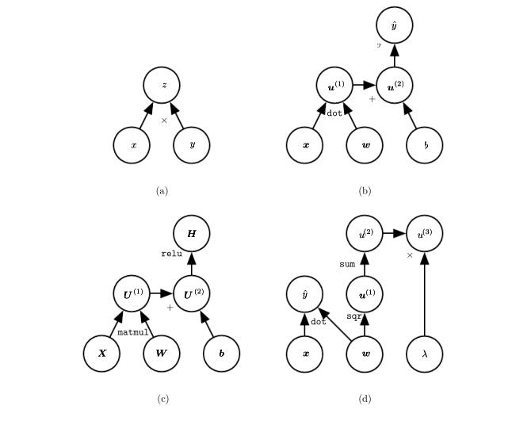
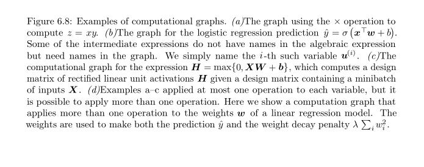
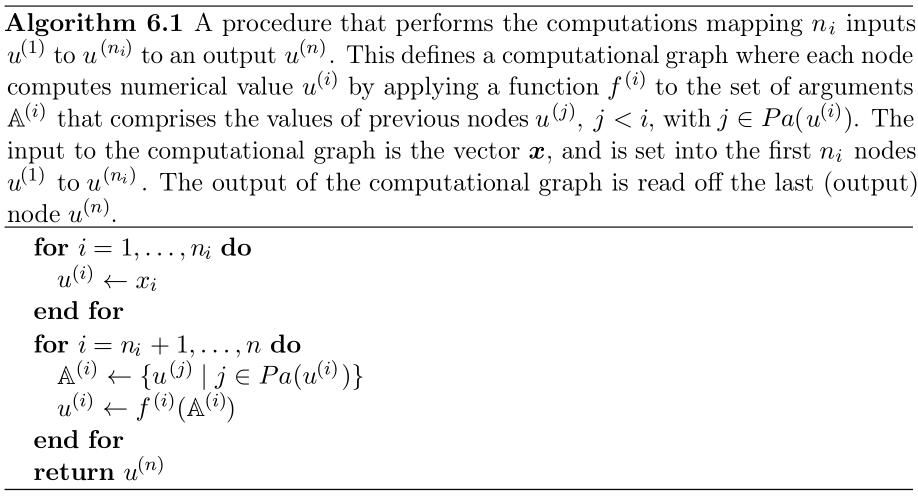
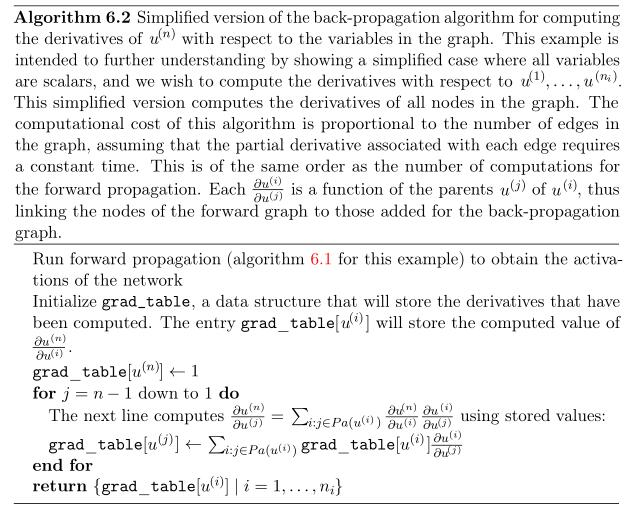
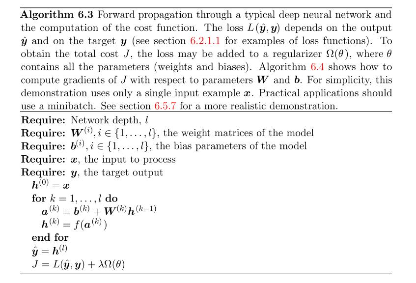
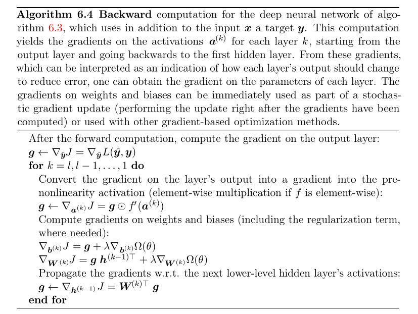
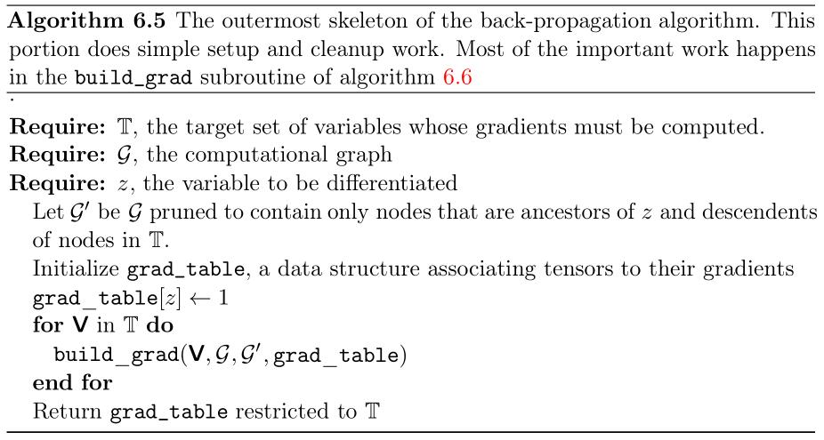
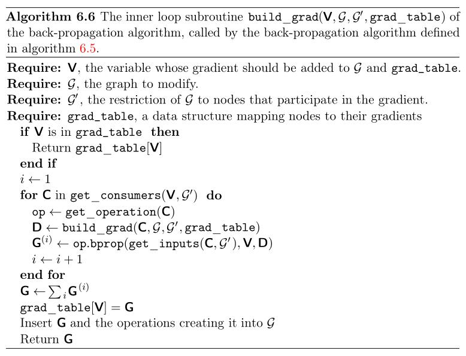

# 6.5 Back-Propagation and Other Differentiation Algorithms

When we use a feedforward neural network to accept an input $x$ and produce an output  $\hat{y}$, information flows forward through the network. The inputs $x$ provide the initial information that then propagates up to the hidden units at each layer and finally produces $\hat{y}$ . This is called **forward propagation** . During training,
**forward propagation** can continue onward until it produces a scalar cost $J( \theta )$. The back-propagation algorithm ( Rumelhart et al. 1986a ), often simply called  **backprop**, allows the information from the cost to then flow backwards through the network, in order to compute the gradient.

Computing an analytical expression for the gradient is straightforward, but numerically evaluating such an expression can be computationally expensive. The back-propagation algorithm does so using a simple and inexpensive procedure.

The term back-propagation is often misunderstood as meaning the whole learning algorithm for multi-layer neural networks. Actually, back-propagation refers only to the method for computing the **gradient**, while another algorithm, such as **stochastic gradient descent**, is used to perform learning using this **gradient**. Furthermore, back-propagation is often misunderstood as being specific to multi-layer neural networks, but in principle it can compute **derivatives** of any function (for some functions, the correct response is to report that the derivative of the function is undefined). Specifically, we will describe how to compute the **gradient** $\nabla_x {f(x, y)}$ for an arbitrary function $f$ , where $x$ is a set of variables whose derivatives are desired, and $y$ is an additional set of variables that are inputs to the function but whose derivatives are not required. In learning algorithms, the **gradient** we most often require is the gradient of the **cost function** with respect to the **parameters**, $\nabla_{\theta} J(\theta)$ . Many machine learning tasks involve computing other derivatives, either as part of the learning process, or to analyze the learned model. The **back-propagation algorithm** can be applied to these tasks as well, and is not restricted to computing the **gradient** of the **cost function** with respect to the **parameters**. The idea of computing derivatives by propagating information through a network is very general, and can be used to compute values such as the **Jacobian** of a function f with multiple outputs. We restrict our description here to the most commonly used case where has a single output.

## 6.5.1 Computational Graphs

> NOTE: Computational Graph是非常核心的概念，后续的内容基本上都是基于它的，它是一种结构化的表示方式。

So far we have discussed neural networks with a relatively informal graph language. To describe the back-propagation algorithm more precisely, it is helpful to have a more precise **computational graph** language. 

Many ways of formalizing computation as graphs are possible.

### Node

Here, we use each **node** in the graph to indicate a variable. The variable may be a scalar, vector, matrix, tensor, or even a variable of another type. 

### Operation 

> NOTE: operation的概念十分重要，在6.5.6 General Back-Propagation还会说明operation。

To formalize our graphs, we also need to introduce the idea of an **operation** . An operation is a simple **function** of one or more variables. Our graph language is accompanied by a set of allowable operations. Functions more complicated than the operations in this set may be described by composing many operations together.

Without loss of generality, we define an operation to return only a single output variable. This does not lose generality because the output variable can have multiple entries, such as a vector. Software implementations of back-propagation usually support operations with multiple outputs, but we avoid this case in our description because it introduces many extra details that are not important to conceptual understanding. 

### Construction of computational graph

If a variable $y$ is computed by applying an operation to a variable $x$ , then we draw a directed edge from $x$ to $y$ . We sometimes annotate the output node with the name of the operation applied, and other times omit this label when the operation is clear from context.

Examples of computational graphs are shown in figure 6.8. 

## 6.5.2 Chain Rule of Calculus

> NOTE: 作者对本章内容的组织是循序渐进的：首先描述Chain Rule of Calculus的scalar形式，然后描述它的vector形式，然后描述它的tensor形式。
>
> |            |              |
> | ---------- | ------------ |
> | scalar形式 | Formula 6.44 |
> | vector形式 | Formula 6.46 |
> | tensor形式 | Formula 6.47 |
>
> 

The chain rule of calculus (not to be confused with the chain rule of probability) is used to compute the derivatives of functions formed by composing other functions whose derivatives are known. Back-propagation is an algorithm that computes the chain rule, with a specific order of operations that is highly efficient.

Let $x$ be a real number, and let $f$ and $g$ both be functions mapping from a real number to a real number. Suppose that $y = g ( x )$ and $z = f ( g ( x )) = f ( y )$. Then the chain rule states that

### Formula 6.44

$$
\frac {dz} {dx} = \frac {dz} {dy} \frac {dy} {dx} \tag {6.44}
$$

We can generalize this beyond the scalar case. Suppose that $\boldsymbol x \in \mathbb R^m$ , $\boldsymbol y \in \mathbb R^n$ ,$g$ maps from $\mathbb R^m$ to $ \mathbb R^n$ , and $f$ maps from $\mathbb R^n$ to $\mathbb R$ . If $\boldsymbol y = g ( \boldsymbol x )$ and $z = f ( \boldsymbol y )$, then

> NOTE: 需要注意，粗体调试的是向量，所以$z$是scalar， $\boldsymbol x$、$\boldsymbol y$是vector；

### Formula 6.45

$$
\frac {\partial z} {\partial x_i} = \sum_j \frac {\partial z} {\partial y_j} \frac {\partial y_j} {\partial dx_i} \tag {6.45}
$$

In vector notation, this may be equivalently written as

### Formula 6.46

$$
{\displaystyle \nabla _{x}z=(\frac {\partial \boldsymbol y} {\partial \boldsymbol x})\nabla_{\boldsymbol y}\boldsymbol z.} \tag {6.46}
$$

where $\frac {\partial \boldsymbol y} {\partial \boldsymbol x}$ is the Jacobian matrix of $g$.

> NOTE: 式(6.45)和式(6.46)，可以参见维基百科[Chain rule#General rule](https://en.wikipedia.org/wiki/Chain_rule#General_rule)

> NOTE: 使6.45和式6.46都是递归定义。
>
> 对于式6.46，求$\nabla _{x}Z$，可以转换为求$\nabla_{\boldsymbol y}\boldsymbol z$和一个Jacobian matrix of $g$.
>
> 对于式6.45，与式6.46类似

> NOTE: 从式6.45到式6.46存在着一定的跳跃性，因为式6.45所描述的是partial derivative，而式6.46所描述的是gradient。

> NOTE: 式(6.45)所描述的是$z$对某一维，式(6.46)所描述的是通用的形式，它描述的是所有的维度，从此可以看出tensor表述的威力，显然tensor是一种更加强大的表述方式。

From this we see that the gradient of a variable $\boldsymbol x$ can be obtained by multiplying a Jacobian matrix $\frac {\partial \boldsymbol y} {\partial \boldsymbol x}$ by a gradient $\nabla _{\boldsymbol y}z$ . The back-propagation algorithm consists of performing such a Jacobian-gradient product for each operation in the graph.

Usually we do not apply the **back-propagation algorithm** merely to **vectors**, but rather to **tensors** of arbitrary dimensionality. Conceptually, this is exactly the same as back-propagation with vectors. The only difference is how the numbers are arranged in a grid to form a tensor. We could imagine flattening each tensor into a vector before we run back-propagation, computing a vector-valued gradient, and then reshaping the gradient back into a tensor. In this rearranged view, back-propagation is still just multiplying Jacobians by gradients. 

To denote the gradient of a value $z$ with respect to a tensor $\rm \textbf X$ , we write $\nabla _{\rm \textbf X}z$ , just as if  $\rm \textbf X$  were a vector. The indices into  $\rm \textbf X$  now have multiple coordinates—for example, a 3-D tensor is indexed by three coordinates. We can abstract this away by using a single variable $i$ to represent the complete tuple of indices. For all possible index tuples $i$ , $( \nabla _{\rm \textbf X}z )_i$ gives $\frac {\partial z} {\partial \boldsymbol X_i}$. This is exactly the same as how for all possible integer indices $i$ into a vector,  $(\nabla _{\boldsymbol x}z)_i$ gives $\frac {\partial z} {\partial x_i}$. Using this notation, we can write the chain rule as it applies to tensors. If $ {\rm \textbf Y} = g({\rm \textbf X})$ and $z = f({\rm \textbf Y})$ , then

### Formula 6.47

$$
\nabla_{\rm \textbf X}z = \sum_j (\nabla_{\rm \textbf X} \boldsymbol Y_i  ) \frac {\partial z} {\partial \boldsymbol Y_j} \tag {6.47}
$$

> NOTE: 上述式子仅仅给出了非常简单的复合函数，实际的full-connected network远比它要复杂。所以需要使用更加高级、更加general的描述方式：[Vector calculus](https://en.wikipedia.org/wiki/Vector_calculus)，所有的都要以[tensor](https://en.wikipedia.org/wiki/Tensor)为单位，与此相关的概念有：
>
> - [Jacobian matrix](https://en.wikipedia.org/wiki/Jacobian_matrix_and_determinant)
>
> 

## 6.5.3 Recursively Applying the Chain Rule to Obtain Backprop

Using the chain rule, it is straightforward to write down an algebraic expression for the gradient of a **scalar** with respect to any node in the **computational graph** that produced that scalar. However, actually evaluating that expression in a computer introduces some extra considerations.

> NOTE: 对于neural network，上面这段话中的scalar所指为cost

Specifically, many subexpressions may be repeated several times within the overall expression for the gradient. Any procedure that computes the gradient will need to choose whether to store these subexpressions or to recompute them several times. An example of how these repeated subexpressions arise is given in figure 6.9.  In some cases, computing the same subexpression twice would simply be wasteful. For complicated graphs, there can be exponentially many of these wasted computations, making a naive implementation of the **chain rule** infeasible. In other cases, computing the same subexpression twice could be a valid way to reduce memory consumption at the cost of higher runtime.

> NOTE: tradeoff

We first begin by a version of the **back-propagation algorithm** that specifies the actual **gradient computation** directly (algorithm 6.2 along with algorithm 6.1 for the associated forward computation), in the order it will actually be done and according to the recursive application of **chain rule**. One could either directly perform these computations or view the description of the algorithm as a **symbolic specification**
of the **computational graph** for computing the back-propagation. However, this formulation does not make explicit the manipulation and the construction of the **symbolic graph** that performs the **gradient computation**. Such a formulation is presented below in section 6.5.6, with algorithm 6.5, where we also generalize to nodes that contain arbitrary tensors.

> NOTE: 理解上面这段话可以从这样的问题出发：给定一个function，我们可以画出它的computational graph，那如何来计算它的梯度呢？显然，对于computer而言的，我们需要总结出algorithm: algorithm 6.2 是计算gradient的algorithm；算法6.1是forward computation。
>
> 上面这段话的后面两段是对algorithm 6.2 的描述：
>
> - 我们可以将algorithm 6.2看做是: a **symbolic specification** of the **computational graph** for computing the back-propagation
> - algorithm 6.2并没有告诉我们:  the manipulation and the construction of the **symbolic graph** that performs the **gradient computation**. 
>
> “symbolic graph”是什么？我认为它是计算gradient的computational graph。

First consider a computational graph describing how to compute a single scalar $u^{(n)}$ (say the **loss** on a training example). This scalar is the quantity whose gradient we want to obtain, with respect to the $n_i$ input nodes $u^{(1)}$ to $u^{(n_i )}$ . In other words we wish to compute $ \frac { \partial u^{(n)} } { \partial u^{(i)} }$ for all $i \in \{ 1 , 2 ,...,n_i \}$ . In the application of back-propagation to computing gradients for gradient descent over parameters, $u^{ ( n ) }$ will be the cost associated with an example or a minibatch, while $u^{(1)}$ to $u^{(n_i )}$ correspond to the parameters of the model.

We will assume that the nodes of the graph have been ordered in such a way that we can compute their output one after the other, starting at $u^{(n_i +1)}$ and going up to $u^{n}$. As defined in algorithm 6.1, each node $u ^{( i )}$  is associated with an operation $f^{( i )}$  and is computed by evaluating the function
$$
u^{(i)} = f(\mathbb A^{(i)})   \tag {6.48}
$$
where $\mathbb A^{( i )}$  is the set of all nodes that are parents of $u^{(i)}$ .

> NOTE: 原文作者变量命名的方式是非常不易懂的。搞懂这些变量命名的前提是了解作者的命名规则：作者是以graph的node为单位来进行命名的，即$n_i$是对node的编号， $u^{(i)}$对应的是node的output。
>
> 一个graph是有input nodes的：$n_i$ input nodes $u^{(1)}$ to $u^{(n_i )}$ ；显然input nodes的值是可以直接获取的；其他的node的output是通过式$(6.48)$计算得到的。
>
> 式(6.48)所描述的是前馈过程，即 forward propagation computation，它所描述的是一个node的计算。

### Algorithm 6.1

> NOTE: 上述算法中，$Pa$是$Parent$的缩写；$Pa(u^{(i)})$表示节点$u^{(i)}$的父节点。

### Algorithm 6.2

That algorithm specifies the **forward propagation computation**, which we could put in a graph $\mathcal{G}$ . In order to perform **back-propagation**, we can construct a **computational graph** that depends on $\mathcal{G}$ and adds to it an extra set of nodes. These form a subgraph $\mathcal{B}$ with one node per node of $\mathcal{G}$ . Computation in $\mathcal{B}$ proceeds in exactly the reverse of the order of computation in $\mathcal{G}$ , and each node of $\mathcal{B}$ computes the derivative $\frac { \partial u^{(n)} } { \partial u^{(i)} }$associated with the forward graph node $u^{(i)}$ . This is done using the **chain rule** with respect to scalar output $u ^ { (n) }$ :

> NOTE: $\rm grad\_table[u^{(n)}] \leftarrow 1$ 表示将 node $u^{(n)}$的gradient初始化为1；
>
> 要计算$\rm grad\_table[u^{(j)}]$的值，需要知道$u^{(j)}$的所有的子节点，即上述算法中的$u^{(i)}$，$\rm gra d\_table[u^{(i)}]$的值已经计算得到，因为是方向是back（从后往前），$\frac {u^{(i)}} {u^{(j)}}$其实可以看做是$u^{(j)}$到$u^{(i)}$的边，有了这些认知，就可以上述`for`循环的循环体了。
>
> 上述使用$i:j \in Pa(u^{(i)})$来表示$u^{(j)}$的所有的子节点，它的表面意思是不容易理解的，它的表面意思是：$j$在$Pa(u^{(i)})$中，引申一下就是$j$是$u^{(i)}$的父节点；

Back-propagation thus avoids the exponential explosion in repeated subexpressions. However, other algorithms may be able to avoid more subexpressions by performing simplifications on the computational graph, or may be able to conserve memory by recomputing rather than storing some subexpressions. We will revisit these ideas after describing the back-propagation algorithm itself.

> NOTE: 如何来构造computational graph来使common subexpression称为common node in the graph？原书并没有给出algorithm。

## 6.5.4 Back-Propagation Computation in Fully-Connected MLP

To clarify the above definition of the back-propagation computation, let us consider the specific graph associated with a fully-connected multi-layer MLP.

Algorithm 6.3 first shows the forward propagation, which maps parameters to the supervised loss $L( \hat y, y)$,  associated with a single (input,target) training example $(x, y) $ ,  with $\hat y$ the output of the neural network when is provided in input.

Algorithm  then shows the corresponding computation to be done for applying the back-propagation algorithm to this graph.

Algorithms 6.3 and 6.4 are demonstrations that are chosen to be simple and straightforward to understand. However, they are specialized to one specific problem.

Modern software implementations are based on the generalized form of back-propagation described in section 6.5.6 below, which can accommodate any **computational graph** by explicitly manipulating a **data structure** for representing **symbolic computation**.

### Algorithm 6.3

> NOTE: $f$是activation function。

### Algorithm 6.4

> NOTE: 
>
> 上述直接从algorithm 6.3过渡到algorithm 6.4，一时半会可能无法理解。
>
> 维基百科Backpropagation：
>
> > Note the distinction: during model evaluation, the weights are fixed, while the inputs vary (and the target output may be unknown), and the network ends with the output layer (it does not include the loss function). During model training, the input–output pair is fixed, while the weights vary, and the network ends with the loss function.
>
> algorithm 6.3对应的是model evaluation；algorithm 6.4对应的是model training。
>
> ### Gradient descent
>
> algorithm 6.4给出的是计算gradient的algorithm，要充分理解它，我们需要首先从目的出发来思考：为什么要计算gradient？目的是使用gradient descend algorithm来使cost function达到极值，从而“学习”到使模型拟合效果最佳的**parameter**；对于cost function而言，它的自变量是parameter，如果用我们在高中数学中的问题来类比的话，可以使用二次函数$y = a x^2 + b x + c$，给定$a, b, c$，也就确定了一个二次函数，令它的倒数为0，我们就可以计算得到它的极值点，从而得到$x$的值；但是对于neural model而言，它的cost function是非凸的，所以training的过程是循序渐进（使用gradient descend逐步更新parameter直到cost function收敛），而非一蹴而就（对于凸函数，直接令导数为0，从而找到极值点）；
>
> 当我们决定采用一个neural model，我们会确定它的hyper parameter，会initialize它的parameter（一般是一个random值），会指定它的activation function，简而言之，会完全的确定一个function（model function），进而完全地确定对应的cost function；
>
> 我们首先执行forward propagation（evaluation的过程），我们采用algorithm 6.3，进而计算得到cost function的值；
>
> 然后执行back-propagation（training的过程），我们首先要计算得到cost function在某点的gradient（经过上面的分析我们已经知道了，此时的cost function是固定的，通过对于给定example，我们是可以计算得到它的对应的cost function的一个点的），由于cost function已知，所以我们就可以使用**链式法则**计算得到gradient的值，然后用计算得到的gradient来更新cost function的自变量即model function的parameter的值，显然我们这样做的目的是期望cost function走向一个极值点。
>
> 按照上述过程循环往复，知道cost function收敛。
>
> 需要注意的是：在training过程中，整个样本数据是会划分为各个batch的，然后逐个batch、逐个batch地feed到model中，每个batch的训练中，采用的不是同一个cost function（但是是同一类型的），在每个batch中，都会更新一次parameter，并且每个batch的数据也不同。因此，对于包含了非常多的噪声的数据，可能会导致错误的更新，导致无法收敛，无法拟合，所以这就需要采用更加高级的优化算法、采用正则化。

> NOTE: 对比思考：
>
> ### Algorithm 6.1 and algorithm 6.3
>
> 
>
> ### Algorithm 6.2和algorithm 6.4
>
> 两者描述的都是back-propagation。
>
> algorithm 6.4采用的还是“逐层剥离”（rewrite）的思路，首先求外层$\nabla_{a^{(i)}} J$，再求内层：$\nabla_{b^{(k)}} J$、$\nabla_{W^{(i)}} J$，因为两者都是$a^{(i)}$的函数。

## 6.5.5 Symbol-to-Symbol Derivatives

**Algebraic expressions** and **computational graphs** both operate on **symbols** , or variables that do not have specific values. These algebraic and graph-based representations are called **symbolic representations**. When we actually use or train a neural network, we must assign specific values to these symbols. We replace a symbolic input to the network $x$ with a specific numeric value, such as $[1.2,3.765,-1.8]$.

Some approaches to **back-propagation** take a **computational graph** and a set of numerical values for the inputs to the graph（the graph所指代的是前面所说的computational graph）, then return a set of numerical values describing the gradient at those input values. We call this approach “**symbol-to-number**” differentiation. This is the approach used by libraries such as Torch( Collobert et al. , 2011b ) and Caffe (Jia, 2013). 

Another approach is to take a computational graph and add additional nodes to the graph that provide a symbolic description of the desired derivatives. This is the approach taken by Theano (Bergstra et al. 2010 Bastien et al. 2012 ) and TensorFlow ( Abadi et al. 2015 ). An example of how this approach works is illustrated in figure 6.10. The primary advantage of this approach is that the derivatives are described in the same language as the original expression. Because the derivatives are just another computational graph, it is possible to run back-propagation again, differentiating the derivatives in order to obtain higher derivatives. Computation of higher-order derivatives is described in section 6.5.10. 

> NOTE: 关于tensorflow的实现方式，可以参见[tensorflow white paper](https://www.tensorflow.org/about/bib)，其中对这个问题进行了专门的描述。

We will use the latter approach and describe the back-propagation algorithm in terms of constructing a computational graph for the derivatives. Any subset of the graph may then be evaluated using specific numerical values at a later time. This allows us to avoid specifying exactly when each operation should be computed. Instead, a generic graph evaluation engine can evaluate every node as soon as its parents’ values are available.

The description of the **symbol-to-symbol** based approach subsumes（包括） the **symbol-to-number** approach. The symbol-to-number approach can be understood as performing exactly the same computations as are done in the graph built by the **symbol-to-symbol** approach. The key difference is that the symbol-to-number approach does not expose the graph.

## 6.5.6 General Back-Propagation

The back-propagation algorithm is very simple. To compute the gradient of some scalar $z$ with respect to one of its ancestors $x$ in the graph, we begin by observing that the gradient with respect to $z$ is given by $\frac {dz} {dz} = 1$. We can then compute the gradient with respect to each parent of $z$ in the graph by multiplying the
current gradient by the Jacobian of the operation that produced $z$ . We continue multiplying by Jacobians traveling backwards through the graph in this way until we reach $x$ . For any node that may be reached by going backwards from $z$ through two or more paths, we simply sum the gradients arriving from different paths at that node.

More formally, each node in the graph $\mathcal {G}$ corresponds to a variable. To achieve maximum generality, we describe this variable as being a tensor $\rm \textbf{V}$ . Tensor can in general have any number of dimensions. They subsume（包括） scalars, vectors, and matrices.

We assume that each variable $\rm \textbf{V}$ is associated with the following subroutines:

| subroutine                                      | explanation                                                  | 注解                                                         |
| ----------------------------------------------- | ------------------------------------------------------------ | ------------------------------------------------------------ |
| $\rm get\_operation( \textbf{V})$               | This returns the operation that computes $\rm \textbf{V}$ , represented by the edges coming into $\rm \textbf{V}$ in the computational graph. For example, there may be a Python or `C++` class representing the matrix multiplication operation, and the get_operation function. Suppose we have a variable that is created by matrix multiplication, $C = AB$ . Then $\rm get\_operation( \textbf{V})$returns a pointer to an instance of the corresponding `C++` class. | operation描述了computational graph的node之间的函数关系，比如在computational graph中，$C = AB$对应的graph中，$A$、$B$是$C$的parent node，它们之间的关系matrix multiplication。 |
| $\rm get\_consumers( \textbf{V}, \mathcal {G})$ | This returns the list of variables that are children of $\rm \textbf{V}$ in the computational graph $\mathcal {G}$. |                                                              |
| $\rm get\_inputs( \textbf{V}, \mathcal {G})$    | This returns the list of variables that are parents of $\rm \textbf{V}$ in the computational graph $\mathcal {G}$. |                                                              |

> NOTE: 需要结合computational graph来理解上述内容，6.5.1 Computational Graphs中描述了computational graph的内容，上述三个函数需要和它结合一起阅读。

Each operation $\rm op$ is also associated with a $\rm bprop$ operation. This $\rm bprop$ operation can compute a Jacobian-vector product as described by equation 6.47. This is how the back-propagation algorithm is able to achieve great generality. Each **operation** is responsible for knowing how to back-propagate through the edges in the graph that it participates in. For example, we might use a matrix multiplication operation to create a variable $C = AB $. Suppose that the gradient of a scalar $z$ with respect to $C$ is given by $G$ . The matrix multiplication operation is responsible for defining two back-propagation rules, one for each of its input
arguments. If we call the $\rm bprop$ method to request the gradient with respect to $A$ given that the gradient on the output is $G$ , then the $ \rm bprop$ method of the matrix multiplication operation must state that the gradient with respect to $A$ is given by $G B^\mathrm{T} $ . Likewise, if we call the $ \rm bprop$ method to request the gradient
with respect to $B$ , then the matrix operation is responsible for implementing the $ \rm bprop$ method and specifying that the desired gradient is given by $A^\mathrm{T} G$ . The back-propagation algorithm itself does not need to know any differentiation rules. It only needs to call each operation’s $\rm bprop$ rules with the right arguments. Formally, $ \rm op.bprop(inputs, \textbf X, \textbf G)$ must return

### Formula 6.54

$$
\rm \sum_i { (\nabla_{\textbf X} op.f(inputs)_i) \mathbf G_i} \tag {6.54}
$$

which is just an implementation of the chain rule as expressed in equation 6.47. Here, inputs is a list of inputs that are supplied to the operation, $\rm op.f$ is the mathematical function that the operation implements, $\textbf X$ is the input whose gradient we wish to compute, and is the gradient on the output of the operation.

The $\rm op.bprop$ method should always pretend that all of its inputs are distinct from each other, even if they are not. For example, if the $\rm mul$ operator is passed two copies of $x$ to compute $x^2$ , the $\rm op.bprop$ method should still return $x$ as the derivative with respect to both inputs. The back-propagation algorithm will later
add both of these arguments together to obtain $2 x$ , which is the correct total derivative on $x$.

Software implementations of back-propagation usually provide both the operations and their $\rm bprop$ methods, so that users of deep learning software libraries are able to back-propagate through graphs built using common operations like matrix multiplication, exponents, logarithms, and so on. Software engineers who build a new implementation of back-propagation or advanced users who need to add their own operation to an existing library must usually derive the $\rm op.bprop$ method for any new operations manually.

### Algorithm 6.5

The back-propagation algorithm is formally described in algorithm 6.5.

### Algorithm 6.6

## 6.5.7 Example: Back-Propagation for MLP Training

## 6.5.8 Complications

## 6.5.9 Differentiation outside the Deep Learning Community

[automatic differentiation](http://en.wikipedia.org/wiki/Automatic_differentiation) 

reverse mode accumulation：

- https://rufflewind.com/2016-12-30/reverse-mode-automatic-differentiation
- https://stats.stackexchange.com/questions/224140/step-by-step-example-of-reverse-mode-automatic-differentiation