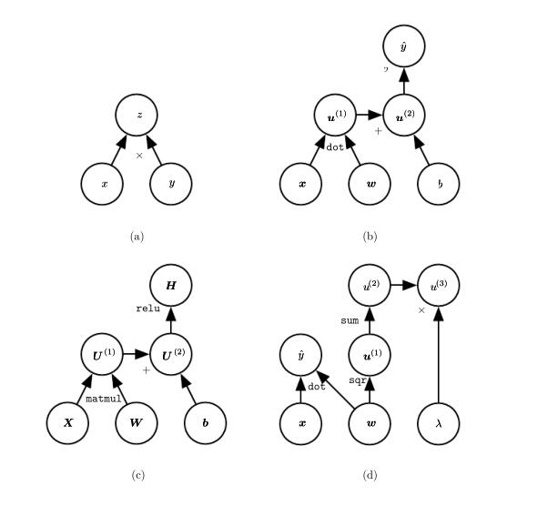

# 6.5 Back-Propagation and Other Differentiation Algorithms

When we use a feedforward neural network to accept an input $x$ and produce an output  $\hat{y}$, information flows forward through the network. The inputs $x$ provide the initial information that then propagates up to the hidden units at each layer and finally produces $\hat{y}$ . This is called **forward propagation** . During training,
**forward propagation** can continue onward until it produces a scalar cost $J( \theta )$. The back-propagation algorithm ( Rumelhart et al. 1986a ), often simply called  **backprop**, allows the information from the cost to then flow backwards through the network, in order to compute the gradient.

Computing an analytical expression for the gradient is straightforward, but numerically evaluating such an expression can be computationally expensive. The back-propagation algorithm does so using a simple and inexpensive procedure.

The term back-propagation is often misunderstood as meaning the whole learning algorithm for multi-layer neural networks. Actually, back-propagation refers only to the method for computing the gradient, while another algorithm, such as stochastic gradient descent, is used to perform learning using this gradient. Furthermore, back-propagation is often misunderstood as being specific to multi-layer neural networks, but in principle it can compute derivatives of any function (for some functions, the correct response is to report that the derivative of the function is undefined). Specifically, we will describe how to compute the gradient ∇ x f ( x y , ) for an arbitrary function f , where x is a set of variables whose derivatives
are desired, and y is an additional set of variables that are inputs to the function but whose derivatives are not required. In learning algorithms, the gradient we most often require is the gradient of the cost function with respect to the parameters, ∇ θ J ( θ ). Many machine learning tasks involve computing other derivatives, either as part of the learning process, or to analyze the learned model. The back-propagation algorithm can be applied to these tasks as well, and is not restricted to computing the gradient of the cost function with respect to the parameters. The idea of computing derivatives by propagating information through a network is very general, and can be used to compute values such as the Jacobian of a function
f with multiple outputs. We restrict our description here to the most commonly used case where has a single output.

## 6.5.1 Computational Graphs

So far we have discussed neural networks with a relatively informal graph language. To describe the back-propagation algorithm more precisely, it is helpful to have a more precise language.

Many ways of formalizing computation as graphs are possible.

Here, we use each node in the graph to indicate a variable. The variable may be a scalar, vector, matrix, tensor, or even a variable of another type. To formalize our graphs, we also need to introduce the idea of an operation . An operation is a simple function of one or more variables. Our graph language is accompanied by a set of allowable operations. Functions more complicated than the operations in this set may be described by composing many operations together.

Without loss of generality, we define an operation to return only a single output variable. This does not lose generality because the output variable can have multiple entries, such as a vector. Software implementations of back-propagation usually support operations with multiple outputs, but we avoid this case in our description because it introduces many extra details that are not important to conceptual understanding. 

If a variable y is computed by applying an operation to a variable x , then we draw a directed edge from x to y . We sometimes annotate the output node with the name of the operation applied, and other times omit this label when the operation is clear from context.

Examples of computational graphs are shown in figure 6.8. 

## 6.5.2 Chain Rule of Calculus

The chain rule of calculus (not to be confused with the chain rule of probability) is used to compute the derivatives of functions formed by composing other functions whose derivatives are known. Back-propagation is an algorithm that computes the chain rule, with a specific order of operations that is highly efficient.

Let x be a real number, and let f and g both be functions mapping from a real number to a real number. Suppose that y = g ( x ) and z = f ( g ( x )) = f ( y ). Then the chain rule states that

We can generalize this beyond the scalar case. Suppose that x ∈ R m , y ∈ R n ,g maps from R m to R n , and f maps from R n to R . If y = g ( x ) and z = f ( y ), then

In vector notation, this may be equivalently written as

