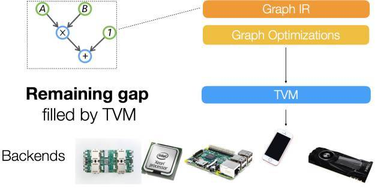
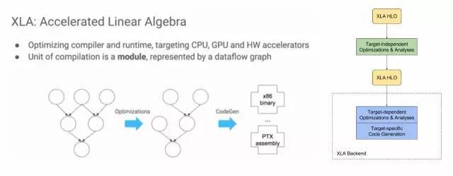
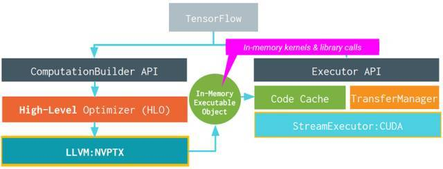
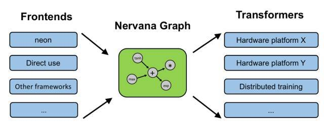
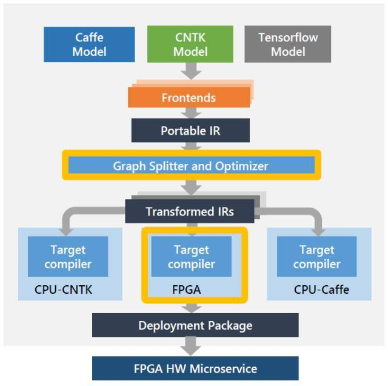

# Compiler

## NNVM compiler

1) [最新 | NNVM 编译器导论：用于AI框架的一种新式端到端编译器](https://mp.weixin.qq.com/s/CHUZX92tERidKq-y3EMTfQ)

2) [陈天奇团队发布NNVM编译器，性能优于MXNet，李沐撰文介绍](https://baijiahao.baidu.com/s?id=1580600243200331182)

3) [深度学习编译中间件之NNVM(一)介绍](https://blog.csdn.net/sanallen/article/details/79196868)

4) [理解一下nnvm 和 tvm的区别](https://www.cnblogs.com/jxr041100/p/8288381.html)

5) [一种开源、端到端的新型人工智能框架编译器——NNVM编译器](https://baijiahao.baidu.com/s?id=1580691215347183353&wfr=spider&for=pc)

### apache [Apache TVM](https://tvm.apache.org/)

### amazon [Introducing NNVM Compiler: A New Open End-to-End Compiler for AI Frameworks](https://aws.amazon.com/blogs/machine-learning/introducing-nnvm-compiler-a-new-open-end-to-end-compiler-for-ai-frameworks/)

## IR

### 新智元 [深度学习的IR“之争”](https://www.sohu.com/a/191605477_473283) 

**【新智元导读】**熟悉**编译器**的同学应该对上图并不陌生。它就是大名鼎鼎的LLVM的logo。Google Tensorflow **XLA** (Accelerated Linear Algebra)就使用了**LLVM IR**（**Intermediate Representation**）。而它的“竞争对手”，刚刚发布的**TVM/NNVM**，则是“Tensor IR Stack for Deep Learning Systems”。IR是什么？为什么重要？我们一起来看看。

上周，我们看到这样的新闻“Facebook and Microsoft introduce new open ecosystem for interchangeable AI frameworks”。这也让Framework之争更加热闹。简单来说，ONNX也是为了解决目前多个Framework互操作的问题。但有趣的是，这个“开放”的系统看起来更像是微软和FB连合对抗Google。目前Tensorflow的占有率已经领先不少，其它的Framework肯定也不希望看到Tensorflow一家独大，毕竟Framework是做deep learning的一个“入口”。最近PyTorch的势头不错，Caffe2, PyTorch和Cognitive Toolkit通过这种方式“联合”，似乎也是个不错的选择。

> **“An Intermediate representation (IR) is the data structure or code used internally by a compiler or virtual machine to represent source code.**An IR is designed to be conducive for further processing, such as optimization and translation. A "**good**" IR must be **accurate**– capable of representing the source code without loss of information – and **independent** of any particular source or target language. An IR may take one of several forms: an in-memory data structure, or a special tuple- or stack-based code readable by the program. In the latter case it is also called an intermediate language.” - Wikipedia

我们还是从目前Deep Learning的一个现实问题说起吧。

上图来自介绍NNVM的一篇文章[1]。文中在谈到NNVM的目标的时候，是这么说的：

> “This is a new interesting era of deep learning, with emergence trend of new system, hardware and computational model. The usecase for deep learning is **more heterogeneous**, and we need tailored(剪裁) learning system for our cars, mobiles and cloud services. The future of deep learning system is going to be more heterogeneous, and we will find **emergence need of different front-ends, backends and optimization techniques**. Instead of building a monolithic(集成的) solution to solve all these problems, how about adopt unix philosophy, build effective modules for learning system, and assemble them together to build minimum and effective systems?”

简单来说，**现在Deep Learning有这么多不同前端（framework），有这么多不同的后端（hardware），是否能找到一个桥梁更有效实现他们之间的优化和影射呢？**

实际上这个问题并不新鲜。当年，随着不同的应用场景和需求，出现了大量不同的编程语言和不同的处理器架构，软件产业也遇到过类似的问题。

换句话说，这也正是重演了LLVM出现时的场景：**大量不同的编程语言和越来越多的硬件架构之间需要一个桥梁**。LLVM的出现，让不同的前端后端使用统一的 LLVM IR ,如果需要支持新的编程语言或者新的设备平台，只需要开发对应的前端和后端即可。同时基于 LLVM IR 我们可以很快的开发自己的编程语言。比如，LLVM创建者Chris Lattner后来加入了Apple，又创建了Swift语言，可以看作是LLVM的前端。

由此也可以看出，LLVM统一的IR是它成功的关键之一，也充分说明了一个优秀IR的重要性。

**当然，IR本质上是一种中间表示形式，是一个完整编译工具的一部分。而我们下面讨论的TVM，XLA都是围绕特定IR构建的优化和编译工具。**

陈天奇在另一篇文章中提到：“...对于深度学习，我们需要类似的项目。学习 LL**VM** 的思想，我们将其取名 NN**VM**”。(2016年10月)

8月17号，陈天奇的团队又发布了T**VM**：An End to End **IR** Stack for Deploying the Deep Learning Workloads to Hardwares[2]，其架构如下图所示：

> We adopt **a common philosophy from the compiler community**and **provide two intermediate representation layers**to efficiently lower high-level deep learning algorithms down to a multitude of hardware back-ends.

可以看出，他们在之前的NNVM之外上增加了一个新的IR Stack，TVM，试图解决下图所示的Gap,“A lot of powerful optimizations can be supported by the graph optimization framework. ...**However we find that the computational graph based IR alone is not enough to solve the challenge of supporting different hardware backends.**”这里的graph based IR则是指NNVM。

我们知道，在LLVM环境中，只有一个统一的IR。**那么，为什么Deep Learning环境中graph based IR还不够呢**？在随后的一篇知乎文章中[3]，陈天奇提到了去年10月知乎上关于“**如何评价陈天奇的模块化深度学习系统NNVM？**”的讨论[4]。而这个讨论中王健飞的回答似乎是TVM产生的灵感之一。

同样在这篇文章当中，陈天奇还提到，“TVM和已有的解决方案不同，**以XLA作为例子，TVM走了和目前的XLA比更加激进的技术路线，TVM可以用来使得实现XLA需要的功能更加容易**”。

既然TVM的作者点了对手的名，我们就来看看Google的XLA吧。

> **XLA (Accelerated Linear Algebra) is a domain-specific compiler** for **linear algebra** that optimizes TensorFlow computations. The results are improvements in speed, memory usage, and portability on server and mobile platforms. Initially, most users will not see large benefits from XLA, but are welcome to experiment by using XLA via just-in-time (JIT) compilation or ahead-of-time (AOT) compilation. Developers targeting new hardware accelerators are especially encouraged to try out XLA.

下图左半部分来自“2017 EuroLLVM Deveopers’ Meeting”上的一个报告[6]，比较清楚介绍了XLA的目标，其基本功能也是优化和代码生成。

XLA具体的架构如图右半部分所示，可以看出，它也是**两层优化**的结构[5]，使用LLVM用作low-level IR, optimization, and code-generation。由于使用了LLVM IR, 他可以比较容易的支持不同的后端（Backend）。下图就是使用GPU Backend的例子。

对于目前不直接支持的后端，XLA给出了三种场景的开发方法。包括：

> \1. Existing CPU architecture not yet officially supported by XLA, with or without an existing LLVM backend.
>
> \2. Non-CPU-like hardware with an existing LLVM backend.
>
> \3. Non-CPU-like hardware without an existing LLVM backend.

总的来说，XLA和TVM试图解决的问题类似。但XLA只是针对Google的Tensorflow的。而TVM/NNVM虽然是MxNe阵营，但试图作为一个开发和公共的接口。

这里插播一个新闻，Chris Lattner最近加入了Google Brain。虽然还不知道他的主要工作是不是会放在XLA这里，但是他和Jeff Dean配合，确实是令人生畏。

其实，类似的想法还包括：Intel’s NGraph（如下图），HP的Cognitive Computing Toolkit (CCT)， IBM的SystemML。

而在刚刚结束的Hot Chips会议上，Microsoft发布了Project Brainwave，Cloud的AI FPGA加速平台。它的工具链是这样的，是不是又看到了两层IR？

最后，最近还看到另一个有趣的尝试：Khronos Neural Network Exchange Format (NNEF)，试图定义一种标准的数据交换格式。“The NNEF standard encapsulates neural network structure, data formats, commonly used operations (such as convolution, pooling, normalization, etc.) and formal network semantics. ”

T.S.：

随着Deep Learning的应用越来越广，大家越来越关心DNN(deep  nerual network)在不同硬件架构上Training和Inference的实现效率。参考传统编译器（compiler）设计的经验，XLA和TVM/NNVM都开始了很好的尝试。而“IR”的竞争，将是未来Framework之争的重要一环。

**Reference：**

[1]陈天奇, "Build your own TensorFlow with NNVM and Torch", http://tqchen.github.io/2016/10/01/build-your-own-tensorflow-with-nnvm-and-torch.html

[2]陈天奇, "TVM: An End to End IR Stack for Deploying the Deep Learning Workloads to Hardwares",http://tvmlang.org/2017/08/17/tvm-release-announcement.html

[3]陈天奇, "如何评价陈天奇团队新开源的TVM？", https://www.zhihu.com/question/64091792/answer/217722459

[4] 王健飞，“如何评价陈天奇的模块化深度学习系统NNVM？”，https://www.zhihu.com/question/51216952/answer/124708405

[5]"XLA Overview", https://www.tensorflow.org/performance/xla/

[6]"2017 EuroLLVM Developers’ Meeting: D. Majnemer “XLA: Accelerated Linear Algebra”",https://www.youtube.com/watch?v=2IOPpyyuLkc

[7]"A Brief Introduction to LLVM", https://www.youtube.com/watch?v=a5-WaD8VV38"

[8]"XLA: TensorFlow Compiled!",https://www.youtube.com/watch?v=kAOanJczHA0