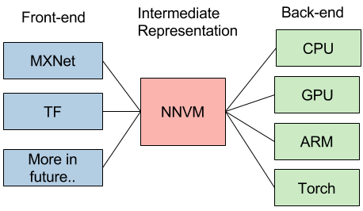
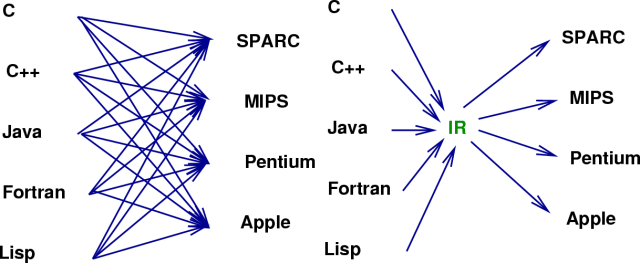
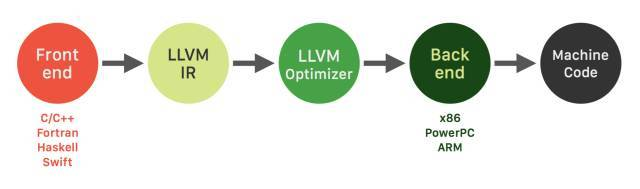
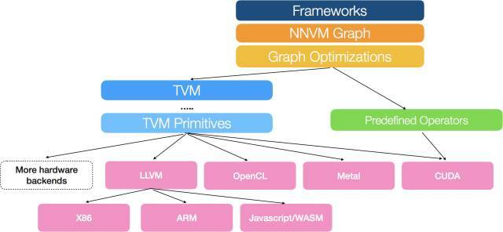

## 新智元 [深度学习的IR“之争”](https://www.sohu.com/a/191605477_473283) 

**【新智元导读】**熟悉**编译器**的同学应该对上图并不陌生。它就是大名鼎鼎的LLVM的logo。Google Tensorflow **XLA** (Accelerated Linear Algebra)就使用了**LLVM IR**（**Intermediate Representation**）。而它的“竞争对手”，刚刚发布的**TVM/NNVM**，则是“Tensor IR Stack for Deep Learning Systems”。IR是什么？为什么重要？我们一起来看看。

上周，我们看到这样的新闻“Facebook and Microsoft introduce new open ecosystem for interchangeable AI frameworks”。这也让Framework之争更加热闹。简单来说，ONNX也是为了解决目前多个Framework互操作的问题。但有趣的是，这个“开放”的系统看起来更像是微软和FB连合对抗Google。目前Tensorflow的占有率已经领先不少，其它的Framework肯定也不希望看到Tensorflow一家独大，毕竟Framework是做deep learning的一个“入口”。最近PyTorch的势头不错，Caffe2, PyTorch和Cognitive Toolkit通过这种方式“联合”，似乎也是个不错的选择。

> **“An Intermediate representation (IR) is the data structure or code used internally by a compiler or virtual machine to represent source code.**An IR is designed to be conducive for further processing, such as optimization and translation. A "**good**" IR must be **accurate**– capable of representing the source code without loss of information – and **independent** of any particular source or target language. An IR may take one of several forms: an in-memory data structure, or a special tuple- or stack-based code readable by the program. In the latter case it is also called an intermediate language.” - Wikipedia

我们还是从目前Deep Learning的一个现实问题说起吧。

上图来自介绍NNVM的一篇文章[1]。文中在谈到NNVM的目标的时候，是这么说的：

> “This is a new interesting era of deep learning, with emergence trend of new system, hardware and computational model. The usecase for deep learning is **more heterogeneous**, and we need tailored(剪裁) learning system for our cars, mobiles and cloud services. The future of deep learning system is going to be more heterogeneous, and we will find **emergence need of different front-ends, backends and optimization techniques**. Instead of building a monolithic(集成的) solution to solve all these problems, how about adopt unix philosophy, build effective modules for learning system, and assemble them together to build minimum and effective systems?”

简单来说，**现在Deep Learning有这么多不同前端（framework），有这么多不同的后端（hardware），是否能找到一个桥梁更有效实现他们之间的优化和影射呢？**

实际上这个问题并不新鲜。当年，随着不同的应用场景和需求，出现了大量不同的编程语言和不同的处理器架构，软件产业也遇到过类似的问题。

换句话说，这也正是重演了LLVM出现时的场景：**大量不同的编程语言和越来越多的硬件架构之间需要一个桥梁**。LLVM的出现，让不同的前端后端使用统一的 LLVM IR ,如果需要支持新的编程语言或者新的设备平台，只需要开发对应的前端和后端即可。同时基于 LLVM IR 我们可以很快的开发自己的编程语言。比如，LLVM创建者Chris Lattner后来加入了Apple，又创建了Swift语言，可以看作是LLVM的前端。

由此也可以看出，LLVM统一的IR是它成功的关键之一，也充分说明了一个优秀IR的重要性。

**当然，IR本质上是一种中间表示形式，是一个完整编译工具的一部分。而我们下面讨论的TVM，XLA都是围绕特定IR构建的优化和编译工具。**

陈天奇在另一篇文章中提到：“...对于深度学习，我们需要类似的项目。学习 LL**VM** 的思想，我们将其取名 NN**VM**”。(2016年10月)

8月17号，陈天奇的团队又发布了T**VM**：An End to End **IR** Stack for Deploying the Deep Learning Workloads to Hardwares[2]，其架构如下图所示：

> We adopt **a common philosophy from the compiler community**and **provide two intermediate representation layers**to efficiently lower high-level deep learning algorithms down to a multitude of hardware back-ends.

