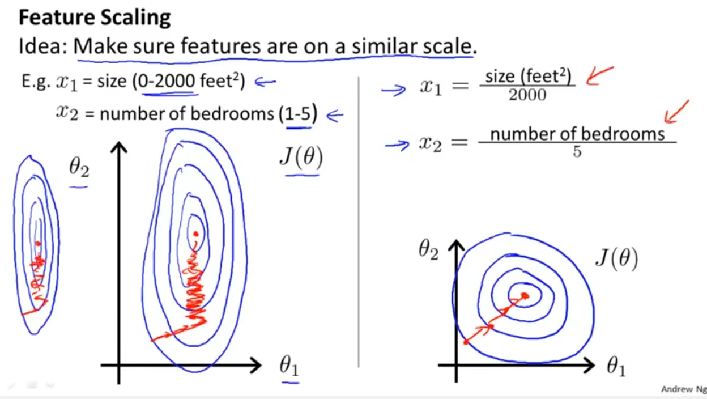

# medium [Feature Scaling- Why it is required?](https://rahul-saini.medium.com/feature-scaling-why-it-is-required-8a93df1af310)

**Feature scaling** can vary your results a lot while using certain algorithms and have a minimal or no effect in others. To understand this, let’s look why features need to be scaled, varieties of scaling methods and when we should scale our features.

## What is Feature Scaling?

It refers to putting the values in the same **range**(范围) or same **scale**(尺寸、单位) so that no variable is dominated by the other.

> **翻译**: 它指的是将数值置于相同的范围或相同的尺度，从而避免某一变量被其他变量所主导。 
> 解析： 
> 
> - **putting the values in the same range or same scale**：通过线性变换（如Min-Max归一化）或标准化（Z-Score）将不同量纲的特征缩放到统一区间，消除数值差异对模型的影响。 
> - **no variable is dominated by the other**：例如在机器学习中，若特征A取值范围为[0,1000]，特征B为[0,1]，未归一化时模型会过度关注A的变化，归一化后可确保各特征对模型的贡献权重均衡。 
>   该句解释了归一化的核心目标——消除特征间的尺度差异，保证建模公平性。

## Why Scaling

Most of the times, your dataset will contain features highly varying in magnitudes, units and range. But since, most of the machine learning algorithms use **Euclidean distance** between two data points in their computations, this is a problem.

If left alone, these algorithms only take in the magnitude of features neglecting(忽视) the units. The results would vary greatly between different units, 5kg and 5000gms. The features with high magnitudes will weigh in a lot more in the distance calculations than features with low magnitudes. To suppress this effect, we need to bring all features to the same level of magnitudes. This can be achieved by scaling.

Some examples of algorithms where feature scaling matters are:

- **k-nearest neighbors** with an Euclidean distance measure is sensitive to magnitudes and hence should be scaled for all features to weigh in equally.

- **Scaling is critical**, while performing **Principal Component Analysis(PCA)**. PCA tries to get the features with maximum variance and the variance is high for high magnitude features. This skews the PCA towards high magnitude features.

- We can speed up **gradient descent** by scaling. This is because θ will descend quickly on small ranges and slowly on large ranges, and so will oscillate(震荡) inefficiently down to the optimum when the variables are very uneven.

- **Tree based models** are not distance based models and can handle varying ranges of features. Hence, Scaling is not required while modelling trees.

- Algorithms like **Linear Discriminant Analysis(LDA), Naive Bayes** are by design equipped to handle this and gives weights to the features accordingly. Performing a features scaling in these algorithms may not have much effect.

following slide screenshot is taken from **Andrew Ng coursera machine learning course** where he shows how we converge to optimal value using gradient descent with out feature scaling (left) and with feature scaling(right).

